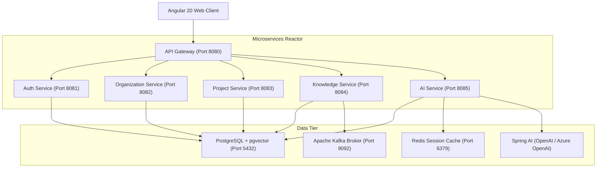

# ProjectMind AI 🚀

### *Personal Portfolio: AI Knowledge Continuity & Retrieval Platform*

ProjectMind AI preserves corporate intellectual property and increases developer productivity by capturing, indexing, and retrieving project knowledge from engineering systems (repositories, tickets, wikis) using Retrieval-Augmented Generation (RAG) and semantic searches.

---

[](LICENSE)
[](https://www.oracle.com/java/)
[](https://spring.io/projects/spring-boot)
[](https://angular.dev/)
[](https://www.postgresql.org/)
[](https://www.docker.com/)
[](https://kubernetes.io/)
[](https://github.com/features/actions)

---

## 📖 Table of Contents

1. [Project Overview](#-project-overview)
2. [Key Features](#-key-features)
3. [System Architecture](#-system-architecture)
4. [Technology Stack](#-technology-stack)
5. [Folder Structure](#-folder-structure)
6. [Getting Started & Installation](#-getting-started--installation)
7. [Running Locally](#-running-locally)
8. [Containerized Deployment (Docker)](#-containerized-deployment-docker)
9. [Kubernetes & Helm Rollouts](#-kubernetes--helm-rollouts)
10. [API Documentation](#-api-documentation)
11. [Security Control Framework](#-security-control-framework)
12. [Visual Previews](#-visual-previews)
13. [Release & Roadmap](#-release--roadmap)
14. [License](#-license)

---

## 🌟 Project Overview

Software engineering environments suffer from fragmented information spread across git repositories, ticketing systems, and wikis. This fragmentation causes knowledge silos, extends developer onboarding cycles, and leads to documentation decay.

**ProjectMind AI** acts as a read-only integration layer that connects to existing engineering tools. It parses, segments, and indexes codebase assets as vector embeddings inside a multi-tenant PostgreSQL database (`pgvector`), enabling grounded AI conversations via a modern Angular client.

### Core Value Propositions
* **Accelerated Onboarding**: Incoming developers can query codebases and architectural designs in natural language.
* **IP Continuity**: Safeguard institutional and legacy systems context during engineer transitions.
* **Cited RAG Grounding**: Provide grounded Q&A with clickable citations pointing directly back to files, line ranges, or commit histories.

---

## ⚡ Key Features

| Feature Group | Functional Capabilities | Project Scope |
| :--- | :--- | :---: |
| **Interactive AI Chat** | Multi-turn conversational interface with contextual memory and system grounding. | ✅ |
| **Clickable Citations** | Clickable links tracing AI answers back to their exact source files or wiki pages. | ✅ |
| **Multitenant Isolation** | Strict PostgreSQL row-level/query-level security isolating tenant data by Organization. | ✅ |
| **Outbox Pattern Events** | Reliable event publishing with transactional outboxes and Apache Kafka message brokers. | ✅ |
| **Observability Integration** | Metric gathering via Prometheus, dashboarding via Grafana, and log aggregation via Loki. | ✅ |
| **Stateless Security** | JWT-token based session validations with role permissions (Owner, Admin, Member, Viewer). | ✅ |

---

## 🏗️ System Architecture

ProjectMind AI is built using a scalable, stateless microservice model mediated by a Spring Cloud API Gateway.



### Microservice Roles
1. **API Gateway**: Orchestrates path routing, propagates JWT security headers, and enforces Rate Limiting.
2. **Auth Service**: Manages accounts, JWT token signatures, password resets, and user roles.
3. **Organization Service**: Houses multi-tenant settings, feature flags, and member invitations.
4. **Project Service**: Governs project workspaces, team roles, and repository mappings.
5. **Knowledge Service**: Ingests files, integrates connectors (GitHub/Jira), and queues outbox events.
6. **AI Service**: Computes vector chunks using `pgvector` and structures RAG pipelines.

---

## 🛠️ Technology Stack

### Frontend Client
* **Framework**: Angular 20 (Standalone Components, Signals state management, TypeScript)
* **Styling**: Vanilla SCSS (Harmonious sleek palettes, dark modes, dynamic transition animations)
* **Testing**: Vitest for unit specs

### Backend Services
* **Language & SDK**: Java 17 / 21 (Spring Boot 3.5.x, Spring Cloud, Spring AI 1.0.0)
* **ORM & Migration**: Hibernate, Spring Data JPA, H2 (for repository testing)
* **Token Security**: JJWT 0.12.x
* **Build Tool**: Maven

### Infrastructure & Datastores
* **Database**: PostgreSQL 15+ with `pgvector` extension
* **Cache & Memory**: Redis (Distributed Caching & Rate Limiting)
* **Event Broker**: Apache Kafka (Outbox events integration)
* **Telemetry**: Prometheus, Grafana, Loki, Alertmanager

---

## 📂 Folder Structure

```text
projectmind-ai/
├── docs/                      # Comprehensive design and requirements documentation
├── helm/                      # Kubernetes deployment configurations
├── frontend/                  # Angular standalone client application
│   ├── src/
│   ├── package.json
│   └── vitest.config.ts
└── backend/                   # Spring Boot microservices maven project
    ├── api-gateway/           # Spring Cloud Gateway
    ├── auth-service/          # Authentication & Profiles manager
    ├── organization-service/  # Tenant settings & Feature flags
    ├── project-service/       # Workspaces & Members rules
    ├── knowledge-service/     # File ingestion & Git connectors
    ├── ai-service/            # pgvector chunking & RAG pipeline
    ├── common-library/        # Shared DTOs, Security, and Utils
    └── pom.xml                # Parent Maven configuration
```

---

## 🚀 Getting Started & Installation

### Prerequisites
- **Java Development Kit**: JDK 17 or JDK 21 installed.
- **NodeJS Environment**: Node.js v18+ and npm v9+ installed.
- **Docker**: Desktop or Daemon installed (optional for local, required for containerization).
- **Environment Variables**: Configure variables in a `.env` file within the `backend/` directory.

---

## 💻 Running Locally

### 1. Database & Cache Services
Before boot, ensure PostgreSQL (with `pgvector` extension) and Redis are running.
If running local PostgreSQL, create these databases:
```sql
CREATE DATABASE acciobuild_auth;
CREATE DATABASE acciobuild_org;
CREATE DATABASE acciobuild_project;
CREATE DATABASE acciobuild_knowledge;
CREATE DATABASE acciobuild_ai;
```

### 2. Compile Backend Microservices
Navigate to the backend parent folder and run the Maven wrapper:
```bash
cd backend
$env:JAVA_HOME="C:\Program Files\Java\jdk-17.0.18" # Or your JDK 17/21 path
./mvnw clean install -DskipTests
```
To run unit and integration tests:
```bash
./mvnw clean test
```

### 3. Run Microservices
Launch the service JAR files or run via Maven commands, for instance:
```bash
cd auth-service
java -jar target/auth-service-0.1.0-SNAPSHOT.jar
```

### 4. Build & Launch Frontend Client
```bash
cd ../frontend
npm install
npm run start
```
The interface will boot at `http://localhost:4200`.

---

## 🐳 Containerized Deployment (Docker)

To launch the entire platform stack using Docker Compose:

1. Configure environment variables in `backend/.env.example` and save as `backend/.env`.
2. Build the services container images:
```bash
cd backend
docker-compose build
```
3. Boot the stack in detached mode:
```bash
docker-compose up -d
```
All backend routing and gateway functions will be accessible on port `8080`.

---

## ☸️ Kubernetes & Helm Rollouts

Deployments to Kubernetes environments use the Helm chart directory structure:

1. Install and initialize the charts:
```bash
helm install projectmind ./helm/acciobuild
```
2. Configure persistent volumes and DNS rules inside `values.yaml`.

---

## 🔌 API Documentation

### Path Endpoint Map

| Service | Verb | Endpoint | Description |
| :--- | :--- | :--- | :--- |
| **Auth** | `POST` | `/api/v1/auth/register` | Register a new user profile. |
| **Auth** | `POST` | `/api/v1/auth/login` | Log in and obtain a JWT access token. |
| **Organization** | `POST` | `/api/v1/organizations` | Create a tenant organization. |
| **Project** | `POST` | `/api/v1/projects` | Register a new workspace project. |
| **Knowledge** | `POST` | `/api/v1/projects/{projectId}/repositories` | Associate a Git repository connector. |
| **AI** | `POST` | `/api/v1/ai/chat` | Query RAG conversational pipeline. |

---

## 🔒 Security Control Framework

1. **Header Verification**: APIs extract and validate Stateless RS256 JWT signatures.
2. **Access RBAC Control**: Service interfaces restrict updates via custom method security annotations.
3. **Data Encryption**: Fields like passwords and connector keys are hashed at rest via BCRYPT/AES-256.
4. **Tenant Segmentation**: SQL queries append active tenant filters using dynamic JPA specifications.

---

## 🖼️ Visual Previews

### Landing Page & Workspace Dashboard
Shows user organizations list, recent project activity metrics, sync status indicators, and repository collaborator logs.

### AI Search & Conversational Panel
Provides conversational chat bubbles with responsive citations. Clickable citations slide out the exact chunk content, matching line ranges, and document metadata.

### System Settings Console
Administrative interface for organization settings, feature flag toggles, manual file uploads, and user invitations.

---

## 🖼️ Release & Roadmap

- **v1.0.0 (Current Release)**
  - Angular 20 standalone client deployment.
  - Multi-tenant data segregation.
  - Outbox publishing integrations with Apache Kafka.
  - Telemetry logs (Prometheus & Grafana) support.
  - 100% successful unit and integration test runs.

---

## 📄 License

Licensed under the [MIT License](LICENSE).
