# Sequence Diagrams

## Document Metadata

| Metadata Field | Value |
|---|---|
| Document Type | System Design / UML Sequence Diagrams |
| Version | 1.0.0 |
| Status | Published |
| Owner | Portfolio Developer |
| Reviewer | Portfolio Developer |
| Last Updated | 2026-07-22 |

---

# Executive Summary

UML sequence diagrams illustrate the runtime interactions and message flows between system actors, client interfaces, microservices, and external repositories. By modeling chronological transaction sequences, these diagrams guide developers through API coordination, trace service boundaries, and assist QA engineers in writing integration test scenarios.

The workflows covered in this document map all critical pathways defined in the platform's functional modules. They represent happy-path operations and error exception handling, establishing clear parameters for system boundary compliance.

---

# Actors

The sequence diagrams utilize the following actors and component systems:

* **User / Developer / Tech Lead / Organization Admin:** External human actors executing actions.
* **Frontend:** The web browser dashboard or IDE workspace extension.
* **Authentication Service:** Service validating credentials and session tokens.
* **Organization Service:** Service managing isolated tenant metadata and user roles.
* **Project Service:** Service organizing project workspaces and connector boundaries.
* **Knowledge Service:** Service executing external tool integrations and document syncs.
* **AI Service:** Service parsing codebase syntax trees, generating vector embeddings, and indexing context.
* **Search Service:** Service matching queries against vector databases and applying RBAC filters.
* **Database:** The local relational configuration databases and vector index stores.
* **GitHub / Jira / Confluence:** External platforms containing codebase assets, ticket trackers, and wikis.

---

# Sequence Diagram 1

## User Registration
* **Description:** A new user registers a platform account using their company email domain.
* **Preconditions:** The company email domain is registered by the organization admin.
* **Main Flow:**
  1. The user enters registration details on the signup form.
  2. The Frontend validates email format and forwards the request to the Authentication Service.
  3. The Authentication Service checks the database to verify the email domain matches active tenant domains.
  4. The Authentication Service registers the user profile as inactive in the Database and triggers an activation email.
  5. The user receives the email, clicks the secure token link, and validates their account.

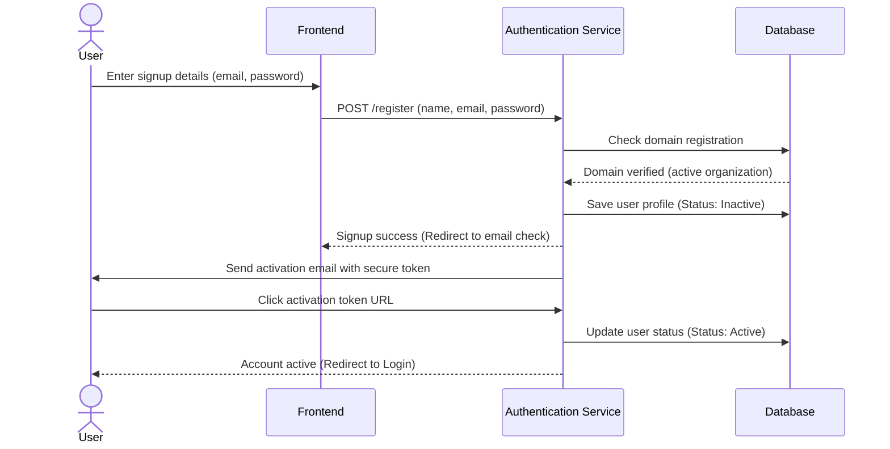

* **Postconditions:** User profile is created in the database and active for logins.

---

# Sequence Diagram 2

## User Login
* **Description:** User authenticates and receives a secure session token.
* **Preconditions:** User account is active in the database.
* **Main Flow:**
  1. User enters login details in the Frontend or IDE console.
  2. Frontend posts credentials to the Authentication Service.
  3. The service validates credentials against the database, generates a JWT token, and returns it to the client.

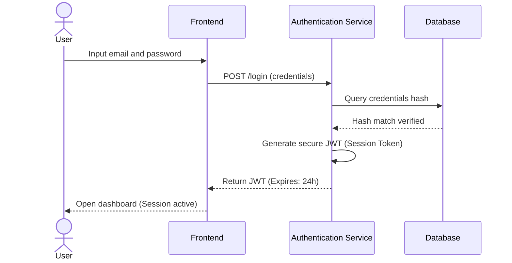

---

# Sequence Diagram 3

## Create Organization
* **Description:** Global administrator initializes a new corporate tenant organization.
* **Preconditions:** Global administrator session is active.

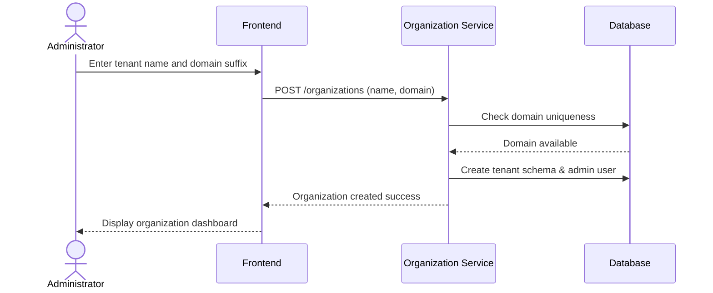

---

# Sequence Diagram 4

## Invite Team Member
* **Description:** Organization admin invites team members to join the tenant.
* **Preconditions:** Admin is logged in.

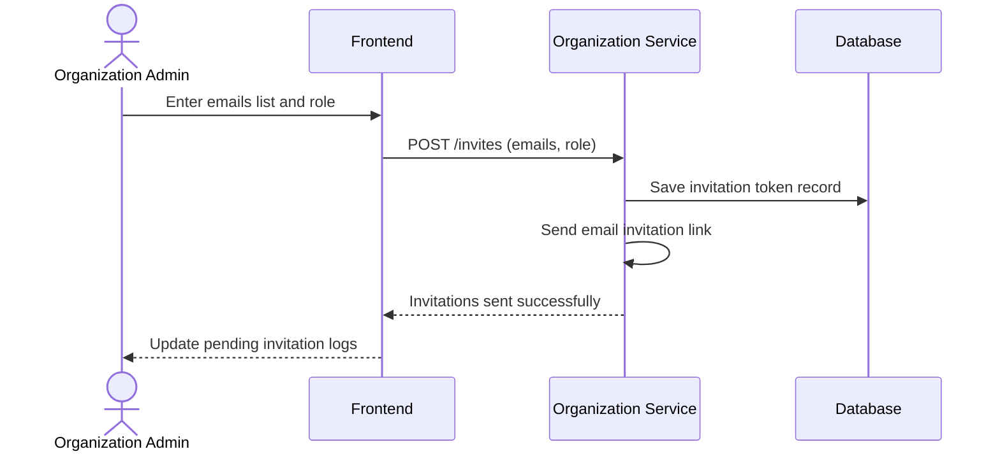

---

# Sequence Diagram 5

## Create Project
* **Description:** Admin initializes a project workspace to group codebase connectors.
* **Preconditions:** Admin is logged in.

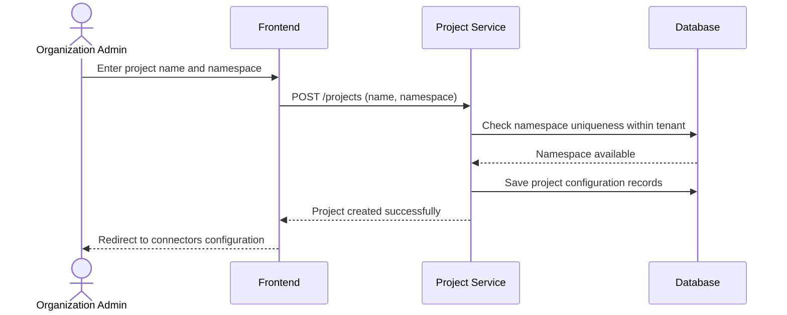

---

# Sequence Diagram 6

## Connect GitHub Repository
* **Description:** Link a codebase repository path.
* **Preconditions:** Project workspace exists.

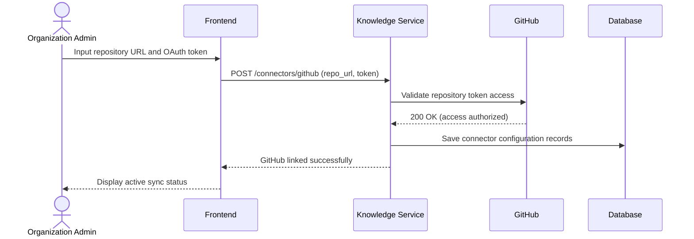

---

# Sequence Diagram 7

## Connect Jira Project
* **Description:** Link a Jira tracker board.
* **Preconditions:** Project workspace exists.

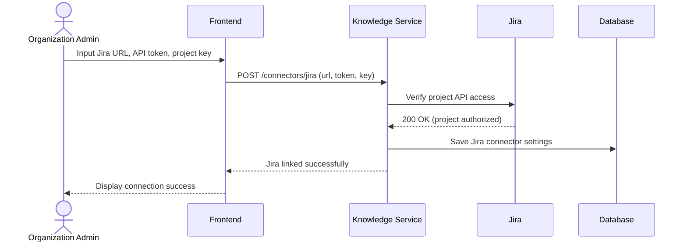

---

# Sequence Diagram 8

## Connect Confluence Space
* **Description:** Link Confluence documentation folder.
* **Preconditions:** Project workspace exists.

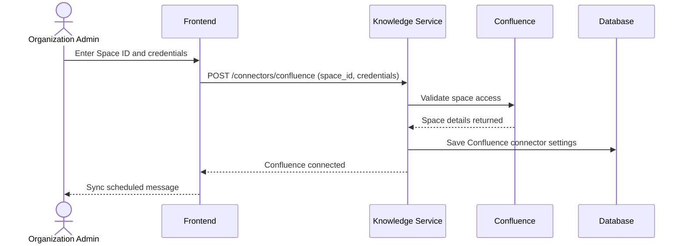

---

# Sequence Diagram 9

## Upload Documents
* **Description:** User uploads supplementary reference document files.
* **Preconditions:** User is logged in.

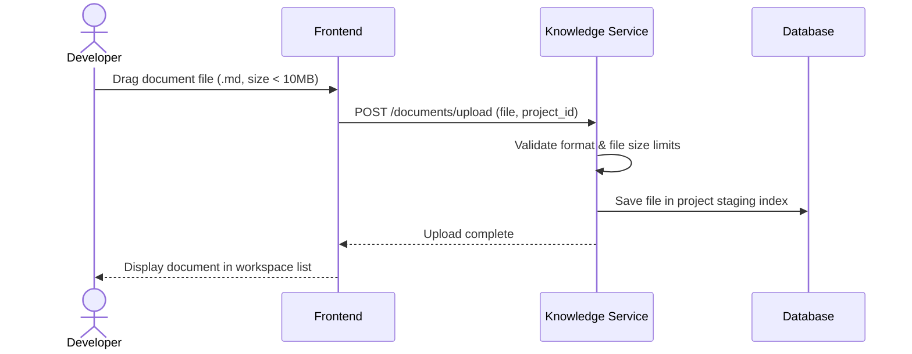

---

# Sequence Diagram 10

## Synchronize Knowledge Sources
* **Description:** GitHub push event webhooks trigger delta downloads.
* **Preconditions:** Push webhook endpoints configured.

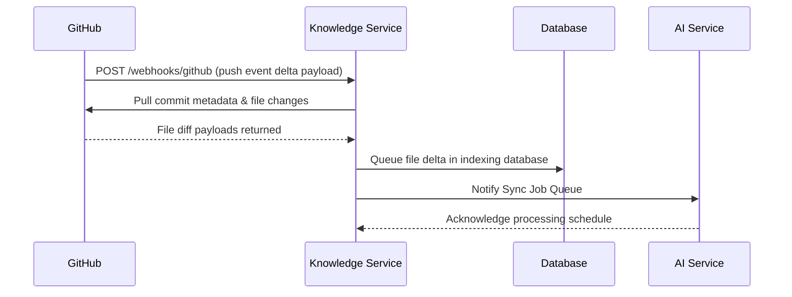

---

# Sequence Diagram 11

## AI Knowledge Indexing
* **Description:** The system parses codebase files and writes semantic embeddings.
* **Preconditions:** Sync delta queues contain un-parsed datasets.

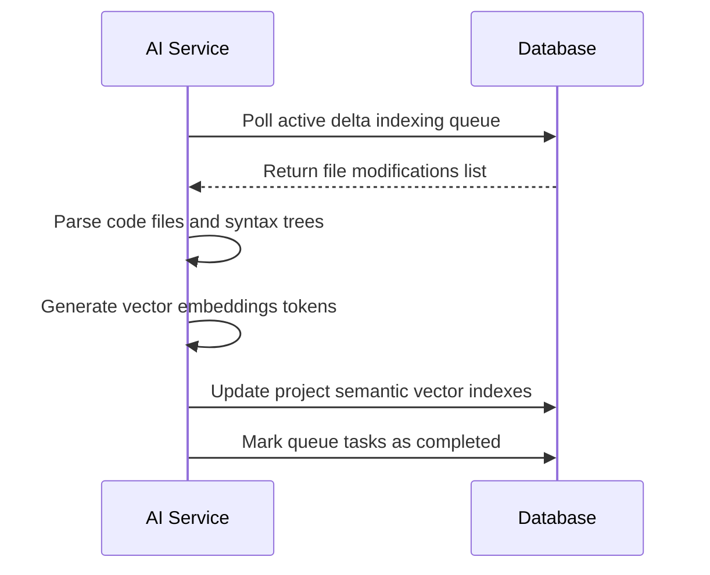

---

# Sequence Diagram 12

## Ask AI Question
* **Description:** Developer queries the platform from the IDE search console.
* **Preconditions:** User session active; project semantic index healthy.

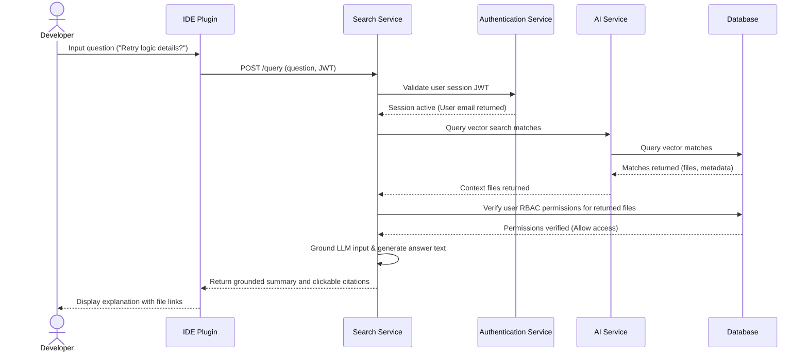

---

# Sequence Diagram 13

## Semantic Search
* **Description:** Developer executes concepts searches within the workspace.
* **Preconditions:** User is logged in.

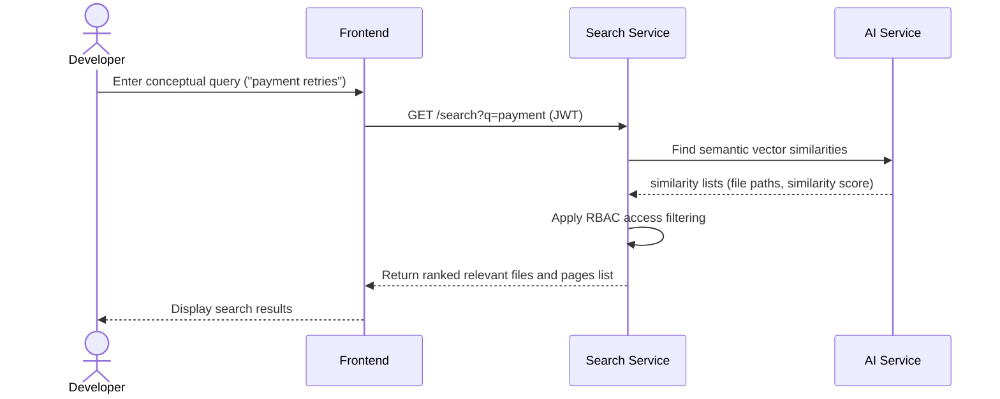

---

# Sequence Diagram 14

## View Dashboard
* **Description:** User checks indexing status and connection health indicators.
* **Preconditions:** User is logged in.

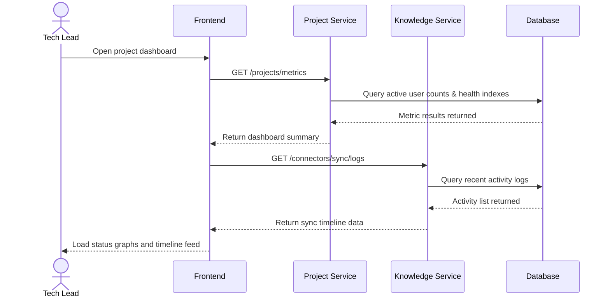

---

# Sequence Diagram 15

## User Management
* **Description:** Admin deactivates a member profile.
* **Preconditions:** Admin is logged in.

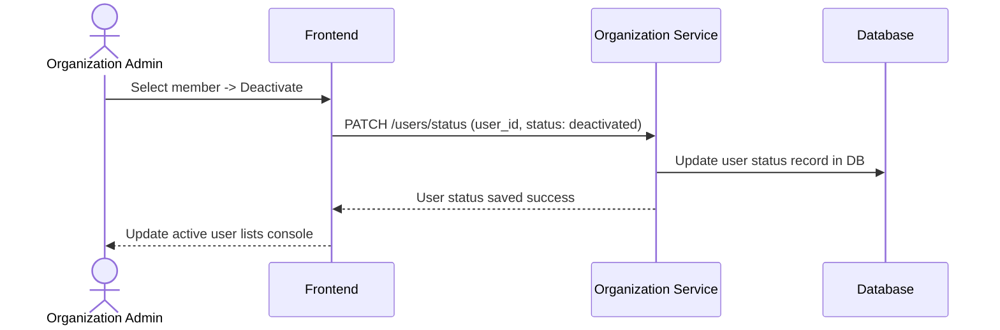

---

# Error Scenarios

The following diagrams illustrate workflow behaviors under exception scenarios:

## Invalid Login
* **Description:** User enters incorrect credentials.

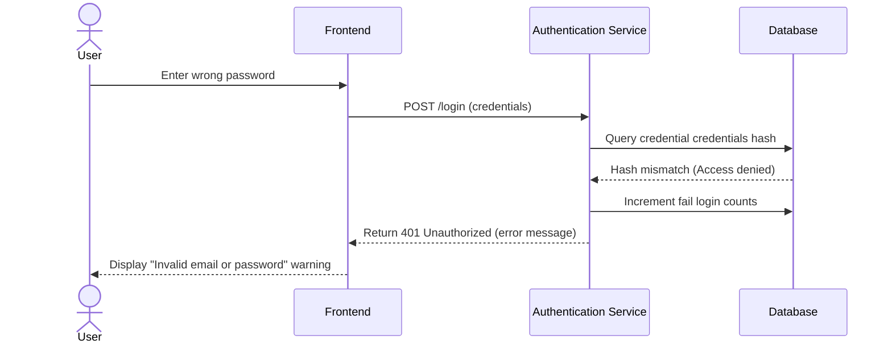

## Unauthorized Access
* **Description:** An unauthenticated query attempt is rejected.

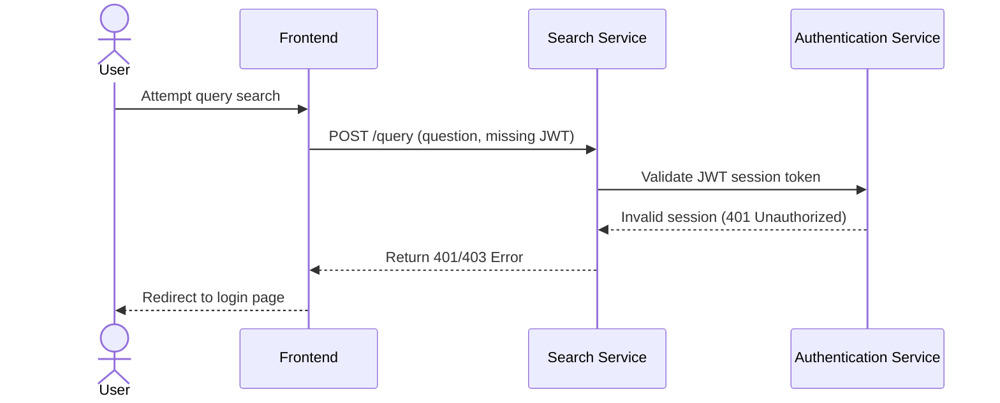

## GitHub Connection Failure
* **Description:** GitHub API returns errors during sync configuration.

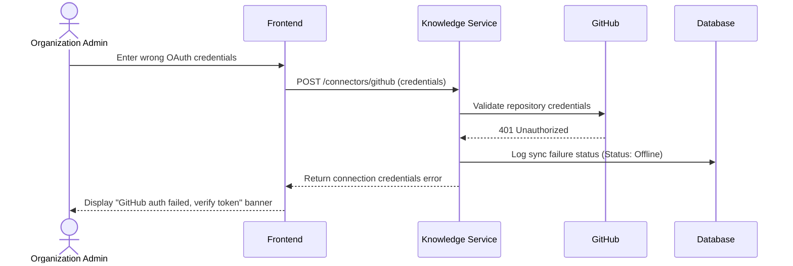

## AI Processing Failure
* **Description:** Sync data contains corrupt files that trigger parser exceptions.

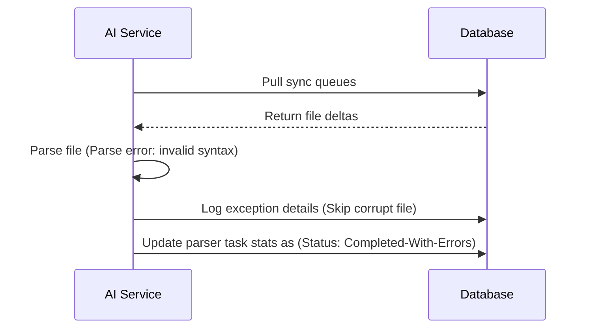

## Search Failure (Context Sparse)
* **Description:** Developer queries information missing from the semantic index.

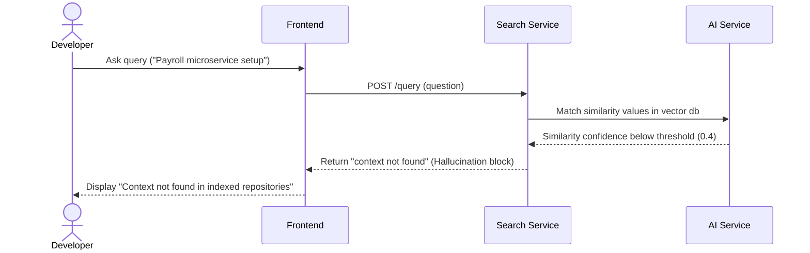

---

# Assumptions

The sequence diagrams rely on the following design assumptions:
* Third-party systems expose stable REST/GraphQL endpoints for ingestion.
* Session tokens (JWT) can be decrypted and verified without database access.
* Database actions execute within normal transactional limits.
* IDE extensions can display formatted markdown search responses.

---

# Constraints

* **Read-Only Scopes:** Under no circumstances do sequences write modifications to external platforms (GitHub/Jira).
* **Latency Limits:** Synchronous search lookup sequences (SD 12, SD 13) must complete execution in less than 2.0 seconds.
* **Domain Check:** Registration is constrained by organization email domain suffix filters.

---

# Risks

### Ingestion Sequence Timeout
* *Risk:* Sync sequence blocks if GitHub/Jira response times lag, delaying delta queues.
* *Mitigation:* Ingest files asynchronously using separate background worker pools.

### Search Access Leak
* *Risk:* User obtains code search responses from repositories they do not have credentials to read on GitHub.
* *Mitigation:* Ensure the Search Service queries the Organization Service to match role permissions before building answer summaries.

---

# Conclusion

These UML sequence diagrams establish the runtime interaction models for the ProjectMind AI platform. By clarifying the message-passing sequences between actors, frontend clients, backend services, and external platforms, this document guides developers through API structure design, helps QA engineers write interface integration tests, and validates architectural boundaries.

---

# Revision History

| Version | Date | Author / Role | Summary of Changes |
|---|---|---|---|
| 0.1.0 | 2026-07-22 | Developer / Architect | Initial creation of the Sequence Diagrams Document. |
