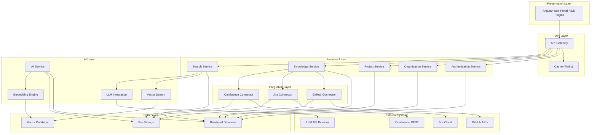
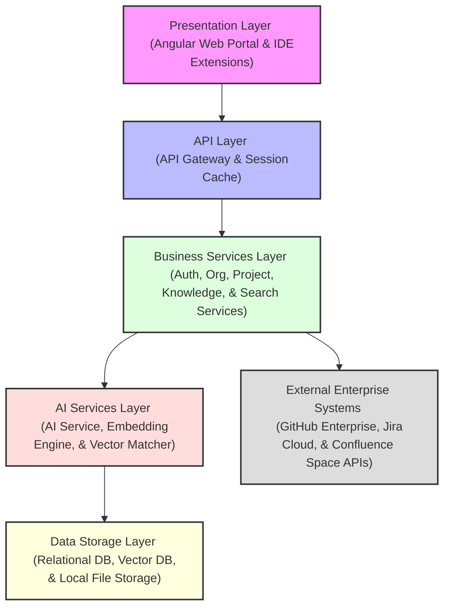

# Component Diagram

## Document Metadata

| Metadata Field | Value |
|---|---|
| Document Type | Architecture / Component Diagram |
| Version | 1.0.0 |
| Status | Published |
| Owner | Portfolio Developer |
| Reviewer | Portfolio Developer |
| Last Updated | 2026-07-22 |

---

# Executive Summary

A component diagram defines the static structure of the ProjectMind AI platform, mapping logical software components, their interfaces, dependencies, and boundary constraints. By grouping system capabilities into distinct layers, this document provides the the developer with a blueprint for component encapsulation, interface contracts design, and codebase separation.

Establishing clear boundaries between front-end workspaces, api gateways, business controllers, vector processors, and isolated databases prevents modular drift and supports secure multi-tenant execution.

---

# Architecture Overview

ProjectMind AI decomposes its runtime capabilities across six logical architecture layers:

* **Presentation Layer:** The user-facing interfaces (Angular Web Portal and IDE workspace plugins) that capture inputs and render search citations.
* **API Layer:** The entry boundary (API Gateway and Redis Cache) that routes requests, throttles query volume, and validates session headers.
* **Business Layer:** The microservices (Authentication, Organization, Project, Knowledge, and Search Services) managing tenant boundaries, project logic, and RBAC filters.
* **AI Layer:** The intelligence engine (AI Service, Embedding Engine, Vector Search, and LLM Integrations) parsing syntax code structures and generating responses.
* **Integration Layer:** The ingestion modules (GitHub, Jira, and Confluence Connectors) executing read-only REST API delta updates downloads.
* **Data Layer:** The persistent partition databases (Relational Database, Vector Database, and File Storage partitions) isolating tenant config metadata and vector search graphs.

---

# Major Components

The structural components of the ProjectMind AI platform are mapped below:

| Component Name | Responsibility Description | Bounded Dependencies |
|---|---|---|
| **Angular Web App** | Render the user configurations dashboard and search portal workspace. | API Gateway |
| **API Gateway** | Route request traffic, terminate TLS, and enforce rate pacing rules. | Cache (Redis), Downstream Services |
| **Authentication Service** | Process SSO login assertions, check credentials, and sign session JWTs. | Relational Database |
| **Organization Service** | Initialize corporate tenant boundaries and manage role assignments. | Relational Database |
| **Project Service** | Create project workspaces to group codebase files and wiki connectors. | Relational Database |
| **Knowledge Service** | Manage tool connectors configuration settings and queue sync runs. | GitHub, Jira, Confluence Connectors, Relational DB |
| **Search Service** | Match queries conceptually, apply user RBAC filters, and format summaries. | Vector Search, LLM Integration, Relational DB |
| **AI Service** | Coordinate codebase parsing delta queues and trigger vector indexing. | Embedding Engine, Relational DB, File Storage |
| **GitHub Connector** | Ingest source code directories, commit files, and reviews comments. | File Storage, External GitHub APIs |
| **Jira Connector** | Ingest project requirements stories and status changes. | File Storage, External Jira APIs |
| **Confluence Connector** | Ingest documentation folders and setup articles. | File Storage, External Confluence APIs |
| **Embedding Engine** | Encode syntax code trees and ticket text segments into vectors. | Vector Database |
| **Vector Search** | Query vector indices to retrieve high-confidence similarity context segments. | Vector Database |
| **LLM Integration** | Generate grounded natural language responses based on context lists. | Vector Database, External LLM Provider |
| **Relational Database** | Store user profiles, project configs, sync histories, and settings. | None |
| **Vector Database** | Store index vector embeddings and graph relations. | None |
| **File Storage** | Staging storage for ingested codebase repositories and wiki files. | None |
| **Cache (Redis)** | Cache user JWT session validations and repetitive search query keys. | None |

---

# Component Responsibilities

### Angular Web Application
* *Purpose:* Serve the administrator dashboard and the user query console.
* *Inputs:* User mouse clicks, search inputs, connector settings.
* *Outputs:* Relational configuration pages, search Q&A answers, active charts.
* *Dependencies:* API Gateway.

### API Gateway
* *Purpose:* Route API traffic from IDEs and browsers to backend services.
* *Inputs:* HTTP client request parameters, JWT session tokens.
* *Outputs:* Decoupled downstream request parameters, TLS validation states.
* *Dependencies:* Cache (Redis), Business Microservices.

### Authentication Service
* *Purpose:* Validate identity and manage user login sessions.
* *Inputs:* Login email and password fields, Okta SSO assertions.
* *Outputs:* Session JWT keys, user profile settings logs.
* *Dependencies:* Relational Database.

### Organization Service
* *Purpose:* Govern isolated tenant scopes.
* *Inputs:* Tenant domain prefixes, user invitation email lists.
* *Outputs:* Configured organization databases, invite tokens.
* *Dependencies:* Relational Database.

### Project Service
* *Purpose:* Manage project workspaces boundaries.
* *Inputs:* Project name, description modifications, archive commands.
* *Outputs:* Project configuration updates, workspace status indicators.
* *Dependencies:* Relational Database.

### Knowledge Service
* *Purpose:* Coordinate external tool syncs and data ingestion.
* *Inputs:* Webhook commit events, manual text file uploads, API tokens.
* *Outputs:* Ingested file logs, active sync task status queues.
* *Dependencies:* GitHub/Jira/Confluence Connectors, Relational Database.

### AI Service
* *Purpose:* Index project materials and build similarity graphs.
* *Inputs:* Ingested raw source code, ticket metadata files, Confluence pages.
* *Outputs:* Processed vector embeddings queues, code-ticket logic link logs.
* *Dependencies:* Embedding Engine, Relational Database, File Storage.

### Search Service
* *Purpose:* Process user natural language queries and return citations.
* *Inputs:* Natural language search query strings, JWT tokens.
* *Outputs:* Grounded explanations, clickable file references.
* *Dependencies:* Vector Search, LLM Integration, Relational Database.

### GitHub Connector
* *Purpose:* Fetch codebase metadata and commits from GitHub APIs.
* *Inputs:* Ingestion triggers, repository directories.
* *Outputs:* Downloaded codebase files, commit logs diff.
* *Dependencies:* File Storage, External GitHub APIs.

### Jira Connector
* *Purpose:* Fetch requirements stories from Jira trackers.
* *Inputs:* Ingestion tasks, project keys.
* *Outputs:* Downloaded ticket log files.
* *Dependencies:* File Storage, External Jira APIs.

### Confluence Connector
* *Purpose:* Fetch setup wikis from Confluence spaces.
* *Inputs:* Ingestion tasks, space IDs.
* *Outputs:* Downloaded documentation files.
* *Dependencies:* File Storage, External Confluence APIs.

### Embedding Engine
* *Purpose:* Generate mathematical vector embeddings representing code/text syntax.
* *Inputs:* Tokenized code blocks, ticket strings.
* *Outputs:* Vector arrays.
* *Dependencies:* Vector Database.

### Vector Search
* *Purpose:* Execute similarity searches in the vector space.
* *Inputs:* Encoded query vectors.
* *Outputs:* High-confidence context segments lists.
* *Dependencies:* Vector Database.

### LLM Integration
* *Purpose:* Execute LLM generation grounded in retrieved vector contexts.
* *Inputs:* Developer query string, context files snippets.
* *Outputs:* Grounded summary paragraph answers.
* *Dependencies:* Vector Database, External LLM Provider.

### Relational Database
* *Purpose:* Persistent storage for relational system settings.
* *Inputs:* Configuration update queries, registration data.
* *Outputs:* Relational record datasets.
* *Dependencies:* None.

### Vector Database
* *Purpose:* High-performance storage for index vector embeddings.
* *Inputs:* Encoded codebase vector models.
* *Outputs:* Match similarity returns.
* *Dependencies:* None.

### File Storage
* *Purpose:* Directory storage for staging raw codebase files.
* *Inputs:* Downloaded repository files, ticket logs.
* *Outputs:* Raw code files and wiki page texts.
* *Dependencies:* None.

### Cache (Redis)
* *Purpose:* High-speed memory storage to cache tokens and search keys.
* *Inputs:* Session credentials checks, search queries.
* *Outputs:* Verified session parameters, cached search returns.
* *Dependencies:* None.

---

# Component Interaction

When a developer submits a query from their IDE plugin, the following component interactions occur:

1. The IDE Plugin passes the query and JWT to the **API Gateway**.
2. The API Gateway validates the session JWT from **Cache (Redis)**.
3. The API Gateway routes the query to the **Search Service**.
4. The Search Service calls **Vector Search** to execute a similarity lookup in the **Vector Database**.
5. The Search Service verifies user permissions on matching files against the **Relational Database**.
6. The Search Service routes the allowed context text to the **LLM Integration** module.
7. The LLM Integration module calls the **LLM Provider** to formulate a grounded summary, returning the answer with citations.

---

# Mermaid Component Diagram

The following diagram models the static structure of ProjectMind AI's internal and external components:

---

# Layered Architecture Diagram

The dependencies flow uniformly down through the system layers:

---

# Dependency Matrix

The dependencies between system components are mapped below:

| Component Name | Depends On | Used By |
|---|---|---|
| **Angular Web App** | API Gateway | None |
| **API Gateway** | Cache (Redis), Business Services | Angular Web App, IDE Plugins |
| **Authentication Service** | Relational Database | API Gateway |
| **Organization Service** | Relational Database | API Gateway |
| **Project Service** | Relational Database | API Gateway |
| **Knowledge Service** | GitHub/Jira/Confluence Connectors, Relational DB | API Gateway |
| **Search Service** | Vector Search, LLM Integration, Relational DB | API Gateway |
| **AI Service** | Embedding Engine, Relational DB, File Storage | Knowledge Service |
| **GitHub Connector** | File Storage, External GitHub APIs | Knowledge Service |
| **Jira Connector** | File Storage, External Jira APIs | Knowledge Service |
| **Confluence Connector** | File Storage, External Confluence APIs | Knowledge Service |
| **Embedding Engine** | Vector Database | AI Service |
| **Vector Search** | Vector Database | Search Service |
| **LLM Integration** | External LLM Provider | Search Service |
| **Relational Database** | None | Auth, Org, Project, Knowledge, Search, AI |
| **Vector Database** | None | Embedding Engine, Vector Search |
| **File Storage** | None | Connectors, AI Service |
| **Cache (Redis)** | None | API Gateway |

---

# Design Principles

ProjectMind AI's component architecture adheres to five core design principles:

* **Loose Coupling:** Components communicate strictly via abstract interfaces and data transfer objects, allowing teams to refactor internal logic without impacting dependencies.
* **High Cohesion:** Each component encapsulates a single logical capability (e.g. the Embedding Engine only tokenizes inputs), reducing downstream structural complexity.
* **Separation of Concerns:** Business logic (Search Service) is separated from data integration (GitHub Connector) and persistence (Vector DB).
* **Reusability:** Connectors and indexing libraries are shared assets, enabling new workspace tools connections with minimal code changes.
* **Scalability:** Stateless design models allow runtime components to scale dynamically across load balancers based on transaction usage.

---

# Risks

The execution of the component design faces key technical risks:

### API Connection Outages
* *Risk:* API updates or timeouts on GitHub/Jira block connectors, causing delta queue indexing failures.
* *Mitigation:* Configure active fallback states, logging sync failure codes and queueing tasks for automated retry.

### Vector Lookup Latency
* *Risk:* Massive indexing sizes increase vector similarity query times, violating the 2.0-second IDE latency limit.
* *Mitigation:* Apply index partitioning and cache repetitive query returns in Cache (Redis).

### Direct DB Connection Leaks
* *Risk:* Inadequate database connection pooling or resource locks cause memory leaks and service crashes under peak query loads.
* *Mitigation:* Enforce strict connection timeout limits and optimize query execution plans.

---

# Conclusion

The ProjectMind AI Component Diagram document establishes the static component architecture, mapping interface roles, execution boundaries, and dependencies. By separating capabilities into logical, decoupled layers and enforcing strict data and API gateways, this design guides developers and SREs in implementing a secure, isolated, and highly performant platform.

---

# Revision History

| Version | Date | Author / Role | Summary of Changes |
|---|---|---|---|
| 0.1.0 | 2026-07-22 | Developer / Architect | Initial creation of the Component Diagram Document. |
