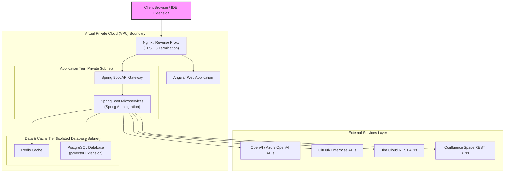

# Deployment Architecture

## Document Metadata

| Metadata Field | Value |
|---|---|
| Document Type | Architecture / Deployment Architecture |
| Version | 1.0.0 |
| Status | Published |
| Owner | Portfolio Developer |
| Reviewer | Portfolio Developer |
| Last Updated | 2026-07-22 |

---

# Executive Summary

The deployment strategy for ProjectMind AI details the operational topography, network boundaries, CI/CD pipeline, and resource scaling plans that support the platform. Operating as a secure read-only indexing workspace, the system is designed to run in early phases using containerized services via Docker Compose (Hackathon MVP) and scale to production clusters under Kubernetes in subsequent deployments.

This document describes how frontend interfaces, Spring Boot microservices, PostgreSQL databases with pgvector, Redis caches, and OpenAI integrations coordinate within Virtual Private Cloud (VPC) network boundaries to guarantee enterprise security, high availability, and P95 performance metrics.

---

# Deployment Objectives

The infrastructure architecture is built around six operational objectives:

* **High Availability:** Redundant service instances, active load balancers, and database clustering prevent single-point failures.
* **Scalability:** Horizontal scaling strategies allow the system to handle spikes in search query volume and resource-heavy vector index creation tasks.
* **Reliability:** Decoupled container lifecycles ensure transient failures in connector sync queues do not interrupt user logins or core search APIs.
* **Security:** Clear VPC networking, private routing subnets, TLS transit encryption, and vault secrets management protect customer codebases and token credentials.
* **Maintainability:** Standardized Infrastructure-as-Code scripts and containerization support fast deployment cycles and environment replication.
* **Cost Optimization:** Decoupled service profiles allow resource allocation (e.g. GPU allocations for AI vectorization) to scale independently, minimizing compute costs.

---

# Environment Strategy

ProjectMind AI isolates code changes across four target environments:

### Development
* *Purpose:* Sandbox environment for engineers to build and test microservices.
* *Deployment:* Lightweight container setups running locally via Docker Compose.

### Testing
* *Purpose:* Isolated QA environment for automated API validation, Gherkin scenario execution, and regression checks.
* *Deployment:* Automatically built test containers integrated with test databases.

### Staging
* *Purpose:* Complete replica of the production environment to validate updates, security audits, and configuration integrations before release.
* *Deployment:* Containerized services deployed to clusters, connected to staging tools instances.

### Production
* *Purpose:* High-performance, secure environment serving the enterprise.
* *Deployment:* Multi-zone Kubernetes clusters, isolated VPC networks, and high-availability database replication.

---

# Infrastructure Components

The software and infrastructure stack for ProjectMind AI is summarized below:

| Component Name | Target Technology | Operational Purpose |
|---|---|---|
| **Angular Frontend** | Angular / HTML / CSS | Web browser interface and administrator configurations portal. |
| **Spring Boot Microservices** | Java / Spring Boot / Spring AI | Bounded backend microservices executing business logic. |
| **PostgreSQL** | PostgreSQL | Relational database to store configuration metadata, settings, and logs. |
| **pgvector** | PostgreSQL Extension | Vector database extension to search and store embeddings. |
| **Redis** | Redis Cache | High-speed cache for session validations and query keys. |
| **OpenAI / Azure OpenAI** | AI Provider APIs | Large Language Model APIs to generate grounded search answers. |
| **GitHub** | GitHub Enterprise APIs | Source system hosting codebase repositories and commits history. |
| **Jira** | Jira Cloud REST APIs | Source system hosting project requirements and issue logs. |
| **Confluence** | Confluence Spaces REST APIs | Source system hosting documentation pages and runbooks. |
| **Docker** | Docker Engine | Containerization standard to package services and dependencies. |
| **Docker Compose** | Docker Compose v2 | Local container orchestration tool used for MVP and sandboxes. |
| **Kubernetes (Future)** | Kubernetes (EKS / GKE) | Production container orchestrator for automated auto-scaling. |
| **Nginx / Reverse Proxy** | Nginx | Reverse proxy for TLS termination, routing, and static UI file serving. |

---

# Deployment Topology

ProjectMind AI separates ingress traffic and database access across secure subnets:

```
   [Public Ingress] -> Nginx Proxy (SSL termination) -> Web App / API Gateway
                                                              |
                  [Private Subnet] -> Microservices -> PostgreSQL / pgvector / Redis
                                                              |
                  [Outbound NAT Gateway] -----------> OpenAI / GitHub / Jira
```

Ingress traffic from IDEs and browsers is intercepted at the edge by the Nginx Reverse Proxy, which handles SSL validation. Request traffic is forwarded to the API Gateway within the private application tier. Microservices run within this private subnet, communicating with PostgreSQL, pgvector, and Redis cache instances located in the database tier. Outbound calls to OpenAI, GitHub, and Jira APIs route securely through NAT Gateways, ensuring zero direct external visibility into the internal database or service nodes.

---

# Mermaid Deployment Diagram

The static physical mapping of ProjectMind AI's runtime nodes is modeled below:



---

# Networking

The platform secures networking paths using the following controls:

* **Internal Communication:** Microservices in the application tier communicate internally using private virtual networks, preventing external direct access.
* **External Communication:** All external egress traffic to OpenAI, GitHub, and Jira APIs is routed through private NAT gateways, securing public IP footprints.
* **HTTPS Protocol:** TLS 1.3 is enforced globally for all browser and IDE request traffic. Non-HTTPS calls are rejected at the Nginx edge.
* **Firewall Considerations:** Security groups restrict inbound access strictly to port 443 on the reverse proxy, blocking database ports (e.g. 5432, 6379) from external subnets.

---

# Scaling Strategy

ProjectMind AI scales infrastructure layers using the following patterns:

* **Horizontal Scaling:** Spring Boot microservices are stateless, allowing SREs to deploy redundant pod containers across load balancers to manage traffic spikes.
* **Stateless Services:** Session configurations and permissions checks are pulled from database caches or JWT signatures on every request, allowing container nodes to spin down safely.
* **Container Scaling:** In subsequent enterprise versions, Kubernetes Horizontal Pod Autoscaler (HPA) monitors CPU/memory thresholds and scales nodes dynamically.

---

# Monitoring

The health and behavior of the deployment architecture is monitored across four layers:

* **Application Logs:** Container logs are aggregated into central search databases, tracking sync durations and runtime issues.
* **Metrics:** Exported metrics track search latency (targeting P95 < 2s) and database connection pools.
* **Health Checks:** Active liveness and readiness endpoints monitor microservice containers, triggering auto-restart policies if service nodes hang.
* **Alerting:** Automated notification rules alert operations teams if third-party connectors experience persistent failures or system memory exceeds 80%.

---

# Backup & Recovery

To prevent data loss and ensure continuity, ProjectMind AI utilizes three disaster recovery strategies:

* **Database Backup:** Daily snapshots of the PostgreSQL database are compiled, encrypted using AES-256, and stored in offsite file storage.
* **File Backup:** Ingested Markdown documents and index config metadata are backed up daily.
* **Disaster Recovery:** Databases are configured with read-replicas across multiple zones, enabling failover processes to update active connections.

---

# Deployment Pipeline

The transition of code changes from developer commits to production release follows a structured CI/CD pipeline:

```
   [Developer Commit] -> Git Repository -> CI Build & Unit Tests -> Docker Image Registry
                                                                          |
   [Production Rollout] <- Staging Deployment <- QA Validation <- Docker Container Registry
```

1. **Commit:** Developer pushes code changes to the central Git Repository.
2. **Build:** The CI runner compiles Spring Boot or Angular code and executes unit tests.
3. **Docker Image:** Once tests pass, the pipeline builds secure Docker images, appending version tags.
4. **Testing:** The image is deployed to the QA environment to run automated API and Gherkin regression checks.
5. **Staging:** The container is rolled out to Staging to validate configurations.
6. **Production:** Once approved, the container image is deployed to the Production cluster.

---

# Deployment Risks

Operating the deployment architecture faces key operational risks:

### API Connection Delays
* *Risk:* Sync pipelines hit rate pacing limits during large repository indexing, causing network timeout exceptions.
* *Mitigation:* Employ incremental indexing, syncing only repository updates from push webhooks.

### DB Connection Saturation
* *Risk:* High volumes of concurrent search queries exhaust database connection pools, stalling searches.
* *Mitigation:* Cache repetitive queries in Redis and optimize database connection pool limits.

### Secrets Leaks in Repositories
* *Risk:* Developers commit API connection credentials or private database passwords to codebase files.
* *Mitigation:* Enforce automated scan rules in the CI pipeline to reject commits containing plain text secrets, pulling keys from secure vault managers.

---

# Future Improvements

For subsequent versions, the deployment architecture will adopt the following technologies:

* **Kubernetes Orchestration:** Migrate the platform from Docker Compose to multi-zone Kubernetes (EKS / GKE) clusters to support autoscale features.
* **Auto-Scaling Node Pools:** Separate index processing tasks into GPU-enabled container pools that scale down to zero when sync queues are empty, minimizing cloud costs.
* **Multi-Region Deployments:** Deploy database replicas and search APIs across multiple regions to optimize latencies for international engineering teams.
* **Service Mesh:** Deploy a service mesh (such as Istio) to govern internal service communication, tracing, and encryption controls.

---

# Conclusion

The ProjectMind AI Deployment Architecture establishes the infrastructure guidelines, network subnets, scaling strategics, and CI/CD pipelines that support the platform. By utilizing decoupled microservices, secure VPC subnets, and automated recovery, this architecture supports pilot validations via Docker Compose while providing a clear transition path to enterprise-grade Kubernetes scaling.

---

# Revision History

| Version | Date | Author / Role | Summary of Changes |
|---|---|---|---|
| 0.1.0 | 2026-07-22 | Developer / Architect | Initial creation of the Deployment Architecture Document. |
