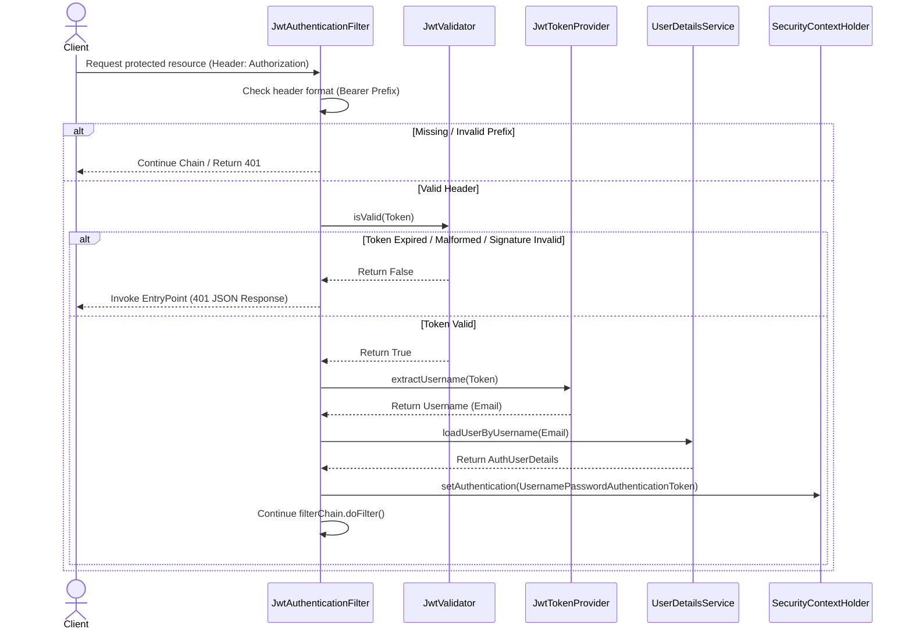
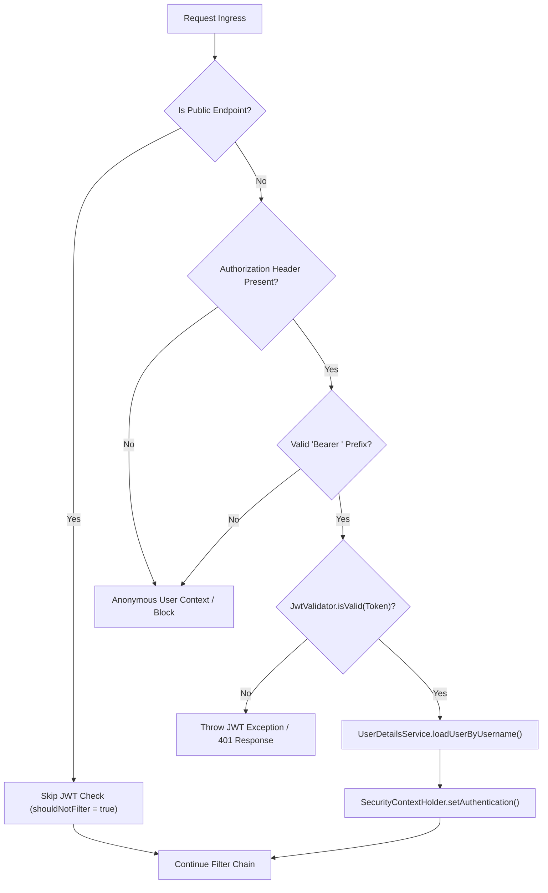

# JWT Filter Integration Specification

## Document Metadata

| Metadata Field | Value |
|---|---|
| Document Type | Security & Compliance / JWT Filter Integration |
| Version | 1.0.0 |
| Status | Published |
| Owner | Principal Security Architect |
| Reviewer | CISO / Security Architect |
| Last Updated | 2026-07-23 |

---

# Executive Summary

This JWT Filter Integration Specification defines how JSON Web Tokens are parsed, validated, and mapped to authenticated security sessions within the Spring Security request lifecycle. By implementing a customized `OncePerRequestFilter` and positioning it before `UsernamePasswordAuthenticationFilter`, the platform blocks unauthorized requests before they reach resource endpoints.

---

# Request Verification Flow

The diagram below models request intercepting, Bearer token validations, claims extracting, user details matching, and security context mapping:

---

# Filter Execution Lifecycle

The lifecycle diagram below maps filter lifecycle states and bypass paths:

---

# Security Best Practices

The JWT filter enforces the following integration controls:

* **Positioning before UsernamePasswordAuthenticationFilter:** JWT authentication replaces standard username/password form logins. Positioning the filter before the default filter guarantees token validations occur first.
* **Skipping Public Endpoints:** Override `shouldNotFilter` using path matchers (e.g. `/api/v1/auth/login`) to bypass the token check, reducing latency for public routes.
* **Stateless Token Verification:** The filter verifies signatures locally without database hits. To validate user statuses (active, locked), it queries `UserDetailsService` (which can be optimized using Redis cache lookups).

---

# Conclusion

The JWT Filter Integration Specification defines how JSON Web Tokens are parsed, validated, and mapped to authenticated security sessions within the Spring Security request lifecycle. Placing the filter before `UsernamePasswordAuthenticationFilter` secures the ProjectMind AI Auth Service against unauthorized access.

---

# Revision History

| Version | Date | Author / Role | Summary of Changes |
|---|---|---|---|
| 0.1.0 | 2026-07-23 | Security Architect | Initial creation of the JWT Filter Integration Spec. |
