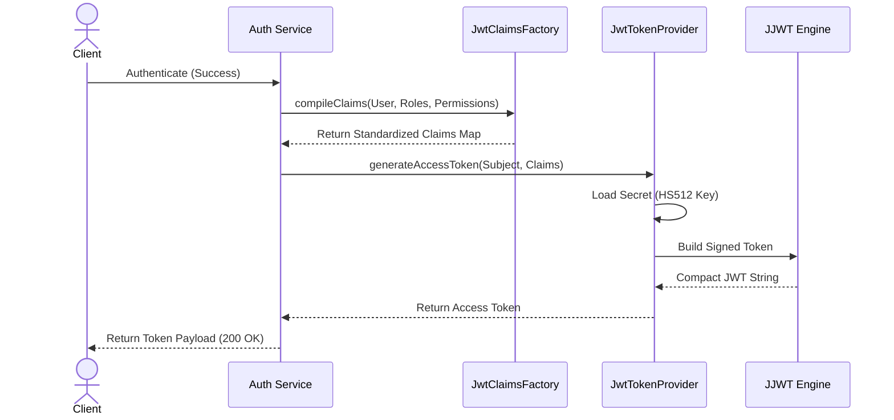
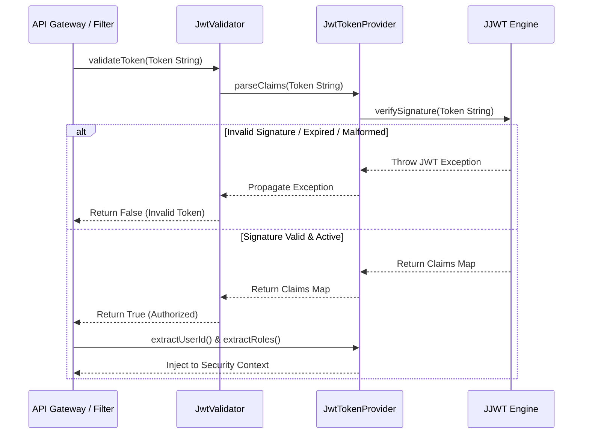

# JWT Infrastructure Specification

## Document Metadata

| Metadata Field | Value |
|---|---|
| Document Type | Security & Compliance / JWT Infrastructure |
| Version | 1.0.0 |
| Status | Published |
| Owner | Principal Security Architect |
| Reviewer | CISO / Security Architect |
| Last Updated | 2026-07-23 |

---

# Executive Summary

This JWT Infrastructure Specification defines the cryptographic parameters, claims factories, verification validations, and exception mappings governing the ProjectMind AI session token lifecycle. Configured under Java 21, Spring Security 6, and JJWT 0.12.x, the infrastructure implements HMAC SHA-512 signatures to secure stateless client API interactions.

---

# JWT Generation Flow

The diagram below models authentication success, claims compilation, and signed JWT access token creation:

---

# JWT Validation Flow

The diagram below models JWT ingress checking, signature parsing, expirations verification, and claims extract:

---

# Security Configuration Variables

JWT parameters configured inside `application.yml` and loaded by `JwtProperties`:

| Config Variable | Type | Purpose | Default / Recommended Value |
|---|---|---|---|
| `jwt.secret` | String | Base64-encoded secret key used to sign tokens. | Must be at least 512 bits for HS512. |
| `jwt.access-token-expiration` | Long | Expiration time of access tokens in milliseconds. | `900000` (15 minutes). |
| `jwt.refresh-token-expiration` | Long | Expiration time of refresh tokens in milliseconds. | `604800000` (7 days). |
| `jwt.issuer` | String | Identifier of the authentication server. | `ProjectMind AI-IdP` |
| `jwt.audience` | String | Target audience identifier check. | `ProjectMind AI-Client` |
| `jwt.clock-skew` | Long | Allowed clock drift verification in seconds. | `60` (1 minute). |

---

# Security Best Practices

The JWT infrastructure enforces the following security controls:

* **HMAC SHA-512 Algorithm:** Ensures access tokens are signed using the HS512 algorithm, requiring a secret key of at least 512 bits.
* **Base64 Encoded Secret:** Secrets are loaded from vault managers as Base64-encoded strings, avoiding cleartext variables.
* **Short-Lived Access Tokens:** Access tokens expire in 15 minutes, limiting exposure if a token is compromised.
* **Refresh Token Blacklisting:** Active refresh tokens are blacklisted in Redis caches during logout events.

---

# Conclusion

The JWT Infrastructure Specification defines the cryptographic parameters, claims factories, verification validations, and exception mappings. Implementing HMAC SHA-512 signatures, short-lived tokens, and structured claims ensures session security.

---

# Revision History

| Version | Date | Author / Role | Summary of Changes |
|---|---|---|---|
| 0.1.0 | 2026-07-23 | JWT Security Expert | Initial creation of the JWT Infrastructure Specification. |
