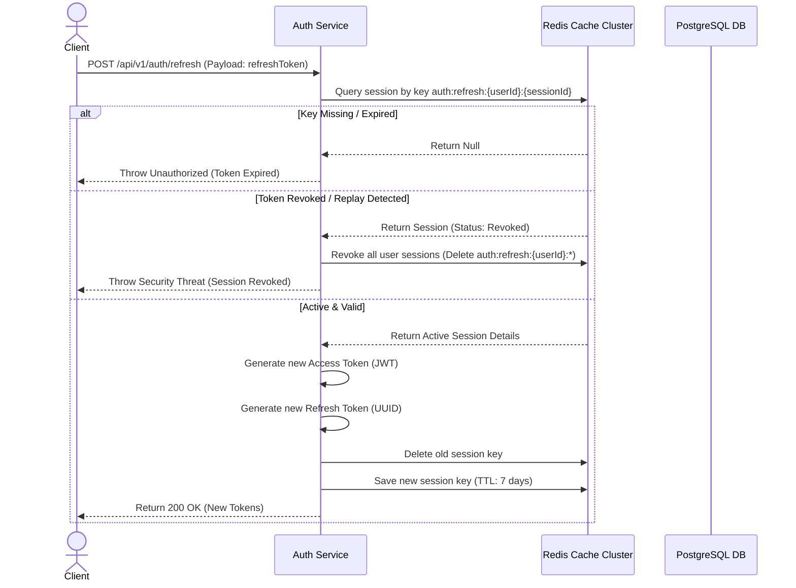

# Redis Session & Refresh Token Specification

## Document Metadata

| Metadata Field | Value |
|---|---|
| Document Type | Security & Compliance / Redis Session Management |
| Version | 1.0.0 |
| Status | Published |
| Owner | Principal Security Architect |
| Reviewer | CISO / Security Architect |
| Last Updated | 2026-07-23 |

---

# Executive Summary

This Redis Session & Refresh Token Specification defines the key namespaces, caching schemas, serialization configurations, and session management boundaries governing the Auth Service caching tier. Using Redis as a high-speed token store, the platform supports multi-device sessions tracking, token rotation rules, and instant logout revocations.

---

# Refresh Token Rotation Flow

The diagram below models token rotation request ingress, validation checks against Redis records, key updates, and response generation:



---

# Redis Key Strategy

To coordinate cached sessions and avoid key collision parameters, the platform uses structured naming spaces:

```text
auth:refresh:{userId}:{sessionId}
```

### Key Components
* **`auth:refresh`:** Prefix namespace isolating session records from general application cache keys.
* **`{userId}`:** The UUID identifying the owner user profile.
* **`{sessionId}`:** A unique UUID generated per login connection to track multiple devices.

---

# Session Schema Model

Session objects are serialized and stored as JSON strings in Redis:

| Field Name | Type | Purpose |
|---|---|---|
| `userId` | UUID | UUID of the session user. |
| `sessionId` | UUID | Session identifier. |
| `refreshToken` | String | Hashed refresh token string. |
| `ipAddress` | String | Client IP address. |
| `device` | String | Device type (Mobile, Desktop, Web). |
| `browser` | String | Browser agent header. |
| `loginTime` | DateTime | Timestamp logging session initiation. |
| `expiresAt` | DateTime | Expiration timestamp (TTL maps this setting). |

---

# Conclusion

The Redis Session & Refresh Token Specification defines key namespaces, caching schemas, serialization configurations, and session management boundaries. Using Redis as a high-speed token store secures the platform's authentication layer.

---

# Revision History

| Version | Date | Author / Role | Summary of Changes |
|---|---|---|---|
| 0.1.0 | 2026-07-23 | SRE Lead / Architect | Initial creation of the Redis Session Management Spec. |
