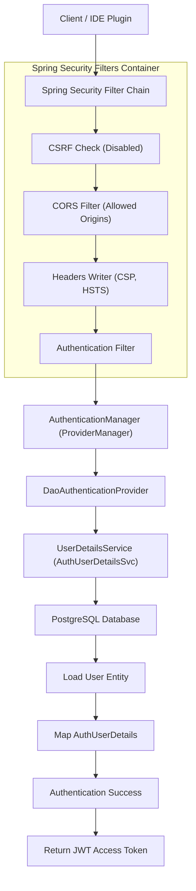

# Spring Security Foundation Specification

## Document Metadata

| Metadata Field | Value |
|---|---|
| Document Type | Security & Compliance / Spring Security Foundation |
| Version | 1.0.0 |
| Status | Published |
| Owner | Principal Security Architect |
| Reviewer | CISO / Security Architect |
| Last Updated | 2026-07-23 |

---

# Executive Summary

This Spring Security Foundation Specification outlines the authentication filters, CORS boundaries, endpoint gates, and method-level access controls securing the ProjectMind AI Auth Service. Configured under Spring Security 6 and Java 21, the security foundation implements stateless session boundaries, robust HTTP headers, and customizable exception handling.

---

# Security Flow Architecture

The flow diagram below models the gateway request ingress, security filter chain processing, and authentication provider validation:

---

# Endpoint Security Rules

The security filter chain divides REST endpoint routing patterns as follows:

### Public Endpoints (Permit All)
* **Authentication REST Routes:**
  * `POST /api/v1/auth/register`
  * `POST /api/v1/auth/login`
  * `POST /api/v1/auth/refresh`
  * `POST /api/v1/auth/forgot-password`
  * `POST /api/v1/auth/reset-password`
* **API Documentation Frameworks:**
  * `/v3/api-docs/**`
  * `/swagger-ui/**`
  * `/swagger-ui.html`
* **Kubernetes Probes Telemetry:**
  * `/actuator/health/**`
  * `/actuator/prometheus`

### Protected Endpoints (Authenticate All)
* All other application routes (e.g. `/api/v1/projects/**`, `/api/v1/ai/**`) require valid JWT bearer tokens.

---

# Security Exception Handling & Responses

Authentication and authorization errors return standardized `ApiResponse` payloads matching the platform's API specifications:

* **Authentication Entry Point (401 Unauthorized):**
  * Invoked when requests lack valid credentials.
  * *Response:* `ApiResponse` payload with code `UNAUTHORIZED_ACCESS` and status 401.
* **Access Denied Handler (403 Forbidden):**
  * Invoked when authenticated users lack required roles or permissions.
  * *Response:* `ApiResponse` payload with code `FORBIDDEN_ACTION` and status 403.

---

# Security HTTP Headers Policy

To protect against web application vulnerabilities, the security filter chain configures the following HTTP response headers:

* `X-Content-Type-Options: nosniff` (Prevents MIME sniffing attacks).
* `X-Frame-Options: DENY` (Prevents clickjacking attacks).
* `Content-Security-Policy: default-src 'self'` (Restricts resource load boundaries).
* `Referrer-Policy: no-referrer` (Prevents referrer leaks).
* `Strict-Transport-Security: max-age=31536000; includeSubDomains` (Enforces HTTPS).

---

# Conclusion

The Spring Security Foundation Specification defines the authentication filters, CORS boundaries, endpoint gates, and method-level access controls. Implementing stateless session boundaries, secure headers policies, and custom exception handlers ensures the Auth Service remains resilient.

---

# Revision History

| Version | Date | Author / Role | Summary of Changes |
|---|---|---|---|
| 0.1.0 | 2026-07-23 | CISO / Architect | Initial creation of the Spring Security Foundation Specification. |
