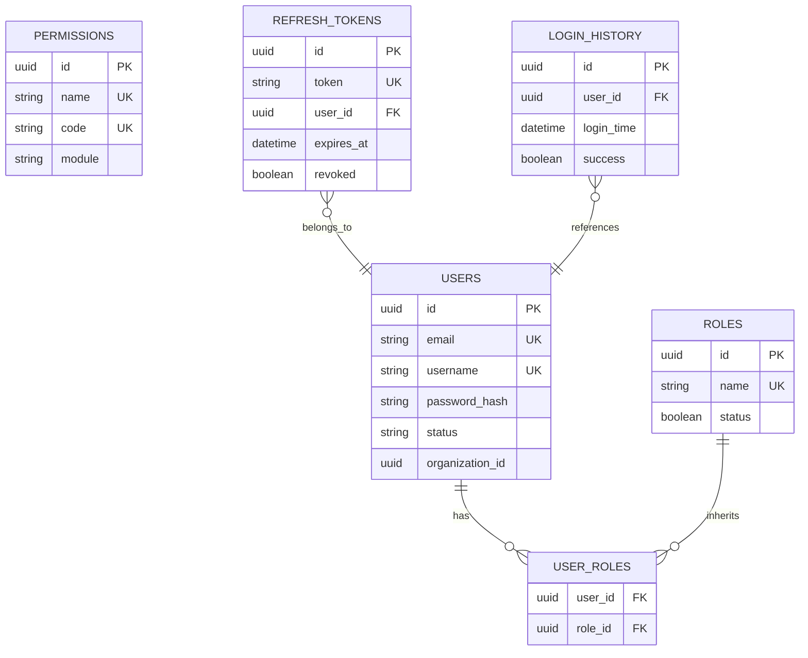

# Entity Persistence Specification

## Document Metadata

| Metadata Field | Value |
|---|---|
| Document Type | Database Design / Entity Persistence Specification |
| Version | 1.0.0 |
| Status | Published |
| Owner | Principal Database Architect |
| Reviewer | Developer / Principal Architect |
| Last Updated | 2026-07-23 |

---

# Executive Summary

This Entity Persistence Specification details the physical JPA mapping definitions, indexes, fetch strategies, and design decisions governing the Auth Service data tier. Configured under Java 21 LTS and Spring Data JPA, the entity layer enforces relational integrity, logical tenant partitioning, and secure transaction boundaries.

---

# Entity Relationships

The diagram below models database relations, cardinality metrics, and cascading boundaries:

---

# Database Mapping & Indexes Schema

The table below catalogs table schemas, indexes, and constraint mappings:

| Entity Name | Target Table | Primary Key | Foreign Keys | Indexes / Unique Constraints |
|---|---|---|---|---|
| **User** | `users` | `id` (UUID) | None | `uk_users_email`, `uk_users_username`, `idx_users_email`, `idx_users_username`, `idx_users_org`. |
| **Role** | `roles` | `id` (UUID) | None | `uk_roles_name`, `idx_roles_name`. |
| **Permission**| `permissions`| `id` (UUID) | None | `uk_permissions_name`, `uk_permissions_code`, `idx_permissions_name`, `idx_permissions_code`. |
| **RefreshToken**| `refresh_tokens`| `id` (UUID) | `user_id` | `uk_refresh_tokens_token`, `idx_refresh_tokens_token`. |
| **LoginHistory**| `login_history` | `id` (UUID) | `user_id` | `idx_login_history_user`, `idx_login_history_time`. |

---

# Design Decisions & Performance Tuning

SRE and database architects enforce the following persistence guidelines:

* **Lazy Loading Fetch Strategy:** All relationships (ManyToMany, ManyToOne) are annotated with `FetchType.LAZY`. This prevents Hibernate from running N+1 select queries.
* **UUID as Primary Key:** All entities inherit UUID v4 generation keys (`BaseEntity`), avoiding sequential ID guessing attacks.
* **Securing String Serialization:** Exclude passwords (`passwordHash`), binary attributes, and association fields from Lombok `toString` and `equals` overrides. This blocks credentials leakage into trace logs and prevents infinite loops during JSON marshaling.
* **Optimistic Locking:** The system inherits the `@Version` property from `AuditEntity`. Updates are checked for conflicts, rejecting stale transactions.

---

# Conclusion

The Entity Persistence Specification defines the physical mapping parameters, lazy loading strategies, unique constraint indexes, and security controls governing the Auth Service database. By implementing JSR validation checks, optimistic locking, and secure toString exclusions, this layer provides a stable, performant, and secure domain model.

---

# Revision History

| Version | Date | Author / Role | Summary of Changes |
|---|---|---|---|
| 0.1.0 | 2026-07-23 | Database Architect | Initial creation of the Entity Persistence Specification. |
