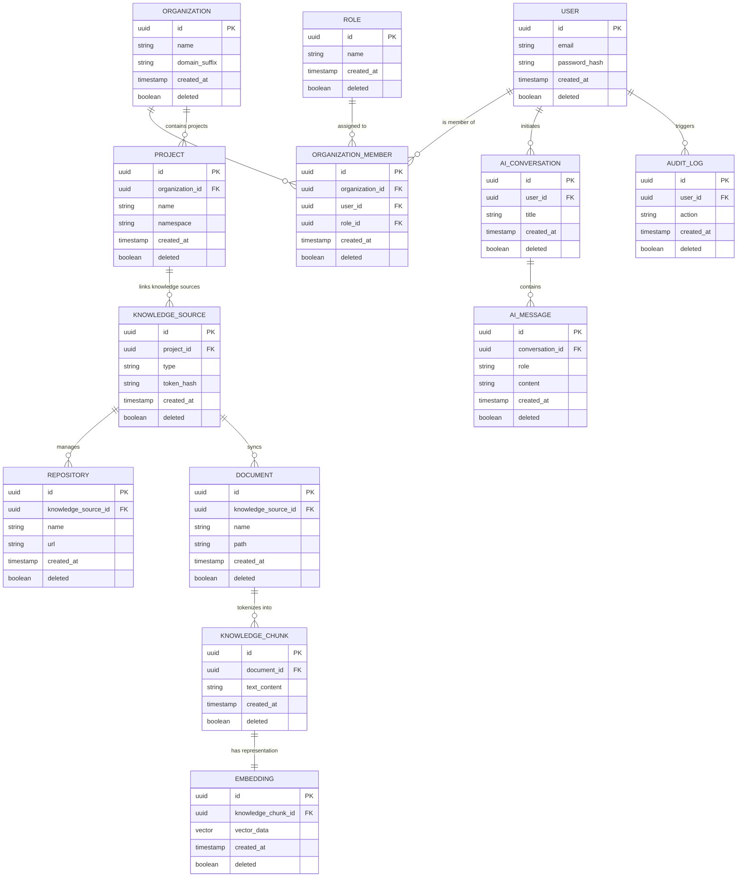

# Entity Relationship Diagram

## Document Metadata

| Metadata Field | Value |
|---|---|
| Document Type | Database Design / ER Diagram |
| Version | 1.0.0 |
| Status | Published |
| Owner | Portfolio Developer |
| Reviewer | Portfolio Developer |
| Last Updated | 2026-07-22 |

---

# Executive Summary

An Entity Relationship (ER) Diagram visually structures the database entities, attributes, primary/foreign keys, and cardinalities that support the ProjectMind AI platform. This document models the logical layout of the database tier, guiding developers through entity relationship setups and database integrity governance.

This model provides clear structures for logical multi-tenancy partitioning, data ownership by services, and vector similarity graph matching, ensuring database performance remains robust under peak query loads.

---

# Database Overview

ProjectMind AI's data architecture is guided by the following principles:

* **Logical Data Model:** The database model combines relational metadata schemas (users, project settings, sync logs) and semantic vector data configurations (embeddings, vector dimensions) within a single unified database.
* **Multi-Tenant Design:** Tenant isolation is enforced logically using an organization identifier (`organization_id`). Every tenant record links to this identifier, and select queries filter out other organizations' data dynamically.
* **Entity Relationships:** Dependencies flow downwards from the parent tenant (Organization) through logical workspaces (Projects) to API connections (Knowledge Sources), which compile index assets (Documents, Chunks, Embeddings). Developer activities are tracked independently through conversation log structures (Conversations, Messages) and security logs (Audit Logs).
* **Ownership Principles:** Each microservice owns its respective entities. Cross-service entity associations use foreign key checks, but microservices modify only their owned tables, preventing direct DB-level connection locks.

---

# Entity List

The entities defining the ProjectMind AI MVP schema are cataloged below:

| Entity Name | Logical Description | Owner Microservice |
|---|---|---|
| **Organization** | Bounded corporate account workspace and configuration mappings. | Organization Service |
| **User** | Registered platform user credentials and profile metadata. | Authentication Service |
| **Role** | Predefined security privilege sets (Engineer, Tech Lead, Admin). | Authentication Service |
| **OrganizationMember** | Associates a user account with a tenant organization and role. | Organization Service |
| **Project** | Project workspace grouping codebase repositories and tickets. | Project Service |
| **KnowledgeSource** | Connector connection credentials (GitHub token, Jira URL). | Knowledge Service |
| **Repository** | Details of connected code repositories synced from GitHub. | Knowledge Service |
| **Document** | Pointers to ingested codebase files, Jira tickets, or Confluence pages. | AI Service |
| **KnowledgeChunk** | Segmented text chunks parsed from ingested documents. | AI Service |
| **Embedding** | Mathematical vector arrays representing chunk semantics. | AI Service |
| **AIConversation** | Q&A session thread created by a developer. | Search Service |
| **AIMessage** | Context-grounded Q&A messages inside a conversation thread. | Search Service |
| **AuditLog** | Immutable security log tracking portal settings edits and queries. | Administration Service |

---

# Relationship Matrix

The logical dependencies and cardinalities connecting platform entities are detailed below:

| Parent Entity | Child Entity | Relationship Description | Cardinality |
|---|---|---|---|
| **Organization** | **OrganizationMember** | Organization hosts member accounts | 1:N (One-to-Many) |
| **User** | **OrganizationMember** | User joins organization | 1:N (One-to-Many) |
| **Role** | **OrganizationMember** | Role determines member access | 1:N (One-to-Many) |
| **Organization** | **Project** | Organization contains project workspaces | 1:N (One-to-Many) |
| **Project** | **KnowledgeSource** | Project groups external source connectors | 1:N (One-to-Many) |
| **KnowledgeSource** | **Repository** | Connector syncs repository metadata | 1:N (One-to-Many) |
| **KnowledgeSource** | **Document** | Connector syncs text documents/pages | 1:N (One-to-Many) |
| **Document** | **KnowledgeChunk** | Document is segmented into text chunks | 1:N (One-to-Many) |
| **KnowledgeChunk** | **Embedding** | Text chunk has semantic vector matching | 1:1 (One-to-One) |
| **User** | **AIConversation** | User initiates lookup session threads | 1:N (One-to-Many) |
| **AIConversation** | **AIMessage** | Thread contains Q&A messages log | 1:N (One-to-Many) |
| **User** | **AuditLog** | User actions trigger audit logs | 1:N (One-to-Many) |

---

# Mermaid ER Diagram

The logical relationships, cardinalities, and attributes of ProjectMind AI are modeled below using Mermaid ER syntax:

---

# Data Ownership

To guarantee microservices autonomy and clean separation of concerns, data ownership boundaries are defined below:

| Entity Name | Owner Microservice | Write Privileges |
|---|---|---|
| **Organization** | Organization Service | Organization Service |
| **User** | Authentication Service | Authentication Service |
| **Role** | Authentication Service | Authentication Service |
| **OrganizationMember** | Organization Service | Organization Service |
| **Project** | Project Service | Project Service |
| **KnowledgeSource** | Knowledge Service | Knowledge Service |
| **Repository** | Knowledge Service | Knowledge Service |
| **Document** | AI Service | AI Service, Knowledge Service (Ingestion) |
| **KnowledgeChunk** | AI Service | AI Service |
| **Embedding** | AI Service | AI Service |
| **AIConversation** | Search Service | Search Service |
| **AIMessage** | Search Service | Search Service |
| **AuditLog** | Administration Service | All Services (Append-only write triggers) |

---

# Entity Lifecycle

Entities progress through key operational states:

* **Creation:** Organizations and users are registered during setup. Projects and Connectors (Knowledge Sources) are created by administrators. Ingested resources (Documents, Chunks, Embeddings) are created asynchronously by sync workers.
* **Updates:** Project configurations and user role parameters can be updated via administrative panels. Index vectors are updated incrementally using Git commit webhooks.
* **Archiving:** Inactive workspaces and connectors can be soft-deleted. The system flags the `deleted` field to `true`, disabling matches queries while retaining index configurations.
* **Deletion:** Permanent deletion (hard delete) of user data or index embeddings is executed strictly for compliance audits (GDPR right to be forgotten) or system space purges.

---

# Multi-Tenant Isolation

ProjectMind AI isolates tenant data through strict database controls:
* **Tenancy Filtering:** The `organization_id` foreign key is present on Projects and User Member tables. Queries automatically filter selections by the user's active tenant ID retrieved from their JWT.
* **Partitioned Vectors:** Vector embeddings database indices are partitioned or tagged by project workspace ID, preventing cross-tenant vector searches.
* **Credentials Isolation:** Integration tokens connected to external APIs (GitHub/Jira keys) are encrypted using keys unique to each tenant organization.

---

# Design Principles

The ProjectMind AI Entity Relationship model adheres to five core database principles:

* **Normalization:** relational schemas are normalized to 3NF, minimizing data redundancy.
* **Data Integrity:** Strict data-type boundary checks, non-nullable constraints, and uniqueness checks ensure consistency.
* **Referential Integrity:** Enforce explicit Foreign Key checks with ON DELETE RESTRICT on core tables, preventing cascade data loss.
* **Auditability:** Every entity features auditing timestamps (`created_at`, `updated_at`, `version`) to track modifications.
* **Scalability:** Separating vector database structures (Embeddings) from metadata tables allows high-volume indexing configurations to scale independently.

---

# Risks

Entity relationship execution faces key database risks:

### Cascade Deletion Hazards
* *Risk:* Deactivating an organization cascades and hard-deletes all associated projects and historical logs.
* *Mitigation:* Enforce soft-delete flags globally. Configure FK constraints with RESTRICT triggers instead of CASCADE on parent tables.

### Vector Search Timeout
* *Risk:* Bulk inserts of code commits lock tables, slowing user search queries.
* *Mitigation:* Index vectors asynchronously using delta staging tables.

---

# Conclusion

The ProjectMind AI Entity Relationship Diagram defines the logical entity layout, dependencies, cardinalities, and ownership bounds. By enforcing logically isolated multi-tenancy, B-Tree and pgvector similarity indexing, and soft-delete audits, this model prepares the the developer to construct secure database tables and write JPA repository classes.

---

# Revision History

| Version | Date | Author / Role | Summary of Changes |
|---|---|---|---|
| 0.1.0 | 2026-07-22 | Developer / Architect | Initial creation of the ER Diagram Document. |
