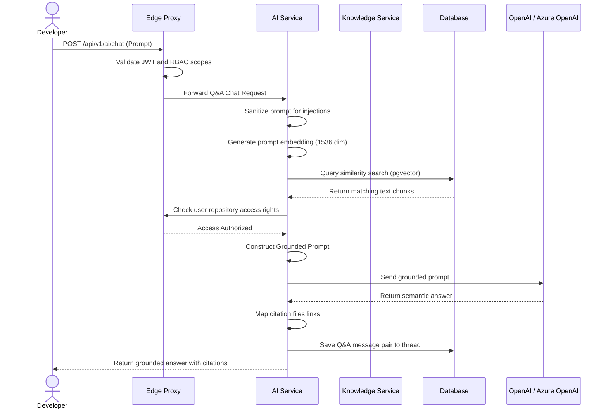

# AI API

## Document Metadata

| Metadata Field | Value |
|---|---|
| Document Type | API Design / AI API Specification |
| Version | 1.0.0 |
| Status | Published |
| Owner | Portfolio Developer |
| Reviewer | Portfolio Developer |
| Last Updated | 2026-07-22 |

---

# Executive Summary

The AI Service manages user query groundings, Retrieval-Augmented Generation (RAG) prompts assembly, citation matches extraction, and conversational sessions tracking. By wrapping Spring AI calls and interfacing with OpenAI and Azure OpenAI endpoints, it translates raw developer questions into grounded, context-aware answers, citing exact repository file structures, Jira tickets, and Confluence spaces.

This document defines the twelve core APIs of the AI Service, details validation policies, maps access roles to an authorization matrix, outlines auditing events, and charts the RAG execution pipeline.

---

# AI Service Responsibilities

The AI Service is responsible for the following domain bounds:

* **AI Chat:** Managing stateless and stateful conversation history loops.
* **Retrieval-Augmented Generation (RAG):** Injecting relevant metadata source chunks into LLM prompt contexts.
* **Semantic Search:** Executing vector similarity matching queries using pgvector.
* **Context Retrieval:** Fetching and ranking matching text segments.
* **Conversation Management:** Initializing, listing, and clearing developer chat threads.
* **AI Summarization:** Compiling descriptions of code directories, tickets lists, and commit histories.
* **AI Insights:** Synthesizing technical onboarding paths and code patterns.
* **Citation Generation:** Parsing output answers to map exact source file URLs and ticket identifiers.
* **Suggested Questions:** Proposing follow-up search terms based on conversation context.
* **AI Feedback:** Gathering user helpfulness ratings to monitor model performance.

---

# API Inventory

The AI Service exposes the following endpoints:

| API ID | Endpoint | Method | Purpose |
|---|---|---|---|
| **AI-001** | `/api/v1/ai/ask` | POST | Submit a single-shot, context-grounded Q&A prompt. |
| **AI-002** | `/api/v1/ai/chat` | POST | Submit a query within an active conversation thread. |
| **AI-003** | `/api/v1/ai/conversations` | GET | Retrieve conversation thread history for the active user. |
| **AI-004** | `/api/v1/ai/conversations/{conversationId}` | GET | Retrieve messages log for a specific conversation thread. |
| **AI-005** | `/api/v1/ai/conversations/{conversationId}` | DELETE | Soft-delete a conversation thread and messages logs. |
| **AI-006** | `/api/v1/ai/summarize` | POST | Generate a summary of a codebase file or Jira ticket list. |
| **AI-007** | `/api/v1/ai/insights` | POST | Synthesize onboarding paths or codebase insights. |
| **AI-008** | `/api/v1/ai/context` | POST | Retrieve raw ranked context chunks without calling the LLM. |
| **AI-009** | `/api/v1/ai/messages/{messageId}/citations` | GET | List citation sources referenced by a specific AI answer. |
| **AI-010** | `/api/v1/ai/suggested` | GET | Propose follow-up questions based on the active thread. |
| **AI-011** | `/api/v1/ai/feedback` | POST | Submit user helpfulness ratings (thumb up/down) for an answer. |
| **AI-012** | `/api/v1/ai/conversations/{conversationId}/clear` | POST | Invalidate messages log in a thread while keeping the session ID. |

---

# API DETAILS

---

## AI-001: Ask AI
### Purpose
Submits a single-shot Q&A query, returning a context-grounded answer.
### Endpoint
`POST /api/v1/ai/ask`
### Authentication Required
Yes
### Required Role
Owner, Admin, Project Manager, Developer, Viewer
### Path Parameters
None.
### Query Parameters
None.
### Request Body
| Field | Type | Required | Validation Rules |
|---|---|---|---|
| `projectId` | UUID | Yes | Target project workspace identifier. |
| `prompt` | String | Yes | Query text string; length 5 to 2000 characters. |
### Success Response
* **Status Code:** 200 OK
* **Response Body Envelope:**
```json
{
  "timestamp": "2026-07-22T23:39:45.000Z",
  "status": 200,
  "message": "AI query resolved successfully",
  "data": {
    "answer": "ProjectMind AI isolates tenant data using logical organization identifiers...",
    "citations": [
      {
        "documentId": "d1o2c3u4-m5e6-n7t8-s9q0-a1s2d3f4g5h6",
        "path": "file:///docs/08-database-design/DATABASE_SCHEMA.md",
        "score": 0.92
      }
    ]
  },
  "metadata": {
    "tokensUsed": 150,
    "model": "gpt-4o"
  }
}
```
### Error Responses
| HTTP Status | Error Code | Description |
|---|---|---|
| 400 | `INVALID_PARAMETER_VALUE` | Prompt violates length constraints or injection filters. |
| 403 | `ACCESS_DENIED` | User lacks project workspace authorization scopes. |
| 408 | `AI_SERVICE_TIMEOUT` | Downstream LLM API response exceeds timeout limits. |
| 429 | `RATE_LIMIT_EXCEEDED` | LLM rate limits triggered. |
| 503 | `AI_SERVICE_UNAVAILABLE` | AI Service connection error. |

---

## AI-002: AI Chat
### Purpose
Submits a query within an active conversation thread.
### Endpoint
`POST /api/v1/ai/chat`
### Authentication Required
Yes
### Required Role
Owner, Admin, Project Manager, Developer, Viewer
### Request Body
| Field | Type | Required | Validation Rules |
|---|---|---|---|
| `conversationId` | UUID | No | Existing thread UUID. If empty, a new thread is created. |
| `projectId` | UUID | Yes | Target project workspace identifier. |
| `prompt` | String | Yes | Query text string. |
### Success Response
* **Status Code:** 200 OK
* **Response Body Envelope:**
```json
{
  "timestamp": "2026-07-22T23:39:45.000Z",
  "status": 200,
  "message": "Chat prompt processed",
  "data": {
    "conversationId": "c1o2n3v4-s5e6-r7t8-p9o0-a1s2d3f4g5h6",
    "messageId": "m1e2s3s4-a5g6-e7t8-r9o0-a1s2d3f4g5h6",
    "answer": "To configure HNSW indexes, add pgvector commands...",
    "citations": []
  },
  "metadata": {}
}
```

---

## AI-003: Get Conversation History
### Purpose
Retrieves chat threads history for the active user.
### Endpoint
`GET /api/v1/ai/conversations`
### Authentication Required
Yes
### Required Role
Owner, Admin, Project Manager, Developer, Viewer
### Query Parameters
* `projectId` (UUID): Target project workspace ID.
* `page`, `size`, `sort` (standard pagination parameters).
### Success Response
* **Status Code:** 200 OK

---

## AI-004: Get Conversation Details
### Purpose
Retrieves the messages log for a specific conversation thread.
### Endpoint
`GET /api/v1/ai/conversations/{conversationId}`
### Authentication Required
Yes
### Required Role
Owner, Admin, Project Manager, Developer, Viewer
### Path Parameters
* `conversationId` (UUID): Target conversation thread ID.
### Success Response
* **Status Code:** 200 OK

---

## AI-005: Delete Conversation
### Purpose
Soft-deletes a conversation thread and message logs.
### Endpoint
`DELETE /api/v1/ai/conversations/{conversationId}`
### Authentication Required
Yes
### Required Role
Owner, Admin, Project Manager, Developer, Viewer
### Path Parameters
* `conversationId` (UUID): Target conversation thread ID.
### Success Response
* **Status Code:** 200 OK

---

## AI-006: Generate Summary
### Purpose
Generates a summary of a codebase file or Jira ticket list.
### Endpoint
`POST /api/v1/ai/summarize`
### Authentication Required
Yes
### Required Role
Owner, Admin, Project Manager, Developer, Viewer
### Request Body
| Field | Type | Required | Validation Rules |
|---|---|---|---|
| `documentId` | UUID | Yes | Target document identifier. |
### Success Response
* **Status Code:** 200 OK

---

## AI-007: Generate Insights
### Purpose
Synthesizes technical onboarding paths or codebase insights.
### Endpoint
`POST /api/v1/ai/insights`
### Authentication Required
Yes
### Required Role
Owner, Admin, Project Manager, Developer
### Request Body
| Field | Type | Required | Validation Rules |
|---|---|---|---|
| `projectId` | UUID | Yes | Target project workspace ID. |
| `type` | String | Yes | Insight target (Onboarding, Complexity, Architecture). |
### Success Response
* **Status Code:** 200 OK

---

## AI-008: Retrieve Context
### Purpose
Retrieves raw ranked context chunks without calling the LLM.
### Endpoint
`POST /api/v1/ai/context`
### Authentication Required
Yes (Internal Service Call)
### Request Body
| Field | Type | Required | Validation Rules |
|---|---|---|---|
| `projectId` | UUID | Yes | Target project workspace ID. |
| `query` | String | Yes | Raw lookup query. |
### Success Response
* **Status Code:** 200 OK

---

## AI-009: Get Citation Sources
### Purpose
Lists citation sources referenced by a specific AI answer.
### Endpoint
`GET /api/v1/ai/messages/{messageId}/citations`
### Authentication Required
Yes
### Required Role
Owner, Admin, Project Manager, Developer, Viewer
### Path Parameters
* `messageId` (UUID): Target message ID.
### Success Response
* **Status Code:** 200 OK

---

## AI-010: Suggested Questions
### Purpose
Proposes follow-up questions based on the active thread context.
### Endpoint
`GET /api/v1/ai/suggested`
### Authentication Required
Yes
### Required Role
Owner, Admin, Project Manager, Developer, Viewer
### Query Parameters
* `conversationId` (UUID): Target conversation thread ID.
### Success Response
* **Status Code:** 200 OK

---

## AI-011: Submit AI Feedback
### Purpose
Submits user helpfulness ratings (thumbs up/down) for an answer.
### Endpoint
`POST /api/v1/ai/feedback`
### Authentication Required
Yes
### Required Role
Owner, Admin, Project Manager, Developer, Viewer
### Request Body
| Field | Type | Required | Validation Rules |
|---|---|---|---|
| `messageId` | UUID | Yes | Target message identifier. |
| `helpful` | Boolean | Yes | Helpfulness rating (true = thumbs up). |
| `comment` | String | No | Optional user feedback comment. |
### Success Response
* **Status Code:** 200 OK

---

## AI-012: Clear Conversation
### Purpose
Invalidates the messages log in a thread while keeping the session ID.
### Endpoint
`POST /api/v1/ai/conversations/{conversationId}/clear`
### Authentication Required
Yes
### Required Role
Owner, Admin, Project Manager, Developer, Viewer
### Path Parameters
* `conversationId` (UUID): Target conversation thread ID.
### Success Response
* **Status Code:** 200 OK

---

# AI Conversation Workflow

The sequence diagram below models the user Q&A execution flow, permissions checks, context extraction, and LLM grounding:



---

# Retrieval-Augmented Generation (RAG)

The AI Service employs a RAG indexing execution pipeline:

* **Knowledge Retrieval:** Converts user queries into vector embeddings and queries pgvector.
* **Chunk Selection:** Retains the top-k chunks (defaulting to 5) that exceed similarity thresholds.
* **Embedding Similarity:** Uses cosine similarity equations to score semantic relevance.
* **Prompt Construction:** Injects retrieved chunks as context alongside the system instructions into the LLM prompt.
* **Citation Mapping:** Maps document IDs of retrieved chunks to generate clickable file links for the user.
* **Response Generation:** Generates grounded answers based on the provided context.

---

# Validation Rules

* **Prompt Validation:** Rejects prompts containing markdown tag injections or system instruction hijack payloads.
* **Empty Prompt Handling:** Rejects empty or whitespace-only inputs (*400 Bad Request*).
* **Maximum Prompt Length:** Restricts prompts to 2000 characters to prevent token limits overflow.
* **Context Size:** Context injections are capped at 4000 tokens to protect downstream API rate paces.
* **Token Limit:** Monitored dynamically to prevent LLM API budget overruns.
* **Conversation Ownership:** Users can query or clear only the conversation IDs linked to their active JWT.
* **AI Timeout Handling:** Standardizes response timeouts at 15 seconds; timeouts return a *408 AI Service Timeout* error code.

---

# Authorization Matrix

Permissions mappings governing AI API access:

| Target Role | Allowed APIs |
|---|---|
| **Owner** | `AI-001` through `AI-012` |
| **Admin** | `AI-001` through `AI-012` |
| **Project Manager** | `AI-001` through `AI-012` |
| **Developer** | `AI-001` (Ask), `AI-002` (Chat), `AI-003` (List Threads), `AI-004` (Get Msg), `AI-005` (Delete Thread), `AI-006` (Summarize), `AI-007` (Insights), `AI-009` (Citations), `AI-010` (Suggested), `AI-011` (Feedback), `AI-012` (Clear Thread) |
| **Viewer** | `AI-001` (Ask), `AI-002` (Chat), `AI-003` (List Threads), `AI-004` (Get Msg), `AI-005` (Delete Thread), `AI-009` (Citations), `AI-010` (Suggested), `AI-011` (Feedback), `AI-012` (Clear Thread) |

---

# Error Code Matrix

Key exceptions returned by the AI APIs:

| Error Code | HTTP Status | Description |
|---|---|---|
| **INVALID_PARAMETER_VALUE** | 400 Bad Request | Invalid parameter formats or prompt length violations. |
| **TOKEN_EXPIRED** | 401 Unauthorized | JWT session has expired. |
| **ACCESS_DENIED** | 403 Forbidden | User lacks authorization in the target organization or project workspace. |
| **RESOURCE_NOT_FOUND** | 404 Not Found | Target Conversation, Message, or Project ID does not exist. |
| **AI_SERVICE_TIMEOUT** | 408 Request Timeout | LLM response exceeded the 15-second timeout window. |
| **RATE_LIMIT_EXCEEDED** | 429 Too Many Requests | User has exceeded prompt limits or LLM tokens limits. |
| **AI_SERVICE_UNAVAILABLE** | 503 Service Unavailable | Downstream LLM API connection error. |

---

# Audit Events

The AI Service logs immutable audit logs for the following actions:

* `AI_QUESTION_ASKED`: Tracked with user ID, project workspace, and prompt length.
* `AI_RESPONSE_GENERATED`: Tracked with response status and token usage.
* `CONTEXT_RETRIEVED`: Tracked with matching document IDs and similarity scores.
* `SUMMARY_GENERATED`: Tracked with target document ID.
* `INSIGHTS_GENERATED`: Tracked with project ID and insight type.
* `FEEDBACK_SUBMITTED`: Tracked with rating score (thumbs up/down).
* `CONVERSATION_DELETED`: Tracked when thread history is deleted.

---

# Risks

AI APIs face key operational and output quality risks:

### Hallucinations
* *Risk:* The LLM generates false context answers or references non-existent files.
* *Mitigation:* Restrict system prompts to answer strictly from the retrieved context chunks, instructing the model to say "I do not know" if context is missing.

### Prompt Injection
* *Risk:* User prompt hacks override system safety rules to reveal database details.
* *Mitigation:* Apply regex sanitizations to incoming prompts and enforce strict system boundaries.

### Sensitive Data Leakage
* *Risk:* Code structures or IP details are sent to public model training queues.
* *Mitigation:* Route all API calls to private corporate Azure OpenAI instances under strict non-ingestion agreements.

---

# Performance Considerations

* **Streaming Responses:** The chat API supports Server-Sent Events (SSE) to stream answers to the UI token-by-token, improving perceived performance.
* **Response Caching:** Standard Q&A queries and context retrievals are cached in Redis to speed up repeated queries.
* **Vector Search Optimization:** Partition pgvector indices by project ID using HNSW configurations.
* **Parallel Context Retrieval:** Search codebase and ticket vector partitions concurrently using Spring Boot async tasks.

---

# Conclusion

The AI API document establishes the detailed specifications, inputs, success configurations, validation parameters, and error codes for the ProjectMind AI AI Service. By enforcing RAG chunk groundings, input sanitizations, streaming responses, and private VPC model integrations, these APIs enable secure, conversational search across enterprise codebases.

---

# Revision History

| Version | Date | Author / Role | Summary of Changes |
|---|---|---|---|
| 0.1.0 | 2026-07-22 | Developer / Architect | Initial creation of the AI Assistant API Specification. |
