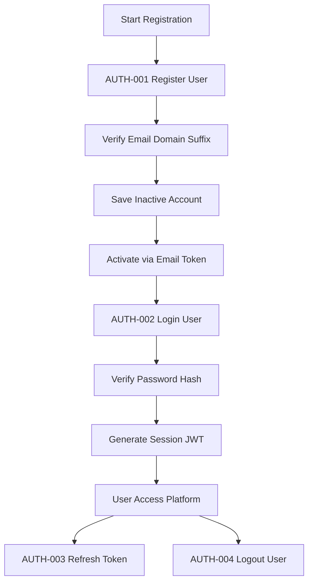
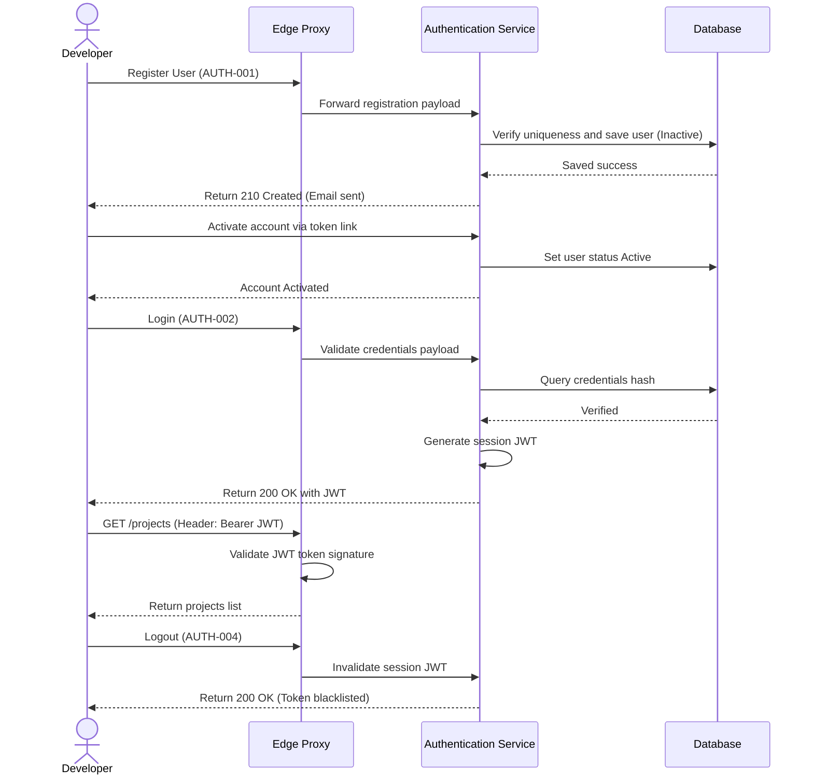

# Authentication API

## Document Metadata

| Metadata Field | Value |
|---|---|
| Document Type | API Design / Authentication API Specification |
| Version | 1.0.0 |
| Status | Published |
| Owner | Portfolio Developer |
| Reviewer | Portfolio Developer |
| Last Updated | 2026-07-22 |

---

# Executive Summary

The Authentication Service (Auth Service) governs access security, identity verification, user profile setup, and session management for the ProjectMind AI platform. It provides the gateway validation layer, mapping users to active corporate tenants and enforcing role-based permissions (RBAC) across all search and query requests.

This document details the eight core APIs required for the platform's MVP, specifying inputs, validation rules, success formats, error codes, sequence flows, and risk mitigations, serving as the blueprint for API controller and filter implementation.

---

# Authentication Flow

ProjectMind AI orchestrates user access, tokens validation, password resets, and session deactivations:

* **User Registration:** Signup is gated by Domain Suffix validation checks. Profiles are saved in an inactive state until email validation tokens are verified.
* **Login:** Compares credentials against bcrypt hashes, issuing secure JWT tokens on success.
* **JWT Generation & Validation:** Signed JSON Web Tokens (JWT) act as the stateless access ticket, verified at the API Gateway for every subsequent request.
* **Logout:** Deactivates user sessions, clearing local tokens on the client proxy.
* **Password Management:** Self-service flows trigger password change or reset tokens via secure emails.



---

# API Inventory

The Authentication Service exposes the following endpoints:

| API ID | Endpoint | Method | Purpose |
|---|---|---|---|
| **AUTH-001** | `/api/v1/auth/register` | POST | Register a new user profile within a tenant organization. |
| **AUTH-002** | `/api/v1/auth/login` | POST | Authenticate user credentials and issue session JWT. |
| **AUTH-003** | `/api/v1/auth/refresh` | POST | Rotate expired session JWTs using refresh tokens. |
| **AUTH-004** | `/api/v1/auth/logout` | POST | Terminate active user session and invalidate token. |
| **AUTH-005** | `/api/v1/auth/me` | GET | Retrieve authenticated profile details for current user. |
| **AUTH-006** | `/api/v1/auth/password/change` | POST | Change user password within an active logged-in session. |
| **AUTH-007** | `/api/v1/auth/password/forgot` | POST | Trigger a self-service password reset email with secure token. |
| **AUTH-008** | `/api/v1/auth/password/reset` | POST | Reset password using a valid secure verification token. |

---

# API DETAILS

---

## AUTH-001: Register User
### Purpose
Allows a developer or administrator to register a new platform profile.
### Endpoint
`POST /api/v1/auth/register`
### Authentication Required
No
### Request Body
| Field | Type | Required | Validation Rules |
|---|---|---|---|
| `name` | String | Yes | Length 2 to 100 characters. |
| `email` | String | Yes | Valid email format; suffix must match active organization domains. |
| `password` | String | Yes | Standard password complexity rules (length >= 8, mixed characters). |
### Success Response
* **Status Code:** 201 Created
* **Response Body Envelope:**
```json
{
  "timestamp": "2026-07-22T23:34:33.000Z",
  "status": 201,
  "message": "User registered successfully. Verification email sent.",
  "data": {
    "userId": "a1b2c3d4-e5f6-7a8b-9c0d-1e2f3a4b5c6d",
    "name": "Jane Developer",
    "email": "jane.dev@company.com",
    "status": "Inactive"
  },
  "metadata": {}
}
```
### Error Responses
| HTTP Status | Error Code | Description |
|---|---|---|
| 400 | `INVALID_PARAMETER_VALUE` | Email format is invalid or passwords constraints failed. |
| 409 | `DUPLICATE_RESOURCE` | The email address is already registered. |
| 422 | `DOMAIN_NOT_REGISTERED` | The email domain suffix is not associated with any active tenant organization. |
| 500 | `INTERNAL_SERVER_ERROR` | Ingestion mail queue or database transaction fails. |
### Business Rules
* The user's email domain suffix must match a registered corporate Organization tenant suffix.
* User account is initialized in an "Inactive" status until email token verification completes.
### Security Considerations
* Input strings must be sanitized to block script injections.
* The password must be hashed using bcrypt before writing to the database.

---

## AUTH-002: Login
### Purpose
Verifies credentials and issues session authorization tokens.
### Endpoint
`POST /api/v1/auth/login`
### Authentication Required
No
### Request Body
| Field | Type | Required | Validation Rules |
|---|---|---|---|
| `email` | String | Yes | Valid email syntax. |
| `password` | String | Yes | Non-empty string. |
### Success Response
* **Status Code:** 200 OK
* **Response Body Envelope:**
```json
{
  "timestamp": "2026-07-22T23:34:33.000Z",
  "status": 200,
  "message": "Login successful",
  "data": {
    "accessToken": "eyJhbGciOiJIUzI1NiIsInR5cCI6IkpXVCJ9...",
    "refreshToken": "d5f6g7h8-i9j0-k1l2-m3n4-o5p6q7r8s9t0",
    "expiresIn": 86400,
    "user": {
      "userId": "a1b2c3d4-e5f6-7a8b-9c0d-1e2f3a4b5c6d",
      "name": "Jane Developer",
      "email": "jane.dev@company.com",
      "role": "Engineer"
    }
  },
  "metadata": {}
}
```
### Error Responses
| HTTP Status | Error Code | Description |
|---|---|---|
| 401 | `INVALID_CREDENTIALS` | Password hash mismatch or non-matching email address. |
| 403 | `ACCOUNT_SUSPENDED` | The account is deactivated or locked due to excessive failures. |
### Business Rules
* Accounts are temporarily locked for 15 minutes after 5 consecutive failed login attempts.
* Users with "Inactive" status are blocked from logging in.
### Security Considerations
* Generates session JWT containing organization ID and role claims.
* Password credentials are processed using secure HTTPS.
* Lockout policies prevent brute-force attacks.

---

## AUTH-003: Refresh Token
### Purpose
Rotates an expired session JWT using a secure refresh token.
### Endpoint
`POST /api/v1/auth/refresh`
### Authentication Required
No
### Request Body
| Field | Type | Required | Validation Rules |
|---|---|---|---|
| `refreshToken` | UUID | Yes | Valid UUID v4 string. |
### Success Response
* **Status Code:** 200 OK
* **Response Body Envelope:**
```json
{
  "timestamp": "2026-07-22T23:34:33.000Z",
  "status": 200,
  "message": "Session token rotated successfully",
  "data": {
    "accessToken": "eyJhbGciOiJIUzI1NiIsInR5cCI6IkpXVCJ9.new...",
    "refreshToken": "h8i9j0k1-l2m3-n4o5-p6q7-r8s9t0u1v2w3",
    "expiresIn": 86400
  },
  "metadata": {}
}
```
### Error Responses
| HTTP Status | Error Code | Description |
|---|---|---|
| 401 | `INVALID_REFRESH_TOKEN` | Refresh token is expired, invalid, or already rotated. |
### Business Rules
* Refresh tokens can be used only once. Used tokens are immediately invalidated.
### Security Considerations
* Implements refresh token rotation (RTR) to detect token reuse attacks.

---

## AUTH-004: Logout
### Purpose
Invalidates the current session token.
### Endpoint
`POST /api/v1/auth/logout`
### Authentication Required
Yes (Bearer Token)
### Request Body
Empty body.
### Success Response
* **Status Code:** 200 OK
* **Response Body Envelope:**
```json
{
  "timestamp": "2026-07-22T23:34:33.000Z",
  "status": 200,
  "message": "Logout successful. Session token invalidated.",
  "data": {},
  "metadata": {}
}
```
### Error Responses
| HTTP Status | Error Code | Description |
|---|---|---|
| 401 | `TOKEN_EXPIRED` | JWT session has already expired. |
### Business Rules
* The active JWT signature is blacklisted in cache stores for its remaining duration.
### Security Considerations
* Tokens blacklist prevents token replay attacks.

---

## AUTH-005: Get Current User
### Purpose
Retrieves active profile details.
### Endpoint
`GET /api/v1/auth/me`
### Authentication Required
Yes (Bearer Token)
### Success Response
* **Status Code:** 200 OK
* **Response Body Envelope:**
```json
{
  "timestamp": "2026-07-22T23:34:33.000Z",
  "status": 200,
  "message": "User profile retrieved successfully",
  "data": {
    "userId": "a1b2c3d4-e5f6-7a8b-9c0d-1e2f3a4b5c6d",
    "name": "Jane Developer",
    "email": "jane.dev@company.com",
    "role": "Engineer",
    "organizationId": "z9y8x7w6-v5u4-t3s2-r1q0-p9o8n7m6l5k4"
  },
  "metadata": {}
}
```
### Error Responses
| HTTP Status | Error Code | Description |
|---|---|---|
| 401 | `TOKEN_EXPIRED` | JWT session token is invalid or expired. |
### Business Rules
* Returned scopes match parameters encrypted inside the request header's JWT.

---

## AUTH-006: Change Password
### Purpose
Changes user password within a logged-in session.
### Endpoint
`POST /api/v1/auth/password/change`
### Authentication Required
Yes (Bearer Token)
### Request Body
| Field | Type | Required | Validation Rules |
|---|---|---|---|
| `currentPassword` | String | Yes | Non-empty string. |
| `newPassword` | String | Yes | Password complexity rules. |
### Success Response
* **Status Code:** 200 OK
* **Response Body Envelope:**
```json
{
  "timestamp": "2026-07-22T23:34:33.000Z",
  "status": 200,
  "message": "Password changed successfully",
  "data": {},
  "metadata": {}
}
```
### Error Responses
| HTTP Status | Error Code | Description |
|---|---|---|
| 400 | `INVALID_PARAMETER_VALUE` | New password complexity checks failed. |
| 401 | `INVALID_CREDENTIALS` | Current password verification hash mismatch. |
### Business Rules
* New password cannot match the current password.

---

## AUTH-007: Forgot Password
### Purpose
Triggers a self-service password reset email.
### Endpoint
`POST /api/v1/auth/password/forgot`
### Authentication Required
No
### Request Body
| Field | Type | Required | Validation Rules |
|---|---|---|---|
| `email` | String | Yes | Valid email format. |
### Success Response
* **Status Code:** 200 OK
* **Response Body Envelope:**
```json
{
  "timestamp": "2026-07-22T23:34:33.000Z",
  "status": 200,
  "message": "If the email exists, a password reset link has been sent.",
  "data": {},
  "metadata": {}
}
```
### Error Responses
None. The API returns 200 OK even if the email does not exist to prevent account harvesting.
### Business Rules
* Generates a single-use password reset token with a 15-minute expiry.

---

## AUTH-008: Reset Password
### Purpose
Resets password using a verification token.
### Endpoint
`POST /api/v1/auth/password/reset`
### Authentication Required
No
### Request Body
| Field | Type | Required | Validation Rules |
|---|---|---|---|
| `token` | String | Yes | Valid reset token string. |
| `newPassword` | String | Yes | Password complexity rules. |
### Success Response
* **Status Code:** 200 OK
* **Response Body Envelope:**
```json
{
  "timestamp": "2026-07-22T23:34:33.000Z",
  "status": 200,
  "message": "Password has been reset successfully.",
  "data": {},
  "metadata": {}
}
```
### Error Responses
| HTTP Status | Error Code | Description |
|---|---|---|
| 400 | `INVALID_RESET_TOKEN` | Reset token is invalid or expired. |
| 422 | `PASSWORD_COMPLEXITY_FAILED` | Password complexity requirements failed. |
### Business Rules
* After success, all active refresh tokens for the user are invalidated, forcing a full login on all devices.

---

# JWT Token Structure

Session tokens signed by the Authentication Service contain the following structures:

* **Access Token:**
  * Type: JWT (signed using HMAC SHA-256 with system keys).
  * Expiration: 86400 seconds (24 hours).
  * Custom Claims:
    * `sub`: User UUID identifier.
    * `email`: User corporate email address.
    * `org_id`: Tenant Organization UUID identifier.
    * `role`: User permissions role string.
* **Refresh Token:**
  * Type: UUID v4 stored securely in the database with a 30-day expiry.

---

# Error Code Matrix

Common error codes returned by the Authentication APIs:

| Error Code | HTTP Status | Meaning |
|---|---|---|
| **INVALID_PARAMETER_VALUE** | 400 Bad Request | Email formatting or parameter checks failed. |
| **INVALID_CREDENTIALS** | 401 Unauthorized | Email mismatch or password hash verification failed. |
| **TOKEN_EXPIRED** | 401 Unauthorized | JWT token signature has expired. |
| **INVALID_REFRESH_TOKEN** | 401 Unauthorized | Refresh token has already been rotated or is invalid. |
| **ACCOUNT_SUSPENDED** | 403 Forbidden | User account is deactivated or suspended. |
| **DOMAIN_NOT_REGISTERED** | 422 Unprocessable | Email domain is not associated with any active organization. |

---

# Validation Rules

The Authentication Service enforces the following data validation rules:

* **Email Validation:** Checked against regex schemas; domains must match active domains registered by the organization admin.
* **Password Policy:** Minimum length of 8 characters, containing at least one uppercase letter, one lowercase letter, one numeric digit, and one special character.
* **Duplicate Account:** Registration attempts with an email already in the relational user table are blocked.
* **Account Status:** Active status is required for logins. Deactivated users cannot log in.
* **Token Expiry:** JWT keys expire after 24 hours; refresh tokens expire after 30 days.

---

# API Sequence

The sequence diagram below models the user registration, login, session queries, and logout flow:



---

# Risks

Authentication services face key security risks:

### Credential Stuffing
* *Risk:* Automated botnets scan login APIs attempting credentials matches.
* *Mitigation:* Implement rate limiting thresholds at the API Gateway and enforce lockouts after 5 consecutive failed login attempts.

### Token Hijacking
* *Risk:* Malicious scripts intercept session JWTs on developers' browsers.
* *Mitigation:* Enforce TLS 1.3 transit encryption, set HttpOnly cookie attributes, and rotate refresh tokens dynamically.

---

# Conclusion

The Authentication API document establishes the detailed specifications, inputs, success configurations, validation parameters, and error codes for the ProjectMind AI Auth Service. By enforcing domain gates, secure bcrypt hashing, single-use refresh token rotations, and token blacklisting, these APIs secure platform workspaces while enabling a smooth, self-service developer login lifecycle.

---

# Revision History

| Version | Date | Author / Role | Summary of Changes |
|---|---|---|---|
| 0.1.0 | 2026-07-22 | Developer / Architect | Initial creation of the Authentication API Specification. |
