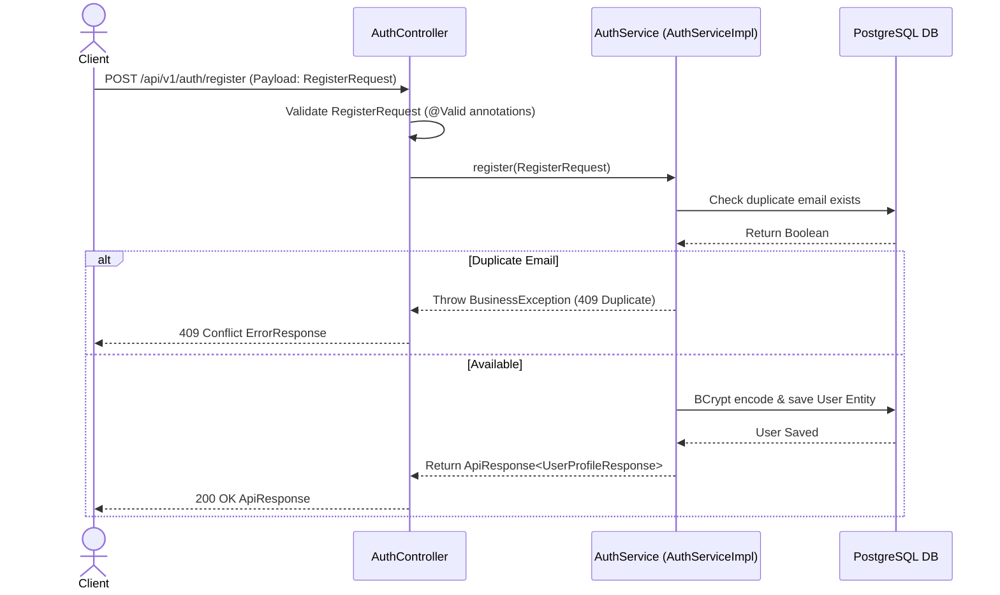
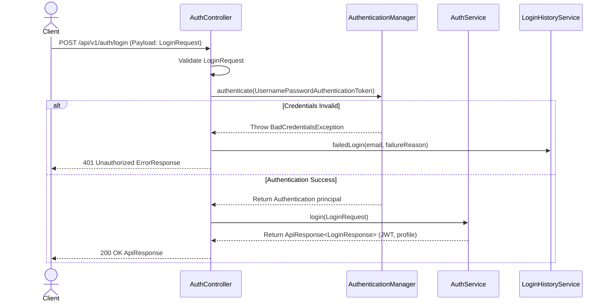

# Auth Service REST API Specification

## Document Metadata

| Metadata Field | Value |
|---|---|
| Document Type | API Design / REST API Specification |
| Version | 1.0.0 |
| Status | Published |
| Owner | REST API Architect |
| Reviewer | Developer / Principal Architect |
| Last Updated | 2026-07-23 |

---

# Executive Summary

This REST API Specification details the endpoint contracts, request/response models, and method authorizations governing the Auth Service controller layer. Configured under Spring Boot 3.5.x and documenting via Swagger/OpenAPI, these controllers delegate strictly to the Service tier to enforce access gates.

---

# Ingress Request Sequences

### User Registration Sequence

### User Login Sequence

---

# API Catalog & Path Variables

REST endpoints details exposed by the Auth Service:

### Authentication Controllers (`/api/v1/auth`)

* **User Register:** `POST /api/v1/auth/register` (Public)
  * *Request:* `RegisterRequest` (email, password, firstName, lastName, organizationId)
  * *Response:* `ApiResponse<UserProfileResponse>`
* **User Login:** `POST /api/v1/auth/login` (Public)
  * *Request:* `LoginRequest` (email, password)
  * *Response:* `ApiResponse<LoginResponse>`
* **Token Rotation:** `POST /api/v1/auth/refresh` (Public)
  * *Request:* `RefreshTokenRequest` (refreshToken)
  * *Response:* `ApiResponse<LoginResponse>`
* **Change Credentials:** `POST /api/v1/auth/change-password` (Authenticated)
  * *Request:* `ChangePasswordRequest` (oldPassword, newPassword)
  * *Response:* `ApiResponse<Void>`
* **Get Profiles:** `GET /api/v1/auth/profile` (Authenticated)
  * *Response:* `ApiResponse<UserProfileResponse>`

### Administrative User Controllers (`/api/v1/users`)

* **Query User Profiles:** `GET /api/v1/users/{id}`
  * *Authorization:* `@PreAuthorize("hasAnyRole('ORG_ADMIN', 'SUPER_ADMIN')")`
  * *Response:* `ApiResponse<UserProfileResponse>`
* **Lock User:** `PATCH /api/v1/users/{id}/lock`
  * *Authorization:* `@PreAuthorize("hasRole('SUPER_ADMIN')")`
  * *Response:* `ApiResponse<Void>`
* **Unlock User:** `PATCH /api/v1/users/{id}/unlock`
  * *Authorization:* `@PreAuthorize("hasRole('SUPER_ADMIN')")`
  * *Response:* `ApiResponse<Void>`

---

# Conclusion

The Auth Service REST API Specification outlines the REST API configurations, OpenAPI documentation parameters, and method authorizations governing the controllers layer. Decoupling routing from domain operations guarantees predictable, clean API interfaces.

---

# Revision History

| Version | Date | Author / Role | Summary of Changes |
|---|---|---|---|
| 0.1.0 | 2026-07-23 | API Lead / SRE | Initial creation of the REST API Specification. |
