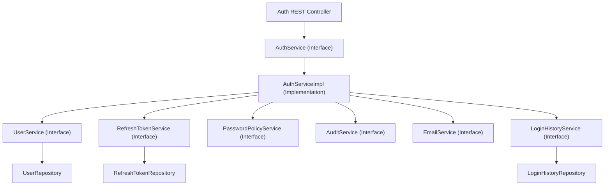

# Auth Service Service Layer Blueprint

## Document Metadata

| Metadata Field | Value |
|---|---|
| Document Type | API Design / Service Layer Blueprint |
| Version | 1.0.0 |
| Status | Published |
| Owner | Principal Java Architect |
| Reviewer | Developer / Principal Architect |
| Last Updated | 2026-07-23 |

---

# Executive Summary

This Service Layer Blueprint defines the service interfaces, class implementations, transaction boundaries, and design decisions governing the Auth Service business logic. By implementing DDD interfaces, constructor injection, Spring `@Transactional` annotations, and MapStruct DTO mappings, this layer coordinates logins, user accounts creations, role updates, and audits.

---

# Service Interfaces & Implementations Inventory

The service layer is composed of nine modules coordinating domain logic:

* **AuthService / AuthServiceImpl:** Authenticates users, rotates tokens, changes passwords, and manages logouts.
* **UserService / UserServiceImpl:** Manages user profile settings, account locks, and status changes.
* **RoleService / RoleServiceImpl:** Assigns and revokes user roles.
* **PermissionService / PermissionServiceImpl:** Assigns and revokes role permissions.
* **RefreshTokenService / RefreshTokenServiceImpl:** Manages refresh tokens generation, revocation, and expirations.
* **LoginHistoryService / LoginHistoryServiceImpl:** Audits login/logout events.
* **PasswordPolicyService / PasswordPolicyServiceImpl:** Enforces complexity rules, reuse block lists, and password history tracking.
* **EmailService:** (Interface Only) Exposes method contracts for verification, welcome, and recovery emails.
* **AuditService / AuditServiceImpl:** Logs system events for compliance.

---

# Dependency Flow & Architecture

The dependency flow model enforces dependency inversion, routing controller requests to service interfaces and implementations:

---

# Transaction Management Strategy

To ensure database consistency and prevent concurrency errors, services implement transactional boundaries:

* **Select Queries:** Annotate read-only queries with `@Transactional(readOnly = true)`. This allows Hibernate to skip dirty-checking checks, reducing memory usage.
* **Update / Write Operations:** Annotate modifying actions (registration, password change, lockouts) with `@Transactional(rollbackFor = Exception.class)`. This ensures modifications roll back on runtime failures.
* **Propagation Rules:** Use `Propagation.REQUIRED` (default) to participate in existing transactions or create new ones if none exist.

---

# Business Rules Mappings

The service layer enforces key security and isolation policies:

* **Brute-Force Lockout:** Logs failed login attempts to `login_history`. If attempts exceed 5 in 10 minutes, the account is locked for 30 minutes.
* **Password Policy:** Validates password updates against complexity patterns, history limits (last 5 passwords), and rotation rules.
* **Tenant Isolation:** Validates organization IDs before completing user creations or assignments, preventing cross-tenant access.

---

# Conclusion

The Service Layer Blueprint defines the service interfaces, class implementations, transaction boundaries, and design decisions governing the Auth Service. By implementing DDD interfaces, constructor injection, Spring `@Transactional` annotations, and MapStruct DTO mappings, this layer coordinates logins, user accounts creations, role updates, and audits.

---

# Revision History

| Version | Date | Author / Role | Summary of Changes |
|---|---|---|---|
| 0.1.0 | 2026-07-23 | Tech Lead / SRE | Initial creation of the Service Layer Blueprint. |
