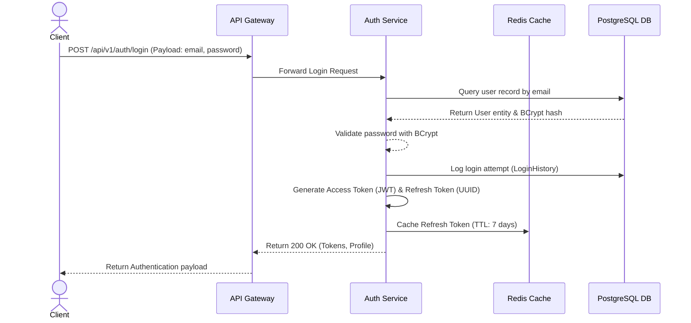
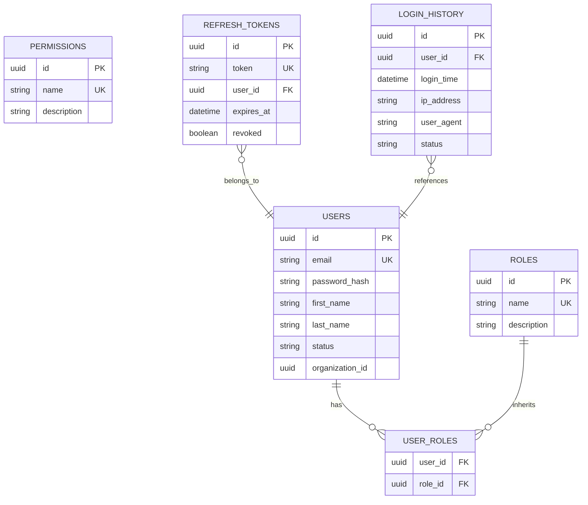

# Auth Service Specification

## Document Metadata

| Metadata Field | Value |
|---|---|
| Document Type | API Design / Auth Service Specification |
| Version | 1.0.0 |
| Status | Published |
| Owner | Principal Java Architect |
| Reviewer | CISO / Security Architect |
| Last Updated | 2026-07-23 |

---

# Executive Summary

The Authentication Service (Auth Service) acts as the Identity Provider (IdP) for ProjectMind AI, managing user credentials, generating JWT session tokens, checking role memberships (RBAC), and auditing administrative operations. 

This document defines the Auth Service's domain entities, ER diagrams, DTO payloads, security validation policies, API endpoints contracts, role-permission mappings, and development workflows.

---

# System Architecture & Flows

The sequence diagram below models authentication request validation, user credential verification, session creation, and JWT generation:

---

# Database Design & Entity Relationships

The data model isolates authentication credentials and maps permissions dynamically across users:

### Table Responsibilities
* **USERS:** Stores credentials hashes, names, and logical multi-tenant organization IDs references.
* **ROLES:** Stores role definitions labels.
* **PERMISSIONS:** Stores fine-grained operational permission labels.
* **USER_ROLES:** Join table mapping users to roles.
* **REFRESH_TOKENS:** Stores refresh tokens mapping active sessions.
* **LOGIN_HISTORY:** Logs access records supporting audit reporting.

---

# Role-Permission Matrix

Platform access controls map specific administrative permissions to roles:

| Role Name | READ | WRITE | UPDATE | DELETE | MANAGE_USERS | MANAGE_PROJECTS | MANAGE_ORGANIZATIONS | ADMIN |
|---|---|---|---|---|---|---|---|---|
| **SUPER_ADMIN** | Yes | Yes | Yes | Yes | Yes | Yes | Yes | Yes |
| **ORG_ADMIN** | Yes | Yes | Yes | Yes | Yes | Yes | No | No |
| **PROJECT_ADMIN** | Yes | Yes | Yes | Yes | No | Yes | No | No |
| **DEVELOPER** | Yes | Yes | Yes | No | No | No | No | No |
| **REVIEWER** | Yes | Yes | No | No | No | No | No | No |
| **VIEWER** | Yes | No | No | No | No | No | No | No |

---

# API Contracts Specifications

Auth Service endpoints exposed by the API Gateway proxy:

### 1. Register User
* **HTTP Method:** `POST`
* **URI:** `/api/v1/auth/register`
* **Authorization:** Public
* **Request DTO:** `RegisterRequest` (email, password, firstName, lastName, organizationId)
* **Response DTO:** `ApiResponse<UserResponse>`
* **Validation Rules:** Valid email syntax, strong password criteria.
* **Error Responses:** 400 Bad Request (Validation failed), 409 Conflict (Email duplicate).

### 2. Login
* **HTTP Method:** `POST`
* **URI:** `/api/v1/auth/login`
* **Authorization:** Public
* **Request DTO:** `LoginRequest` (email, password)
* **Response DTO:** `ApiResponse<LoginResponse>` (accessToken, refreshToken, userProfile)
* **Validation Rules:** Valid email format, non-empty password.
* **Error Responses:** 401 Unauthorized (Credentials invalid), 423 Locked (Brute-force lockout).

### 3. Refresh Token
* **HTTP Method:** `POST`
* **URI:** `/api/v1/auth/refresh`
* **Authorization:** Public
* **Request DTO:** `RefreshTokenRequest` (refreshToken)
* **Response DTO:** `ApiResponse<LoginResponse>`
* **Validation Rules:** Non-empty refresh token.
* **Error Responses:** 401 Unauthorized (Token expired/revoked).

### 4. Logout
* **HTTP Method:** `POST`
* **URI:** `/api/v1/auth/logout`
* **Authorization:** Authenticated (Bearer JWT)
* **Request DTO:** `LogoutRequest` (refreshToken)
* **Response DTO:** `ApiResponse<Void>`
* **Error Responses:** 401 Unauthorized (JWT invalid).

### 5. Get User Profile
* **HTTP Method:** `GET`
* **URI:** `/api/v1/auth/profile`
* **Authorization:** Authenticated (Bearer JWT)
* **Response DTO:** `ApiResponse<UserProfileResponse>`
* **Error Responses:** 401 Unauthorized (JWT expired).

---

# Business Rules & Parameters

The Auth Service enforces the following security boundaries:

* **Duplicate Email Handling:** Checks email availability before completing registrations, returning 409 conflicts.
* **Password Complexity:** Requires a minimum of 8 characters, with at least one uppercase letter, one lowercase letter, one number, and one special character.
* **Refresh Token Expiry:** Refresh tokens expire in 7 days, and are cached in Redis for fast revocation checks.
* **Access Token Expiry:** JWT access tokens expire in 15 minutes.
* **Lockout Policy:** Accounts are locked for 30 minutes after 5 consecutive failed login attempts in 10 minutes.
* **Password History:** Retains a hash history of the user's last 5 passwords to prevent immediate reuse.

---

# Audit Logging Events

To track operations, the Auth Service logs the following audit events:

* `AUTH_LOGIN_SUCCESS`: Logs User ID, client IP, and browser user agent.
* `AUTH_LOGIN_FAILURE`: Logs target email and client IP, incrementing failed login counts.
* `AUTH_USER_REGISTERED`: Logs new user UUID registrations.
* `AUTH_PASSWORD_CHANGED`: Logs password change events.
* `AUTH_ROLE_PROMOTED`: Logs role configuration changes.
* `AUTH_REFRESH_ROTATED`: Logs refresh token rotation actions.

---

# Development Sequence

Develop and verify the Auth Service in the following order:

1. **JPA Entity Mappings:** Setup User, Role, and Permission database schema classes.
2. **Repository Interfaces:** Create database query methods.
3. **Security Filters Config:** Setup Spring Security configurations, password encoders, and JWT extraction filters.
4. **Token Engine Implementation:** Write JWT parser and validation engines.
5. **Business Services Logic:** Write login, profile registration, and token rotation services.
6. **API Controllers Setup:** Build REST endpoints mapping DTO routes.
7. **Forensic Audit Logs:** Integrate logging events.
8. **Unit & Integration Tests:** Write tests to verify endpoint authentication responses.

---

# Conclusion

The Auth Service Specification establishes the database schema mappings, DTO structures, role permissions, endpoint contracts, and security rules for ProjectMind AI's authentication layer. Enforcing multi-tenant isolation, JWT sessions, and brute-force protections ensures corporate codebase indexing indexes remain secured.

---

# Revision History

| Version | Date | Author / Role | Summary of Changes |
|---|---|---|---|
| 0.1.0 | 2026-07-23 | Developer / Architect | Initial creation of the Auth Service Specification. |
