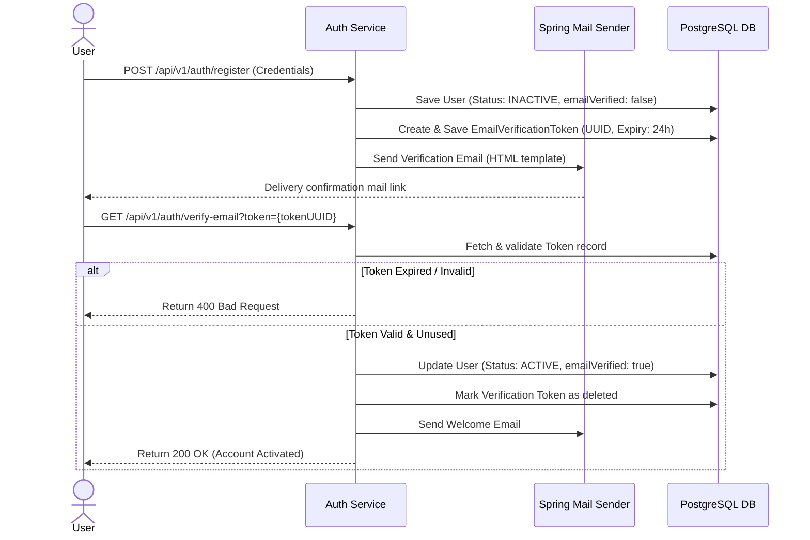

# Email Verification & Account Activation Specification

## Document Metadata

| Metadata Field | Value |
|---|---|
| Document Type | API Design / Email Verification Spec |
| Version | 1.0.0 |
| Status | Published |
| Owner | Principal Security Architect |
| Reviewer | Developer / Principal Architect |
| Last Updated | 2026-07-23 |

---

# Executive Summary

This Email Verification & Account Activation Specification defines the database tokens schema, email configurations, verification endpoints, and rate-limiting rules governing the user onboarding lifecycle. By using one-time token UUIDs, expiring verify windows, and HTML notification templates, the platform forces account verification before unlocking API access.

---

# Verification Request Sequence

The sequence diagram below models registration user flows, one-time token creations, notification emails delivery, and verify triggers:

---

# Database Token Entity Schema

The token is mapped in PostgreSQL to verify one-time registrations:

### `EmailVerificationToken.java`
* **id:** Primary Key (UUID)
* **token:** Unique verification string (UUID)
* **user_id:** Foreign Key mapping the target User.
* **expiresAt:** Date-time timestamp representing token expiration (Default: 24 hours).
* **resendAttempts:** Tracks resend attempt counts to block spamming.

---

# Security Configuration Variables

SMTP values are loaded from `application.yml` and formatted by `MailConfiguration`:

| Config Variable | Type | Purpose | Default / Recommended Value |
|---|---|---|---|
| `spring.mail.host` | String | Target SMTP relay hostname. | `smtp.mailserver.com` |
| `spring.mail.port` | Integer | SMTP port configuration. | `587` |
| `spring.mail.username` | String | Relay credentials username. | Vault Injected Secret |
| `spring.mail.password` | String | Relay credentials password. | Vault Injected Secret |
| `spring.mail.properties.mail.smtp.auth` | Boolean | Forces sender authentication. | `true` |
| `spring.mail.properties.mail.smtp.starttls.enable` | Boolean | Enables TLS encryption. | `true` |

---

# Security Best Practices

The email verification subsystem enforces the following security controls:

* **Inactivating Registrants:** New user records are locked under status `INACTIVE` until email verification succeeds.
* **Hiding Tokens from Trace Logs:** Restrict verification tokens printing inside logging strings to prevent logs hijack leaks.
* **One-Time Token Lifetime:** Tokens expire automatically in 24 hours. Verification immediately flags tokens as deleted.
* **Resend Rate-Limiting:** Restricts resend requests to a maximum of 3 times per hour per email to prevent spam.

---

# Conclusion

The Email Verification & Account Activation Specification defines the database tokens schema, email configurations, verification endpoints, and rate-limiting rules. Placing these verification gates in the onboarding process protects the ProjectMind AI platform from automated spam accounts.

---

# Revision History

| Version | Date | Author / Role | Summary of Changes |
|---|---|---|---|
| 0.1.0 | 2026-07-23 | Security Architect | Initial creation of the Email Verification Specification. |
