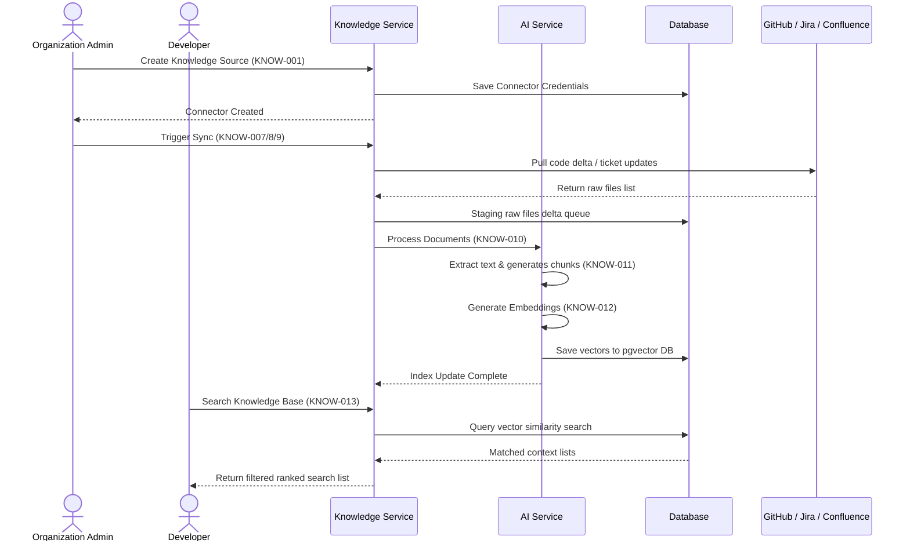

# Knowledge API

## Document Metadata

| Metadata Field | Value |
|---|---|
| Document Type | API Design / Knowledge API Specification |
| Version | 1.0.0 |
| Status | Published |
| Owner | Portfolio Developer |
| Reviewer | Portfolio Developer |
| Last Updated | 2026-07-22 |

---

# Executive Summary

The Knowledge Service manages connections, repository crawling, manual document uploads, and parsing/chunking pipelines that feed the semantic vector database index. It serves as the data transformation engine converting raw codebase files, Jira ticket descriptions, and Confluence wiki documents into mathematical vector representations (embeddings) optimized for conceptual search.

This document defines the sixteen core APIs of the Knowledge Service, details validation policies, maps access roles to an authorization matrix, outlines auditing events, and charts the ingestion, indexing, and search workflows.

---

# Knowledge Service Responsibilities

The Knowledge Service is responsible for the following domain bounds:

* **Knowledge Source Management:** Configuring external system connection credentials and API endpoints.
* **Repository Synchronization:** Fetching delta change files and commit history updates from GitHub, Jira, and Confluence.
* **File Upload:** Validating and parsing manual Markdown local file uploads.
* **Document Processing:** Coordinating the text extraction pipeline on ingested resources.
* **Text Extraction:** Reading files contents, extracting ticket texts, and downloading wiki pages.
* **Chunk Generation:** Segmenting documents into non-overlapping token chunks.
* **Embedding Generation:** Transforming text chunks into vector arrays.
* **Semantic Search:** Querying pgvector for similar context files.
* **Re-indexing:** Regenerating outdated vector spaces to prevent index decay.
* **Knowledge Cleanup:** Purging orphaned chunks and embeddings when project workspaces are deleted.

---

# API Inventory

The Knowledge Service exposes the following endpoints:

| API ID | Endpoint | Method | Purpose |
|---|---|---|---|
| **KNOW-001** | `/api/v1/knowledge/sources` | POST | Register a new knowledge source integration. |
| **KNOW-002** | `/api/v1/knowledge/sources/{sourceId}` | GET | Retrieve metadata details of a specific knowledge source. |
| **KNOW-003** | `/api/v1/knowledge/sources` | GET | List knowledge sources within the project workspace. |
| **KNOW-004** | `/api/v1/knowledge/sources/{sourceId}` | PUT | Update knowledge source credentials or connection endpoints. |
| **KNOW-005** | `/api/v1/knowledge/sources/{sourceId}` | DELETE | Soft-delete a knowledge source connector and purge indexes. |
| **KNOW-006** | `/api/v1/knowledge/sources/upload` | POST | Upload a local Markdown reference file. |
| **KNOW-007** | `/api/v1/knowledge/sources/{sourceId}/sync/github` | POST | Trigger an asynchronous delta sync for a connected GitHub repo. |
| **KNOW-008** | `/api/v1/knowledge/sources/{sourceId}/sync/jira` | POST | Trigger an asynchronous delta sync for connected Jira projects. |
| **KNOW-009** | `/api/v1/knowledge/sources/{sourceId}/sync/confluence` | POST | Trigger an asynchronous delta sync for Confluence spaces. |
| **KNOW-010** | `/api/v1/knowledge/documents/process` | POST | Parse ingested raw files delta text segments. |
| **KNOW-011** | `/api/v1/knowledge/documents/chunks` | POST | Generate tokenized text chunks from parsed documents. |
| **KNOW-012** | `/api/v1/knowledge/documents/embeddings` | POST | Generate mathematical vector embeddings representing text chunks. |
| **KNOW-013** | `/api/v1/knowledge/search` | GET | Run vector similarity searches returning grounded matches list. |
| **KNOW-014** | `/api/v1/knowledge/reindex` | POST | Re-index and regenerate outdated vector graph spaces. |
| **KNOW-015** | `/api/v1/knowledge/tasks/{taskId}` | GET | Query the execution status of active sync or indexing tasks. |
| **KNOW-016** | `/api/v1/knowledge/indexed` | DELETE | Hard purge index vectors and chunks database records. |

---

# API DETAILS

---

## KNOW-001: Create Knowledge Source
### Purpose
Registers a new third-party integration connector.
### Endpoint
`POST /api/v1/knowledge/sources`
### Authentication Required
Yes
### Required Role
Owner, Admin, Project Manager
### Request Body
| Field | Type | Required | Validation Rules |
|---|---|---|---|
| `projectId` | UUID | Yes | Active project workspace identifier. |
| `type` | String | Yes | Ingestion system type (GitHub, Jira, Confluence). |
| `token` | String | Yes | Read-only API access credentials key. |
### Success Response
* **Status Code:** 201 Created
* **Response Body Envelope:**
```json
{
  "timestamp": "2026-07-22T23:37:37.000Z",
  "status": 201,
  "message": "Knowledge source connected successfully",
  "data": {
    "sourceId": "s1o2u3r4-c5e6-a7s8-d9f0-g1h2j3k4l5m6",
    "type": "GitHub",
    "status": "Connected"
  },
  "metadata": {}
}
```
### Error Responses
| HTTP Status | Error Code | Description |
|---|---|---|
| 400 | `INVALID_PARAMETER_VALUE` | Invalid connector types or empty token fields. |
| 403 | `ACCESS_DENIED` | User lacks Admin/Owner role within target project. |
| 422 | `CONNECTION_FAILED` | Target tool API rejected token access credentials validation checks. |

---

## KNOW-002: Get Knowledge Source
### Purpose
Retrieves metadata settings of a specific knowledge source connector.
### Endpoint
`GET /api/v1/knowledge/sources/{sourceId}`
### Authentication Required
Yes
### Required Role
Owner, Admin, Project Manager, Developer, Viewer
### Path Parameters
* `sourceId` (UUID): Target knowledge source connector ID.
### Success Response
* **Status Code:** 200 OK

---

## KNOW-003: List Knowledge Sources
### Purpose
Lists connectors registered within the project workspace.
### Endpoint
`GET /api/v1/knowledge/sources`
### Authentication Required
Yes
### Required Role
Owner, Admin, Project Manager, Developer, Viewer
### Query Parameters
* `projectId` (UUID): Target project workspace ID.
### Success Response
* **Status Code:** 200 OK

---

## KNOW-004: Update Knowledge Source
### Purpose
Updates connector configuration tokens or settings.
### Endpoint
`PUT /api/v1/knowledge/sources/{sourceId}`
### Authentication Required
Yes
### Required Role
Owner, Admin, Project Manager
### Path Parameters
* `sourceId` (UUID): Target connector ID.
### Request Body
| Field | Type | Required | Validation Rules |
|---|---|---|---|
| `token` | String | Yes | Updated read-only API access token. |
### Success Response
* **Status Code:** 200 OK

---

## KNOW-005: Delete Knowledge Source
### Purpose
Soft-deletes a knowledge source connector and queues index purges.
### Endpoint
`DELETE /api/v1/knowledge/sources/{sourceId}`
### Authentication Required
Yes
### Required Role
Owner, Admin, Project Manager
### Path Parameters
* `sourceId` (UUID): Target connector ID.
### Success Response
* **Status Code:** 200 OK

---

## KNOW-006: Upload Document
### Purpose
Uploads a local Markdown reference file to the project workspace index.
### Endpoint
`POST /api/v1/knowledge/sources/upload`
### Authentication Required
Yes
### Required Role
Owner, Admin, Project Manager, Developer
### Request Body
Form data containing:
* `file`: Markdown document binary (size < 10MB).
* `projectId`: UUID key of the workspace.
### Success Response
* **Status Code:** 201 Created
* **Response Body Envelope:**
```json
{
  "timestamp": "2026-07-22T23:37:37.000Z",
  "status": 201,
  "message": "Document uploaded successfully",
  "data": {
    "documentId": "d1o2c3u4-m5e6-n7t8-s9q0-a1s2d3f4g5h6",
    "name": "setup_guide.md",
    "status": "Queued"
  },
  "metadata": {}
}
```
### Error Responses
| HTTP Status | Error Code | Description |
|---|---|---|
| 400 | `INVALID_FILE_FORMAT` | File format is not text-parseable Markdown. |
| 422 | `FILE_SIZE_LIMIT_EXCEEDED` | Upload file exceeds 10MB limit. |

---

## KNOW-007: Sync GitHub Repository
### Purpose
Triggers an asynchronous delta sync for a connected GitHub repo.
### Endpoint
`POST /api/v1/knowledge/sources/{sourceId}/sync/github`
### Authentication Required
Yes
### Required Role
Owner, Admin, Project Manager, Developer
### Path Parameters
* `sourceId` (UUID): Target connector source ID.
### Success Response
* **Status Code:** 202 Accepted
* **Response Body Envelope:**
```json
{
  "timestamp": "2026-07-22T23:37:37.000Z",
  "status": 202,
  "message": "Synchronization task accepted",
  "data": {
    "taskId": "t1a2s3k4-j5o6-b7q8-s9t0-a1s2d3f4g5h6",
    "status": "In-Progress"
  },
  "metadata": {}
}
```

---

## KNOW-008: Sync Jira Project
### Purpose
Triggers an asynchronous delta sync for connected Jira projects.
### Endpoint
`POST /api/v1/knowledge/sources/{sourceId}/sync/jira`
### Authentication Required
Yes
### Required Role
Owner, Admin, Project Manager, Developer
### Path Parameters
* `sourceId` (UUID): Target connector source ID.
### Success Response
* **Status Code:** 202 Accepted

---

## KNOW-009: Sync Confluence Space
### Purpose
Triggers an asynchronous delta sync for Confluence spaces.
### Endpoint
`POST /api/v1/knowledge/sources/{sourceId}/sync/confluence`
### Authentication Required
Yes
### Required Role
Owner, Admin, Project Manager, Developer
### Path Parameters
* `sourceId` (UUID): Target connector source ID.
### Success Response
* **Status Code:** 202 Accepted

---

## KNOW-010: Process Documents
### Purpose
Parses ingested raw files delta text segments.
### Endpoint
`POST /api/v1/knowledge/documents/process`
### Authentication Required
Yes (Internal Service Call)
### Success Response
* **Status Code:** 200 OK

---

## KNOW-011: Generate Chunks
### Purpose
Generates tokenized text chunks from parsed documents.
### Endpoint
`POST /api/v1/knowledge/documents/chunks`
### Authentication Required
Yes (Internal Service Call)
### Success Response
* **Status Code:** 200 OK

---

## KNOW-012: Generate Embeddings
### Purpose
Generates mathematical vector embeddings representing text chunks.
### Endpoint
`POST /api/v1/knowledge/documents/embeddings`
### Authentication Required
Yes (Internal Service Call)
### Success Response
* **Status Code:** 200 OK

---

## KNOW-013: Search Knowledge Base
### Purpose
Runs vector similarity searches returning grounded matches list.
### Endpoint
`GET /api/v1/knowledge/search`
### Authentication Required
Yes
### Required Role
Owner, Admin, Project Manager, Developer, Viewer
### Query Parameters
* `projectId` (UUID): Target project workspace ID.
* `q` (String): Search keyword query string.
### Success Response
* **Status Code:** 200 OK
* **Response Body Envelope:**
```json
{
  "timestamp": "2026-07-22T23:37:37.000Z",
  "status": 200,
  "message": "Search completed successfully",
  "data": [
    {
      "documentId": "d1o2c3u4-m5e6-n7t8-s9q0-a1s2d3f4g5h6",
      "path": "file:///src/main/resources/application.properties",
      "score": 0.89,
      "snippet": "spring.datasource.url=jdbc:postgresql://..."
    }
  ],
  "metadata": {}
}
```

---

## KNOW-014: Re-index Knowledge Base
### Purpose
Re-indexes and regenerates outdated vector graph spaces.
### Endpoint
`POST /api/v1/knowledge/reindex`
### Authentication Required
Yes
### Required Role
Owner, Admin, Project Manager
### Request Body
| Field | Type | Required | Validation Rules |
|---|---|---|---|
| `projectId` | UUID | Yes | Target project workspace identifier. |
### Success Response
* **Status Code:** 202 Accepted

---

## KNOW-015: Get Processing Status
### Purpose
Queries the execution status of active sync or indexing tasks.
### Endpoint
`GET /api/v1/knowledge/tasks/{taskId}`
### Authentication Required
Yes
### Required Role
Owner, Admin, Project Manager, Developer, Viewer
### Path Parameters
* `taskId` (UUID): Target task identifier key.
### Success Response
* **Status Code:** 200 OK
* **Response Body Envelope:**
```json
{
  "timestamp": "2026-07-22T23:37:37.000Z",
  "status": 200,
  "message": "Task status retrieved",
  "data": {
    "taskId": "t1a2s3k4-j5o6-b7q8-s9t0-a1s2d3f4g5h6",
    "status": "Completed",
    "progressPercentage": 100,
    "completedAt": "2026-07-22T23:36:00.000Z"
  },
  "metadata": {}
}
```

---

## KNOW-016: Delete Indexed Data
### Purpose
Hard purges index vectors and chunks database records.
### Endpoint
`DELETE /api/v1/knowledge/indexed`
### Authentication Required
Yes
### Required Role
Owner, Admin
### Query Parameters
* `projectId` (UUID): Target project workspace ID.
### Success Response
* **Status Code:** 200 OK

---

# Knowledge Processing Workflow

The sequence diagram below models organization registration, member invite accepts, role changes, and tenant deletion:



---

# Validation Rules

* **Supported Document Types:** Custom uploads must be Markdown (.md) or text format.
* **Repository URL Validation:** Must follow valid GitHub repository URL format.
* **Jira Project Validation:** Must match standard Jira API keys formatting.
* **Confluence Space Validation:** Space ID must be non-empty and match Confluence metadata constraints.
* **File Size Validation:** Manual uploads are restricted to less than 10MB in size.
* **Duplicate Uploads:** Uploading files sharing a checksum with active documents is blocked.
* **Maximum Chunk Size:** Target chunk sizes are restricted to 1000 characters, with 100-character overlaps.
* **Embedding Validation:** Vector outputs must equal 1536 float elements in pgvector.

---

# Authorization Matrix

Permissions governing access to Knowledge APIs:

| Target Role | Authorized APIs |
|---|---|
| **Owner** | `KNOW-001` through `KNOW-016` |
| **Admin** | `KNOW-001` through `KNOW-016` |
| **Project Manager** | `KNOW-001` through `KNOW-009`, `KNOW-013` (Search), `KNOW-014` (Re-index), `KNOW-015` (Task Status) |
| **Developer** | `KNOW-002` (Get), `KNOW-003` (List), `KNOW-006` (Upload Doc), `KNOW-007/8/9` (Sync), `KNOW-013` (Search), `KNOW-015` (Task Status) |
| **Viewer** | `KNOW-002` (Get), `KNOW-003` (List), `KNOW-013` (Search), `KNOW-015` (Task Status) |

---

# Error Code Matrix

Key exceptions returned by the Knowledge APIs:

| Error Code | HTTP Status | Description |
|---|---|---|
| **INVALID_PARAMETER_VALUE** | 400 Bad Request | Invalid Space ID, project key, or malformed repository URL. |
| **INVALID_FILE_FORMAT** | 400 Bad Request | Uploaded file format is not Markdown. |
| **TOKEN_EXPIRED** | 401 Unauthorized | JWT session has expired. |
| **ACCESS_DENIED** | 403 Forbidden | User lacks authorization scopes in target project. |
| **RESOURCE_NOT_FOUND** | 404 Not Found | Target Source or Document ID does not exist. |
| **FILE_SIZE_LIMIT_EXCEEDED** | 422 Unprocessable | Upload file size exceeds 10MB. |
| **RATE_LIMIT_EXCEEDED** | 429 Too Many Requests | External source API limits triggered during synchronization. |

---

# Audit Events

The Knowledge Service logs immutable audit logs for the following administrative actions:

* `KNOWLEDGE_SOURCE_CREATED`: Logged with creator ID and type.
* `DOCUMENT_UPLOADED`: Tracked with file name and size.
* `GITHUB_SYNCED`: Tracked when repository updates are completed.
* `JIRA_SYNCED`: Tracked when tickets updates are completed.
* `CONFLUENCE_SYNCED`: Tracked when space documentation updates are completed.
* `DOCUMENT_PROCESSED`: Logged when text parsing is complete.
* `CHUNKS_GENERATED`: Logged with total chunks count.
* `EMBEDDINGS_GENERATED`: Logged when pgvector indices updates complete.
* `SEARCH_EXECUTED`: Tracked with query keywords and matches count.
* `RE_INDEX_COMPLETED`: Logged when vector databases are rebuilt.
* `KNOWLEDGE_SOURCE_DELETED`: Tracked when connector and vectors are purged.

---

# Risks

Knowledge management APIs face key security and configuration risks:

### Duplicate Indexing
* *Risk:* Overlapping runs index identical repositories twice, inflating search vectors.
* *Mitigation:* Employ unique file path constraint mappings, updating existing documents instead of adding duplicates.

### Corrupted Documents
* *Risk:* Parse failures on invalid Markdown files lock sync workers.
* *Mitigation:* Configure safe try-catch exception blocks, skipping corrupt files and logging warn details.

### AI Processing Failures
* *Risk:* OpenAI API timeouts block embeddings creation during sync runs.
* *Mitigation:* Queue tasks in retry lists using exponential back-off pacing.

---

# Conclusion

The Knowledge API document establishes the detailed specifications, inputs, success configurations, validation parameters, and error codes for the ProjectMind AI Knowledge Service. By enforcing file constraints, asynchronous sync task queues, role authorizations, and index audit logging, these APIs secure project knowledge ingestion while enabling semantic searches.

---

# Revision History

| Version | Date | Author / Role | Summary of Changes |
|---|---|---|---|
| 0.1.0 | 2026-07-22 | Developer / Architect | Initial creation of the Knowledge API Specification. |
