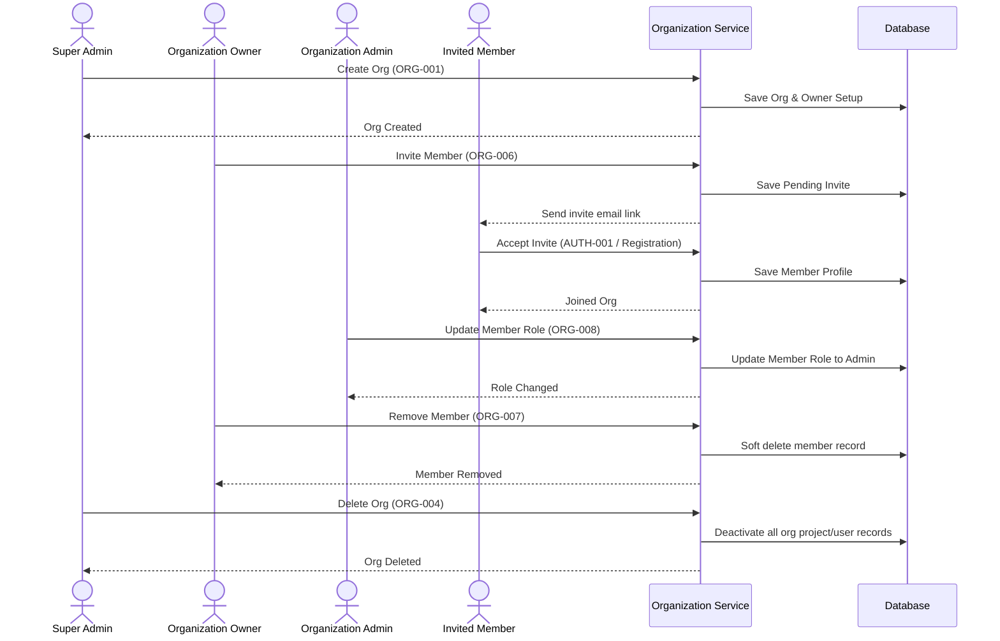

# Organization API

## Document Metadata

| Metadata Field | Value |
|---|---|
| Document Type | API Design / Organization API Specification |
| Version | 1.0.0 |
| Status | Published |
| Owner | Portfolio Developer |
| Reviewer | Portfolio Developer |
| Last Updated | 2026-07-22 |

---

# Executive Summary

The Organization Service manages logical tenant isolation, user memberships, role assignments, and organization-level settings configurations. It acts as the gatekeeper ensuring that all indexed codebases, ticket logs, and user sessions remain logically partitioned, preventing cross-tenant data leaks.

This document defines the ten core APIs of the Organization Service, details validation policies, maps access roles to an authorization matrix, outlines auditing events, and charts the lifecycle of an organization workspace.

---

# Organization Service Responsibilities

The Organization Service is responsible for the following domain bounds:

* **Organization Lifecycle:** Initializing isolated tenant partitions, handling settings modifications, and executing tenant deactivation or archiving.
* **Member Management:** Processing user invitations, tracking active organization rosters, and managing member deactivation or removals.
* **Role Assignment:** Mapping users to target roles (Engineer, Tech Lead, Admin, Owner) within the tenant organization.
* **Organization Settings:** Managing single sign-on (SSO) certificate endpoints and domain registration limits.
* **Tenant Isolation:** Enforcing logical query constraints using organization identifiers on all database transactions.

---

# API Inventory

The Organization Service exposes the following endpoints:

| API ID | Endpoint | Method | Purpose |
|---|---|---|---|
| **ORG-001** | `/api/v1/organizations` | POST | Initialize a new corporate tenant organization. |
| **ORG-002** | `/api/v1/organizations/{organizationId}` | GET | Retrieve metadata details of a specific organization. |
| **ORG-003** | `/api/v1/organizations/{organizationId}` | PUT | Update corporate organization name or description. |
| **ORG-004** | `/api/v1/organizations/{organizationId}` | DELETE | Soft-delete a tenant organization and deactivate all users. |
| **ORG-005** | `/api/v1/organizations/{organizationId}/members` | GET | Retrieve the active membership roster of the organization. |
| **ORG-006** | `/api/v1/organizations/{organizationId}/invites` | POST | Invite a team member to join the tenant workspace. |
| **ORG-007** | `/api/v1/organizations/{organizationId}/members/{userId}` | DELETE | Remove a user from the organization membership roster. |
| **ORG-008** | `/api/v1/organizations/{organizationId}/members/{userId}/role` | PATCH | Update a member's role assignment. |
| **ORG-009** | `/api/v1/organizations/{organizationId}/settings` | PUT | Edit single sign-on (SSO) and domain rules settings. |
| **ORG-010** | `/api/v1/organizations` | GET | Search and list organizations (Admin use only). |

---

# API DETAILS

---

## ORG-001: Create Organization
### Purpose
Initializes a new isolated corporate tenant organization space.
### Endpoint
`POST /api/v1/organizations`
### Authentication Required
Yes
### Required Role
Super Admin (Platform Operator)
### Path Parameters
None.
### Query Parameters
None.
### Request Body
| Field | Type | Required | Validation Rules |
|---|---|---|---|
| `name` | String | Yes | Length 2 to 100 characters. |
| `domainSuffix` | String | Yes | Corporate email domain format (e.g. company.com). |
### Success Response
* **Status Code:** 201 Created
* **Response Body Envelope:**
```json
{
  "timestamp": "2026-07-22T23:35:20.000Z",
  "status": 201,
  "message": "Organization created successfully",
  "data": {
    "organizationId": "z9y8x7w6-v5u4-t3s2-r1q0-p9o8n7m6l5k4",
    "name": "Acme Corp",
    "domainSuffix": "acme.com",
    "status": "Active"
  },
  "metadata": {}
}
```
### Error Responses
| HTTP Status | Error Code | Description |
|---|---|---|
| 400 | `INVALID_PARAMETER_VALUE` | Suffix formatting or name checks failed. |
| 401 | `TOKEN_EXPIRED` | Administrator session JWT is invalid. |
| 403 | `ACCESS_DENIED` | Non-super-admin user attempts execution. |
| 409 | `DUPLICATE_RESOURCE` | The domain suffix is already registered. |
### Business Rules
* The domain suffix must be unique globally.
* The initial organization status defaults to "Active".
### Security Considerations
* Enforce audit logging capturing the creating administrator user ID.

---

## ORG-002: Get Organization
### Purpose
Retrieves metadata settings of a specific organization.
### Endpoint
`GET /api/v1/organizations/{organizationId}`
### Authentication Required
Yes
### Required Role
Owner, Admin, Member
### Path Parameters
* `organizationId` (UUID): Target organization tenant ID.
### Query Parameters
None.
### Success Response
* **Status Code:** 200 OK
* **Response Body Envelope:**
```json
{
  "timestamp": "2026-07-22T23:35:20.000Z",
  "status": 200,
  "message": "Organization details retrieved successfully",
  "data": {
    "organizationId": "z9y8x7w6-v5u4-t3s2-r1q0-p9o8n7m6l5k4",
    "name": "Acme Corp",
    "domainSuffix": "acme.com"
  },
  "metadata": {}
}
```
### Error Responses
| HTTP Status | Error Code | Description |
|---|---|---|
| 403 | `ACCESS_DENIED` | User attempts to access an organization ID they do not belong to. |
| 404 | `RESOURCE_NOT_FOUND` | Target organization ID does not exist or is soft-deleted. |
### Business Rules
* Users can query only the organization ID mapped to their active JWT claims.

---

## ORG-003: Update Organization
### Purpose
Modifies organization metadata.
### Endpoint
`PUT /api/v1/organizations/{organizationId}`
### Authentication Required
Yes
### Required Role
Owner, Admin
### Path Parameters
* `organizationId` (UUID): Target organization tenant ID.
### Request Body
| Field | Type | Required | Validation Rules |
|---|---|---|---|
| `name` | String | Yes | Length 2 to 100 characters. |
### Success Response
* **Status Code:** 200 OK
* **Response Body Envelope:**
```json
{
  "timestamp": "2026-07-22T23:35:20.000Z",
  "status": 200,
  "message": "Organization updated successfully",
  "data": {
    "organizationId": "z9y8x7w6-v5u4-t3s2-r1q0-p9o8n7m6l5k4",
    "name": "Acme Software Corp"
  },
  "metadata": {}
}
```
### Error Responses
| HTTP Status | Error Code | Description |
|---|---|---|
| 403 | `ACCESS_DENIED` | User lacks Admin/Owner role within the target tenant. |
### Business Rules
* The domain suffix cannot be updated via this endpoint, preserving email registration paths.

---

## ORG-004: Delete Organization
### Purpose
Soft-deletes a tenant organization and deactivates memberships.
### Endpoint
`DELETE /api/v1/organizations/{organizationId}`
### Authentication Required
Yes
### Required Role
Super Admin, Owner
### Path Parameters
* `organizationId` (UUID): Target organization tenant ID.
### Success Response
* **Status Code:** 200 OK
* **Response Body Envelope:**
```json
{
  "timestamp": "2026-07-22T23:35:20.000Z",
  "status": 200,
  "message": "Organization archived successfully. All member access revoked.",
  "data": {},
  "metadata": {}
}
```
### Error Responses
| HTTP Status | Error Code | Description |
|---|---|---|
| 403 | `ACCESS_DENIED` | Non-owner user attempts deletion. |
### Business Rules
* Soft-deletes organization records and sets active user statuses to Suspended.

---

## ORG-005: Get Organization Members
### Purpose
Retrieves the active membership roster of the organization.
### Endpoint
`GET /api/v1/organizations/{organizationId}/members`
### Authentication Required
Yes
### Required Role
Owner, Admin, Member
### Path Parameters
* `organizationId` (UUID): Target organization tenant ID.
### Query Parameters
* `page`, `size`, `sort` (standard pagination parameters).
### Success Response
* **Status Code:** 200 OK
* **Response Body Envelope:**
```json
{
  "timestamp": "2026-07-22T23:35:20.000Z",
  "status": 200,
  "message": "Members list retrieved successfully",
  "data": [
    {
      "userId": "a1b2c3d4-e5f6-7a8b-9c0d-1e2f3a4b5c6d",
      "name": "Jane Developer",
      "email": "jane.dev@acme.com",
      "role": "Engineer",
      "joinedAt": "2026-06-01T12:00:00.000Z"
    }
  ],
  "metadata": {
    "page": 0,
    "size": 20,
    "totalElements": 1
  }
}
```

---

## ORG-006: Invite Member
### Purpose
Invites a team member to join the organization workspace.
### Endpoint
`POST /api/v1/organizations/{organizationId}/invites`
### Authentication Required
Yes
### Required Role
Owner, Admin
### Path Parameters
* `organizationId` (UUID): Target organization tenant ID.
### Request Body
| Field | Type | Required | Validation Rules |
|---|---|---|---|
| `email` | String | Yes | Valid email format; suffix must match org domain. |
| `role` | String | Yes | Valid role assignment string (Engineer, Lead, Admin). |
### Success Response
* **Status Code:** 201 Created
* **Response Body Envelope:**
```json
{
  "timestamp": "2026-07-22T23:35:20.000Z",
  "status": 201,
  "message": "Invitation sent successfully",
  "data": {
    "email": "candidate@acme.com",
    "role": "Engineer",
    "status": "Pending"
  },
  "metadata": {}
}
```
### Error Responses
| HTTP Status | Error Code | Description |
|---|---|---|
| 400 | `INVALID_PARAMETER_VALUE` | Email domain mismatch or invalid role parameter. |
| 409 | `DUPLICATE_RESOURCE` | The user is already an active member of this organization. |

---

## ORG-007: Remove Member
### Purpose
Removes a user from the organization membership roster.
### Endpoint
`DELETE /api/v1/organizations/{organizationId}/members/{userId}`
### Authentication Required
Yes
### Required Role
Owner, Admin
### Path Parameters
* `organizationId` (UUID): Target organization tenant ID.
* `userId` (UUID): Target user ID to be removed.
### Success Response
* **Status Code:** 200 OK
* **Response Body Envelope:**
```json
{
  "timestamp": "2026-07-22T23:35:20.000Z",
  "status": 200,
  "message": "Member removed successfully",
  "data": {},
  "metadata": {}
}
```
### Error Responses
| HTTP Status | Error Code | Description |
|---|---|---|
| 422 | `CANNOT_REMOVE_LAST_OWNER` | Attempt to remove the sole active Owner of the organization. |
### Business Rules
* Deactivating sets the OrganizationMember `deleted` flag to `true`, revoking access while preserving logs.

---

## ORG-008: Update Member Role
### Purpose
Updates a member's role assignment.
### Endpoint
`PATCH /api/v1/organizations/{organizationId}/members/{userId}/role`
### Authentication Required
Yes
### Required Role
Owner, Admin
### Path Parameters
* `organizationId` (UUID): Target organization tenant ID.
* `userId` (UUID): Target user ID to modify.
### Request Body
| Field | Type | Required | Validation Rules |
|---|---|---|---|
| `role` | String | Yes | Valid target role name (Engineer, Lead, Admin). |
### Success Response
* **Status Code:** 200 OK
* **Response Body Envelope:**
```json
{
  "timestamp": "2026-07-22T23:35:20.000Z",
  "status": 200,
  "message": "Member role updated successfully",
  "data": {
    "userId": "a1b2c3d4-e5f6-7a8b-9c0d-1e2f3a4b5c6d",
    "role": "Lead"
  },
  "metadata": {}
}
```
### Business Rules
* An Administrator cannot downgrade or remove the Owner role.
* Role updates trigger user token updates in session caches.

---

## ORG-009: Organization Settings
### Purpose
Edits tenant-wide settings parameters.
### Endpoint
`PUT /api/v1/organizations/{organizationId}/settings`
### Authentication Required
Yes
### Required Role
Owner, Admin
### Path Parameters
* `organizationId` (UUID): Target organization tenant ID.
### Request Body
| Field | Type | Required | Validation Rules |
|---|---|---|---|
| `ssoEnabled` | Boolean | Yes | Flag status for SSO logins. |
| `ssoMetadataUrl` | String | No | SAML IdP metadata XML configuration endpoint. |
### Success Response
* **Status Code:** 200 OK
* **Response Body Envelope:**
```json
{
  "timestamp": "2026-07-22T23:35:20.000Z",
  "status": 200,
  "message": "Organization settings updated successfully",
  "data": {
    "ssoEnabled": true,
    "ssoMetadataUrl": "https://okta.acme.com/metadata"
  },
  "metadata": {}
}
```

---

## ORG-010: Search Organizations (Admin)
### Purpose
Lists and filters organizations registered on the platform.
### Endpoint
`GET /api/v1/organizations`
### Authentication Required
Yes
### Required Role
Super Admin
### Success Response
* **Status Code:** 200 OK
* **Response Body Envelope:**
```json
{
  "timestamp": "2026-07-22T23:35:20.000Z",
  "status": 200,
  "message": "Organizations list retrieved successfully",
  "data": [
    {
      "organizationId": "z9y8x7w6-v5u4-t3s2-r1q0-p9o8n7m6l5k4",
      "name": "Acme Corp",
      "domainSuffix": "acme.com",
      "status": "Active"
    }
  ],
  "metadata": {
    "page": 0,
    "size": 20,
    "totalElements": 1
  }
}
```

---

# Organization Lifecycle

The sequence diagram below models organization registration, member invite accepts, role changes, and tenant deletion:



---

# Validation Rules

* **Organization Name:** Length between 2 and 100 characters; alphanumeric and space characters only.
* **Organization Domain Suffix:** Valid domain format syntax; cannot match standard public providers (e.g. gmail.com, outlook.com).
* **Member Invitation:** The invite email address suffix must match the organization's domain suffix.
* **Role Assignment:** Assigned role parameter must match the predefined list: `Owner`, `Admin`, `Member`.
* **Duplicate Membership:** Attempting to invite a user who is already an active member of the tenant returns a conflict code.

---

# Authorization Matrix

Permissions are governed according to the following roles mapping:

| Target Role | Authorized APIs |
|---|---|
| **Super Admin** | `ORG-001` (Create Org), `ORG-004` (Delete Org), `ORG-010` (Search Orgs) |
| **Owner** | `ORG-002` (Get Org), `ORG-003` (Update Org), `ORG-004` (Delete Org), `ORG-005` (Get Members), `ORG-006` (Invite Member), `ORG-007` (Remove Member), `ORG-008` (Update Role), `ORG-009` (Org Settings) |
| **Admin** | `ORG-002` (Get Org), `ORG-003` (Update Org), `ORG-005` (Get Members), `ORG-006` (Invite Member), `ORG-007` (Remove Member), `ORG-008` (Update Role), `ORG-009` (Org Settings) |
| **Member** | `ORG-002` (Get Org), `ORG-005` (Get Members) |

---

# Error Code Matrix

Key exceptions returned by the Organization APIs:

| Error Code | HTTP Status | Description |
|---|---|---|
| **INVALID_PARAMETER_VALUE** | 400 Bad Request | Invalid parameter lengths, email suffix, or invalid role name. |
| **TOKEN_EXPIRED** | 401 Unauthorized | JWT session has expired. |
| **ACCESS_DENIED** | 403 Forbidden | User lacks permissions within the target organization ID. |
| **RESOURCE_NOT_FOUND** | 404 Not Found | Target Organization or Member ID does not exist. |
| **DUPLICATE_RESOURCE** | 409 Conflict | Domain suffix or email invitation already exists. |
| **CANNOT_REMOVE_LAST_OWNER** | 422 Unprocessable | Action blocked to prevent leaving the tenant ownerless. |

---

# Audit Events

The service logs immutable security logs for the following administrative actions:

* `ORGANIZATION_CREATED`: Tracked with creator user ID and domain suffix.
* `ORGANIZATION_UPDATED`: Tracked with modifier user ID and changes details.
* `MEMBER_INVITED`: Tracked with invite email and target role.
* `MEMBER_JOINED`: Logged when user accepts token link and completes profile.
* `MEMBER_REMOVED`: Tracked with target removed member user ID.
* `ROLE_CHANGED`: Tracked with target user ID and new role value.
* `ORGANIZATION_DELETED`: Tracked when organization is soft-deleted.

---

# Risks

Organization management APIs face key security and runtime risks:

### Cross-Tenant Access
* *Risk:* Malicious tenant users modify query parameters to view or change another company's members roster.
* *Mitigation:* The API Gateway dynamically extracts the user's `org_id` from their signed JWT, matching it against the path parameter on every call.

### Privilege Escalation
* *Risk:* An Administrator user attempts to upgrade their own profile role to Owner.
* *Mitigation:* Deny self-promotion actions on the patch API. Ensure role changes require Owner validation checks.

### Ownerless Tenants (Race Conditions)
* *Risk:* Two administrators attempt to delete the final Owner profile concurrently.
* *Mitigation:* Enforce database locks and transaction gates, rejecting updates if active Owner counts fall to zero.

---

# Conclusion

The Organization API document establishes the detailed specifications, inputs, success configurations, validation parameters, and error codes for the ProjectMind AI Organization Service. By enforcing logical multi-tenant filters, RBAC checks, domain suffix validations, and immutable audit logs, these APIs secure organization workspaces while enabling team collaboration.

---

# Revision History

| Version | Date | Author / Role | Summary of Changes |
|---|---|---|---|
| 0.1.0 | 2026-07-22 | Developer / Architect | Initial creation of the Organization API Specification. |
