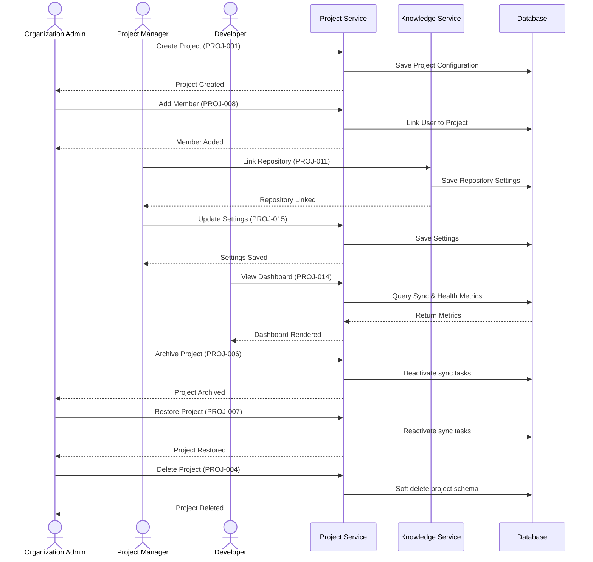

# Project API

## Document Metadata

| Metadata Field | Value |
|---|---|
| Document Type | API Design / Project API Specification |
| Version | 1.0.0 |
| Status | Published |
| Owner | Portfolio Developer |
| Reviewer | Portfolio Developer |
| Last Updated | 2026-07-22 |

---

# Executive Summary

The Project Service manages logical workspace allocations, external resource connections, and project memberships. It acts as the coordinator linking codebases, ticket logs, and wiki pages into structured workspace boundaries, unblocking developers and providing tech leads with project configuration management.

This document defines the fifteen core APIs of the Project Service, details validation policies, maps access roles to an authorization matrix, outlines auditing events, and charts the lifecycle of project workspaces.

---

# Project Service Responsibilities

The Project Service is responsible for the following domain bounds:

* **Project Lifecycle:** Managing workspace initialization, details updates, and workspace archiving/restoration.
* **Repository Management:** Coordinating read-only links to GitHub repositories and monitoring connection statuses.
* **Project Membership:** Mapping users to project roles and restricting workspace query permissions.
* **Project Settings:** Configuring index sync intervals and rate limiting boundaries.
* **Project Archival:** Deactivating delta updates indexing runs while preserving historical logs.
* **External Repository Linking:** Orchestrating API credentials setup and push webhook triggers setup.

---

# API Inventory

The Project Service exposes the following endpoints:

| API ID | Endpoint | Method | Purpose |
|---|---|---|---|
| **PROJ-001** | `/api/v1/projects` | POST | Initialize a project workspace workspace. |
| **PROJ-002** | `/api/v1/projects/{projectId}` | GET | Retrieve metadata details of a specific project workspace. |
| **PROJ-003** | `/api/v1/projects/{projectId}` | PUT | Update project name or description parameters. |
| **PROJ-004** | `/api/v1/projects/{projectId}` | DELETE | Soft-delete a project workspace and disconnect connectors. |
| **PROJ-005** | `/api/v1/projects` | GET | List projects within the active organization tenant. |
| **PROJ-006** | `/api/v1/projects/{projectId}/archive` | POST | Archive a project workspace, halting background indexing. |
| **PROJ-007** | `/api/v1/projects/{projectId}/restore` | POST | Restore an archived project workspace. |
| **PROJ-008** | `/api/v1/projects/{projectId}/members` | POST | Add a user as a member of the project workspace. |
| **PROJ-009** | `/api/v1/projects/{projectId}/members/{userId}` | DELETE | Remove a user from the project workspace membership. |
| **PROJ-010** | `/api/v1/projects/{projectId}/members/{userId}/role` | PATCH | Update a project member's role setting. |
| **PROJ-011** | `/api/v1/projects/{projectId}/repositories` | POST | Link a read-only GitHub repository connector. |
| **PROJ-012** | `/api/v1/projects/{projectId}/repositories/{repositoryId}` | DELETE | Unlink a GitHub repository connector from the project. |
| **PROJ-013** | `/api/v1/projects/{projectId}/repositories` | GET | List GitHub repositories connected to the project workspace. |
| **PROJ-014** | `/api/v1/projects/{projectId}/dashboard` | GET | Retrieve project metrics and active synchronization logs. |
| **PROJ-015** | `/api/v1/projects/{projectId}/settings` | PUT | Edit project-wide synchronization settings parameters. |

---

# API DETAILS

---

## PROJ-001: Create Project
### Purpose
Initializes a new project workspace workspace within the tenant.
### Endpoint
`POST /api/v1/projects`
### Authentication Required
Yes
### Required Role
Owner, Organization Admin
### Path Parameters
None.
### Query Parameters
None.
### Request Body
| Field | Type | Required | Validation Rules |
|---|---|---|---|
| `name` | String | Yes | Length 2 to 100 characters. |
| `namespace` | String | Yes | URL-friendly namespace key (alphanumeric, hyphens). |
### Success Response
* **Status Code:** 201 Created
* **Response Body Envelope:**
```json
{
  "timestamp": "2026-07-22T23:36:11.000Z",
  "status": 201,
  "message": "Project created successfully",
  "data": {
    "projectId": "p1o2i3u4-y5t6-r7e8-w9q0-a1s2d3f4g5h6",
    "name": "Billing Service Backend",
    "namespace": "billing-backend",
    "organizationId": "z9y8x7w6-v5u4-t3s2-r1q0-p9o8n7m6l5k4",
    "status": "Active"
  },
  "metadata": {}
}
```
### Error Responses
| HTTP Status | Error Code | Description |
|---|---|---|
| 400 | `INVALID_PARAMETER_VALUE` | Namespace is not URL-friendly or name constraints failed. |
| 403 | `ACCESS_DENIED` | User lacks Admin/Owner role within the organization. |
| 409 | `DUPLICATE_RESOURCE` | The project namespace is already registered in the tenant. |

---

## PROJ-002: Get Project
### Purpose
Retrieves metadata settings of a specific project workspace.
### Endpoint
`GET /api/v1/projects/{projectId}`
### Authentication Required
Yes
### Required Role
Owner, Organization Admin, Project Manager, Developer, Viewer
### Path Parameters
* `projectId` (UUID): Target project workspace ID.
### Success Response
* **Status Code:** 200 OK
* **Response Body Envelope:**
```json
{
  "timestamp": "2026-07-22T23:36:11.000Z",
  "status": 200,
  "message": "Project retrieved successfully",
  "data": {
    "projectId": "p1o2i3u4-y5t6-r7e8-w9q0-a1s2d3f4g5h6",
    "name": "Billing Service Backend",
    "namespace": "billing-backend",
    "status": "Active"
  },
  "metadata": {}
}
```

---

## PROJ-003: Update Project
### Purpose
Modifies project name or description settings.
### Endpoint
`PUT /api/v1/projects/{projectId}`
### Authentication Required
Yes
### Required Role
Owner, Organization Admin, Project Manager
### Path Parameters
* `projectId` (UUID): Target project workspace ID.
### Request Body
| Field | Type | Required | Validation Rules |
|---|---|---|---|
| `name` | String | Yes | Length 2 to 100 characters. |
### Success Response
* **Status Code:** 200 OK
* **Response Body Envelope:**
```json
{
  "timestamp": "2026-07-22T23:36:11.000Z",
  "status": 200,
  "message": "Project updated successfully",
  "data": {
    "projectId": "p1o2i3u4-y5t6-r7e8-w9q0-a1s2d3f4g5h6",
    "name": "Billing Service API Engine"
  },
  "metadata": {}
}
```

---

## PROJ-004: Delete Project
### Purpose
Soft-deletes a project workspace and disconnects tool connectors.
### Endpoint
`DELETE /api/v1/projects/{projectId}`
### Authentication Required
Yes
### Required Role
Owner, Organization Admin
### Path Parameters
* `projectId` (UUID): Target project workspace ID.
### Success Response
* **Status Code:** 200 OK
* **Response Body Envelope:**
```json
{
  "timestamp": "2026-07-22T23:36:11.000Z",
  "status": 200,
  "message": "Project archived and disconnected successfully.",
  "data": {},
  "metadata": {}
}
```

---

## PROJ-005: List Projects
### Purpose
Lists projects registered within the user's organization.
### Endpoint
`GET /api/v1/projects`
### Authentication Required
Yes
### Required Role
Owner, Organization Admin, Project Manager, Developer, Viewer
### Query Parameters
* `page`, `size`, `sort` (standard pagination parameters).
### Success Response
* **Status Code:** 200 OK
* **Response Body Envelope:**
```json
{
  "timestamp": "2026-07-22T23:36:11.000Z",
  "status": 200,
  "message": "Projects list retrieved successfully",
  "data": [
    {
      "projectId": "p1o2i3u4-y5t6-r7e8-w9q0-a1s2d3f4g5h6",
      "name": "Billing Service Backend",
      "namespace": "billing-backend",
      "status": "Active"
    }
  ],
  "metadata": {
    "page": 0,
    "size": 20,
    "totalElements": 1
  }
}
```

---

## PROJ-006: Archive Project
### Purpose
Archives a project workspace, deactivating background sync updates.
### Endpoint
`POST /api/v1/projects/{projectId}/archive`
### Authentication Required
Yes
### Required Role
Owner, Organization Admin, Project Manager
### Path Parameters
* `projectId` (UUID): Target project workspace ID.
### Success Response
* **Status Code:** 200 OK
* **Response Body Envelope:**
```json
{
  "timestamp": "2026-07-22T23:36:11.000Z",
  "status": 200,
  "message": "Project archived successfully. Index sync runs suspended.",
  "data": {},
  "metadata": {}
}
```

---

## PROJ-007: Restore Project
### Purpose
Restores an archived project workspace.
### Endpoint
`POST /api/v1/projects/{projectId}/restore`
### Authentication Required
Yes
### Required Role
Owner, Organization Admin, Project Manager
### Path Parameters
* `projectId` (UUID): Target project workspace ID.
### Success Response
* **Status Code:** 200 OK
* **Response Body Envelope:**
```json
{
  "timestamp": "2026-07-22T23:36:11.000Z",
  "status": 200,
  "message": "Project restored successfully. Sync queues reactivated.",
  "data": {},
  "metadata": {}
}
```

---

## PROJ-008: Add Project Member
### Purpose
Links a user profile to the project workspace.
### Endpoint
`POST /api/v1/projects/{projectId}/members`
### Authentication Required
Yes
### Required Role
Owner, Organization Admin, Project Manager
### Path Parameters
* `projectId` (UUID): Target project workspace ID.
### Request Body
| Field | Type | Required | Validation Rules |
|---|---|---|---|
| `userId` | UUID | Yes | Active user identifier key. |
| `role` | String | Yes | Project role name (Developer, Manager, Viewer). |
### Success Response
* **Status Code:** 201 Created
* **Response Body Envelope:**
```json
{
  "timestamp": "2026-07-22T23:36:11.000Z",
  "status": 201,
  "message": "Member linked to project successfully",
  "data": {
    "userId": "a1b2c3d4-e5f6-7a8b-9c0d-1e2f3a4b5c6d",
    "role": "Developer"
  },
  "metadata": {}
}
```

---

## PROJ-009: Remove Project Member
### Purpose
Unlinks a user from the project workspace.
### Endpoint
`DELETE /api/v1/projects/{projectId}/members/{userId}`
### Authentication Required
Yes
### Required Role
Owner, Organization Admin, Project Manager
### Path Parameters
* `projectId` (UUID): Target project workspace ID.
* `userId` (UUID): Target user ID to be unlinked.
### Success Response
* **Status Code:** 200 OK

---

## PROJ-010: Update Project Member Role
### Purpose
Updates a project member's role settings.
### Endpoint
`PATCH /api/v1/projects/{projectId}/members/{userId}/role`
### Authentication Required
Yes
### Required Role
Owner, Organization Admin, Project Manager
### Request Body
| Field | Type | Required | Validation Rules |
|---|---|---|---|
| `role` | String | Yes | Project role name (Developer, Manager, Viewer). |
### Success Response
* **Status Code:** 200 OK

---

## PROJ-011: Link GitHub Repository
### Purpose
Connects a read-only GitHub repository.
### Endpoint
`POST /api/v1/projects/{projectId}/repositories`
### Authentication Required
Yes
### Required Role
Owner, Organization Admin, Project Manager
### Path Parameters
* `projectId` (UUID): Target project workspace ID.
### Request Body
| Field | Type | Required | Validation Rules |
|---|---|---|---|
| `repositoryUrl` | String | Yes | Valid Git HTTPS URL format. |
| `accessToken` | String | Yes | OAuth token containing read-only access. |
### Success Response
* **Status Code:** 201 Created
* **Response Body Envelope:**
```json
{
  "timestamp": "2026-07-22T23:36:11.000Z",
  "status": 201,
  "message": "GitHub repository connected successfully",
  "data": {
    "repositoryId": "r9e8w7q6-a5s4-d3f2-g1h0-j9k8l7m6n5o4",
    "url": "https://github.com/company/billing-backend",
    "status": "Connected"
  },
  "metadata": {}
}
```

---

## PROJ-012: Unlink GitHub Repository
### Purpose
Disconnects a GitHub repository from the project workspace.
### Endpoint
`DELETE /api/v1/projects/{projectId}/repositories/{repositoryId}`
### Authentication Required
Yes
### Required Role
Owner, Organization Admin, Project Manager
### Path Parameters
* `projectId` (UUID): Target project workspace ID.
* `repositoryId` (UUID): Target linked repository ID.
### Success Response
* **Status Code:** 200 OK

---

## PROJ-013: List Linked Repositories
### Purpose
Lists GitHub repositories connected to the project workspace.
### Endpoint
`GET /api/v1/projects/{projectId}/repositories`
### Authentication Required
Yes
### Required Role
Owner, Organization Admin, Project Manager, Developer, Viewer
### Path Parameters
* `projectId` (UUID): Target project workspace ID.
### Success Response
* **Status Code:** 200 OK

---

## PROJ-014: Project Dashboard
### Purpose
Retrieves project dashboard summary indicators.
### Endpoint
`GET /api/v1/projects/{projectId}/dashboard`
### Authentication Required
Yes
### Required Role
Owner, Organization Admin, Project Manager, Developer, Viewer
### Path Parameters
* `projectId` (UUID): Target project workspace ID.
### Success Response
* **Status Code:** 200 OK
* **Response Body Envelope:**
```json
{
  "timestamp": "2026-07-22T23:36:11.000Z",
  "status": 200,
  "message": "Dashboard metrics retrieved successfully",
  "data": {
    "totalIndexedFiles": 1205,
    "lastSyncTime": "2026-07-22T23:00:00.000Z",
    "connectorsStatus": {
      "github": "Connected",
      "jira": "Connected"
    },
    "queryVolume30d": 1205,
    "averageQueryLatencyMs": 850
  },
  "metadata": {}
}
```

---

## PROJ-015: Update Project Settings
### Purpose
Modifies workspace sync and pacing parameters.
### Endpoint
`PUT /api/v1/projects/{projectId}/settings`
### Authentication Required
Yes
### Required Role
Owner, Organization Admin, Project Manager
### Path Parameters
* `projectId` (UUID): Target project workspace ID.
### Request Body
| Field | Type | Required | Validation Rules |
|---|---|---|---|
| `syncIntervalHours` | Integer | Yes | Interval hours (value between 1 and 168). |
| `maxFilesLimit` | Integer | Yes | Total indexed files ceiling limit. |
### Success Response
* **Status Code:** 200 OK

---

# Project Lifecycle

The sequence diagram below models project creation, member additions, repository connections, metrics queries, and deactivation:



---

# Validation Rules

* **Project Name:** Length between 2 and 100 characters; alphanumeric and space characters only.
* **Project Namespace:** URL-friendly string format (lowercase, hyphens, alphanumeric characters only).
* **Repository URL:** Valid HTTPS format string matching GitHub domain schemes.
* **Duplicate Repository:** Attempting to connect a repository URL already linked within the same tenant organization is blocked.
* **Duplicate Project:** Creating project namespaces already active in the tenant organization triggers conflict errors.
* **Member Validation:** Users added to project workspaces must exist as active members in the parent tenant Organization database.

---

# Authorization Matrix

Permissions mappings governing Project API access:

| Target Role | Authorized APIs |
|---|---|
| **Owner** | `PROJ-001` through `PROJ-015` |
| **Organization Admin** | `PROJ-001` through `PROJ-015` |
| **Project Manager** | `PROJ-002` (Get), `PROJ-003` (Update), `PROJ-005` (List), `PROJ-006` (Archive), `PROJ-007` (Restore), `PROJ-008` (Add Member), `PROJ-009` (Remove Member), `PROJ-010` (Update Role), `PROJ-011` (Link Repo), `PROJ-012` (Unlink Repo), `PROJ-013` (List Repos), `PROJ-014` (Dashboard), `PROJ-015` (Settings) |
| **Developer** | `PROJ-002` (Get Project), `PROJ-005` (List Projects), `PROJ-013` (List Repos), `PROJ-014` (Project Dashboard) |
| **Viewer** | `PROJ-002` (Get Project), `PROJ-005` (List Projects), `PROJ-014` (Project Dashboard) |

---

# Error Code Matrix

Key exceptions returned by the Project APIs:

| Error Code | HTTP Status | Description |
|---|---|---|
| **INVALID_PARAMETER_VALUE** | 400 Bad Request | Invalid parameter lengths, repository URL syntax, or namespace formats. |
| **TOKEN_EXPIRED** | 401 Unauthorized | JWT session has expired. |
| **ACCESS_DENIED** | 403 Forbidden | User lacks authorization in the target organization or project workspace. |
| **RESOURCE_NOT_FOUND** | 404 Not Found | Target Project, Repository, or User ID does not exist. |
| **DUPLICATE_RESOURCE** | 409 Conflict | Namespace is duplicate or repository URL is already registered. |

---

# Audit Events

The Project Service logs immutable audit logs for the following administrative actions:

* `PROJECT_CREATED`: Logged with creator user ID and namespace.
* `PROJECT_UPDATED`: Tracked with update details.
* `PROJECT_ARCHIVED`: Tracked when indexing runs are suspended.
* `PROJECT_RESTORED`: Tracked when indexing runs are reactivated.
* `PROJECT_DELETED`: Tracked when project is soft-deleted.
* `REPOSITORY_LINKED`: Tracked with target GitHub repository URL.
* `REPOSITORY_UNLINKED`: Logged when connection credentials are deleted.
* `MEMBER_ADDED`: Tracked with user ID and project role configuration.
* `MEMBER_REMOVED`: Logged when member access is unlinked from the project.
* `PROJECT_SETTINGS_UPDATED`: Tracked when sync intervals or indexing parameters change.

---

# Risks

Project management APIs face key security and configuration risks:

### Cross-Tenant Access
* *Risk:* Malicious users modify project IDs to list or alter repositories belonging to other companies.
* *Mitigation:* The API Gateway verifies the tenant `org_id` claim in the signed JWT against the target project organization boundary.

### Repository Conflicts
* *Risk:* A repository is linked to multiple project workspaces concurrently, creating duplicate sync actions.
* *Mitigation:* Restrict repository URLs to a single project mapping within the tenant database schema.

### Privilege Escalation
* *Risk:* A project member tries to alter settings parameters or link repository keys.
* *Mitigation:* Enforce strict RBAC checks, rejecting POST/PUT calls from Developer or Viewer roles.

---

# Conclusion

The Project API document establishes the detailed specifications, inputs, success configurations, validation parameters, and error codes for the ProjectMind AI Project Service. By enforcing logical tenant isolations, strict RBAC matrices, namespace uniqueness validation, and immutable audit logs, these APIs secure codebase workspaces while enabling the developer collaboration.

---

# Revision History

| Version | Date | Author / Role | Summary of Changes |
|---|---|---|---|
| 0.1.0 | 2026-07-22 | Developer / Architect | Initial creation of the Project API Specification. |
