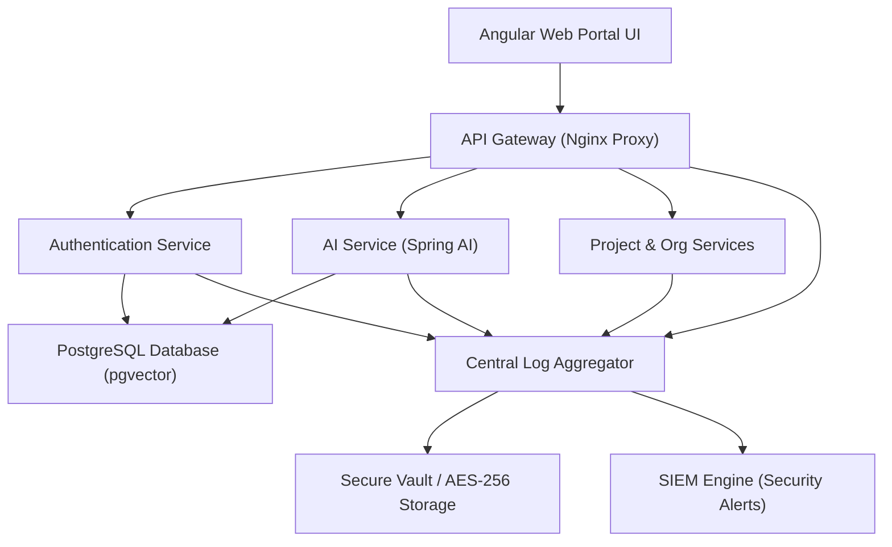
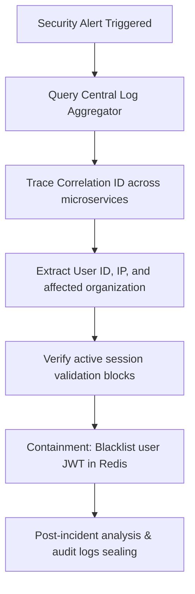

# Audit Logging

## Document Metadata

| Metadata Field | Value |
|---|---|
| Document Type | Security & Compliance / Audit Logging |
| Version | 1.0.0 |
| Status | Published |
| Owner | Chief Information Security Officer (CISO) |
| Reviewer | Developer / Principal Architect |
| Last Updated | 2026-07-22 |

---

# Executive Summary

Audit logging is a critical operational control required to maintain enterprise-grade security, verify logical multi-tenant isolation, and demonstrate compliance with frameworks like ISO 27001 and SOC 2. By capturing details of user activities, API executions, credentials changes, and AI query histories, the platform provides security teams with visibility to detect anomalies, investigate incidents, and support forensic analysis.

This document establishes the platform's audit logging architecture, structures standardized log schemas, defines event lists, and outlines retention, protection, and SIEM integration policies.

---

# Audit Logging Objectives

The platform logging strategy is guided by six primary objectives:

* **Accountability:** Track administrative modifications, permission changes, and connector creations to specific user accounts.
* **Traceability:** Trace API requests across distributed microservices using centralized correlation identifiers.
* **Compliance:** Align log generation, protection, and retention policies with ISO 27001, SOC 2, and GDPR requirements.
* **Incident Investigation:** Provide security teams with clear audit records to conduct post-incident forensic reviews.
* **Security Monitoring:** Enable real-time detection of threats, such as brute-force attempts and cross-tenant access.
* **Operational Visibility:** Monitor search query latencies, API error rates, and sync task completions.

---

# Audit Logging Architecture

ProjectMind AI gathers, processes, and protects log files generated across all tiers of the platform:

* **Application Logs:** Generated by Spring Boot microservices, capturing internal log events and trace details.
* **API Logs:** Generated by the API Gateway, tracking request/response payloads, IP addresses, and latencies.
* **Authentication Logs:** Generated by the Auth Service, tracking logins, deactivations, and password updates.
* **Authorization Logs:** Logs role checks and tenant isolation violations.
* **Database Audit Logs:** Captured at the database engine layer, logging schema updates and CRUD modifications.
* **AI Activity Logs:** Log prompt queries, chunk selections, citation details, and token counts.
* **Integration Logs:** Track API connections and synchronization runs with GitHub, Jira, and Confluence.
* **Infrastructure Logs:** Generated by container engines and host systems.



---

# Audit Event Categories

The table below catalogs audit events mapped by category:

| Category | Examples |
|---|---|
| **Authentication** | Login Success, Login Failure, Logout, MFA Verification. |
| **Authorization** | Permission Denied (403), Token Expiry, Tenant Violation. |
| **User Activity** | Workspace Access, Q&A Query Submission, Feedback Rating. |
| **Organization** | Tenant Created, SSO Configuration Edited, Domain Suffix Added. |
| **Project** | Project Created, Project Settings Updated, Project Archived. |
| **Knowledge** | Connector Configured, Document Uploaded, Sync Task Accepted. |
| **AI Events** | Prompt Ingestion, Cosine Similarity Query, Citations Generated. |
| **Integration** | GitHub Webhook Received, Jira API Call, Confluence Sync Complete. |
| **System** | Service Initialized, Redis Cache Cleared, Database Connection Restored. |
| **Administrative** | Role Promoted, User Account Suspended, Audit Log Exported. |

---

# User Activity Logging

The platform logs the following user actions:

* `USER_LOGIN_SUCCESS`: Tracks User ID, tenant organization, source IP, and timestamp.
* `USER_LOGIN_FAILURE`: Tracks attempted email, failure reason (e.g. invalid credentials), and source IP.
* `USER_LOGOUT`: Tracks session termination.
* `PASSWORD_CHANGED`: Logs password updates.
* `USER_PROFILE_UPDATED`: Logs modifications to name or contact info.
* `ORGANIZATION_JOINED`: Tracks user acceptance of invitation tokens.
* `PROJECT_ACCESSED`: Logs workspace routing events.
* `KNOWLEDGE_SEARCHED`: Logs keyword queries without context retrieval.
* `AI_QUESTION_ASKED`: Logs RAG queries, prompt lengths, and session IDs.
* `FILE_UPLOADED`: Logs document uploads (file name, checksum, size).
* `FILE_DOWNLOADED`: Logs retrieval of source snippets.

---

# Security Event Logging

To detect threats, the platform logs the following security events:

* `AUTH_FAILED_LOGIN`: Multiple failed login attempts (triggering account lockouts).
* `AUTH_ACCOUNT_LOCKED`: Logs account lockouts due to brute-force triggers.
* `AUTHZ_PERMISSION_DENIED`: Logs unauthorized API request attempts.
* `TOKEN_EXPIRED`: Logs requests made with expired JWTs.
* `TOKEN_REVOKED`: Logs use of blacklisted JWTs.
* `SUSPICIOUS_IP_ACTIVITY`: Logs concurrent logins from different geographic locations.
* `TENANT_CROSS_ACCESS_ATTEMPT`: Logs attempts to access other organizations' data.
* `PRIVILEGE_ESCALATION_ATTEMPT`: Logs unauthorized requests to modify user roles.

---

# API Audit Logging

API audit logs trace the lifecycle of HTTP requests:

* `apiEndpoint`: Target URL path (e.g. `/api/v1/projects`).
* `httpMethod`: REST verb used (GET, POST, PUT, DELETE).
* `requestId`: Unique identifier generated per request.
* `correlationId`: Unified UUID traced across microservice logs.
* `userId`: ID of the requesting user.
* `organizationId`: Tenant ID of the user.
* `responseStatus`: HTTP status code (e.g., 200, 403, 500).
* `responseTimeMs`: Request latency in milliseconds.

---

# AI Audit Logging

AI logs track prompt contexts, token usage, and feedback metrics:

* `promptTextLength`: Size of the user prompt in characters.
* `contextChunksCount`: Number of context chunks retrieved from pgvector.
* `citationSourcesList`: List of document paths referenced by the RAG answer.
* `tokensConsumed`: Total prompt and completion tokens consumed.
* `aiExecutionError`: Downstream API connection error logs.
* `userFeedbackScore`: Thumbs up/down indicators.

---

# Database Audit Events

PostgreSQL logs the following database modifications:

* `DB_INSERT`: Tracks record creation.
* `DB_UPDATE`: Tracks record changes.
* `DB_DELETE`: Tracks hard purges.
* `DB_SOFT_DELETE`: Tracks logical deactivations.
* `DB_SCHEMA_CHANGED`: Logs schema modifications.
* `DB_ADMIN_CHANGES`: Logs database privileges updates.

---

# Log Format

All services must generate logs in a standardized JSON structure:

| Field | Data Type | Description |
|---|---|---|
| `timestamp` | ISO-8601 String | Date-time timestamp logging the event. |
| `eventId` | UUID | Unique identifier for the log record. |
| `eventType` | String | Event type code (e.g. `USER_LOGIN_SUCCESS`). |
| `severity` | String | Severity rating (INFO, WARN, ERROR, FATAL). |
| `userId` | UUID | ID of the triggering user (null for system actions). |
| `organizationId`| UUID | Tenant ID of the active user. |
| `projectId` | UUID | Project ID of the workspace (where applicable). |
| `correlationId` | UUID | Tracing key passed across microservices. |
| `sourceService` | String | Name of the generating microservice (e.g. `ai-service`). |
| `message` | String | Detailed description of the event. |

```json
{
  "timestamp": "2026-07-22T23:44:29.000Z",
  "eventId": "e1a2s3k4-j5o6-b7q8-s9t0-a1s2d3f4g5h6",
  "eventType": "TENANT_CROSS_ACCESS_ATTEMPT",
  "severity": "WARN",
  "userId": "a1b2c3d4-e5f6-7a8b-9c0d-1e2f3a4b5c6d",
  "organizationId": "z9y8x7w6-v5u4-t3s2-r1q0-p9o8n7m6l5k4",
  "projectId": "p1o2i3u4-y5t6-r7e8-w9q0-a1s2d3f4g5h6",
  "correlationId": "c1o2r3r4-e5l6-a7t8-i9o0-n1s2d3f4g5h6",
  "sourceService": "project-service",
  "message": "User attempted to modify project settings belonging to different organization."
}
```

---

# Log Retention Policy

* **Retention Period:** Retain security audit logs and database change logs for a minimum of 365 days. Operational logs are retained for 30 days.
* **Archival:** Compress logs older than 30 days and move them to secure cold storage vaults monthly.
* **Secure Storage:** Store cold storage archives in read-only partitions encrypted with AES-256 keys.
* **Secure Deletion:** Automatically purge expired log archives daily, overwriting storage sectors.

---

# Log Protection

* **Encryption:** Encrypt log files in transit using TLS 1.3 and at rest using AES-256.
* **Tamper Resistance:** Write logs to append-only storage partitions. Direct log updates or deletions are blocked.
* **Access Control:** Restrict log storage access to authorized Security Administrators.
* **Integrity Validation:** Use hash-chaining verification to confirm log archives have not been tampered with.

---

# Monitoring & Alerting

The SIEM engine triggers real-time alerts for the following events:

* **Failed Login Alerts:** Raised when an account triggers a lockout (5 failures in 10 minutes).
* **Suspicious Activity Alerts:** Raised when a user attempts cross-tenant access.
* **AI Abuse Alerts:** Raised when a user account exceeds prompt quotas or token limits.
* **API Abuse Alerts:** Raised when rate limit thresholds are exceeded.
* **Infrastructure Alerts:** Raised on system failures or database connection errors.

---

# SIEM Integration

* **Log Aggregation:** Microservices stream JSON logs to a centralized log aggregator.
* **Security Analytics:** The SIEM engine analyzes log streams to detect anomalies and identify potential threats.
* **Threat Detection:** Correlate log events across microservices using correlation IDs to map attack paths.
* **Compliance Reporting:** Automatically compile monthly log reports to satisfy ISO 27001 and SOC 2 requirements.

---

# Audit Reports

The platform supports five standardized compliance and activity reports:

* **User Activity Reports:** Detailed summaries of logins, searches, and file uploads.
* **Security Reports:** Catalog of blocked access attempts, lockouts, and rate limit errors.
* **AI Usage Reports:** Metrics on prompt volumes, token usage, and feedback ratings.
* **Compliance Reports:** Summaries of administrative changes and role modifications.
* **Administrative Reports:** Logs of connector creations and settings updates.

---

# Incident Investigation

The sequence diagram below models forensic log analysis during an incident investigation:



---

# Risks

Logging systems face key operational and security risks:

### Missing Logs
* *Risk:* Network errors cause log drops, creating gaps in audit trails.
* *Mitigation:* Configure local caching on microservices to store logs temporarily during connection drops.

### Log Tampering
* *Risk:* Compromised admin accounts modify logs to hide malicious activities.
* *Mitigation:* Enforce read-only access controls and store logs in write-once-read-many (WORM) vaults.

### Sensitive Data in Logs
* *Risk:* Cleartext passwords or API keys are written to logs, violating compliance rules.
* *Mitigation:* Apply regex sanitization to filter out credentials before writing logs.

---

# Best Practices

ProjectMind AI enforces six logging best practices:
* Format all logs as structured JSON.
* Traces requests across microservices using gateway-generated Correlation IDs.
* Stream all logs to a centralized log aggregator.
* Enforce automated log rotation to manage storage capacity.
* Restrict log access to authorized Security Administrators.
* Conduct monthly reviews of security alerts and log archives.

---

# Conclusion

The ProjectMind AI Audit Logging document defines the logging architecture, event schemas, protection controls, and SIEM integration rules. Implementing this centralized, immutable logging strategy provides the operational visibility and forensic evidence trail necessary to secure workspace knowledgebases and satisfy ISO 27001 and SOC 2 compliance.

---

# Revision History

| Version | Date | Author / Role | Summary of Changes |
|---|---|---|---|
| 0.1.0 | 2026-07-22 | CISO / Architect | Initial creation of the Audit Logging Document. |
