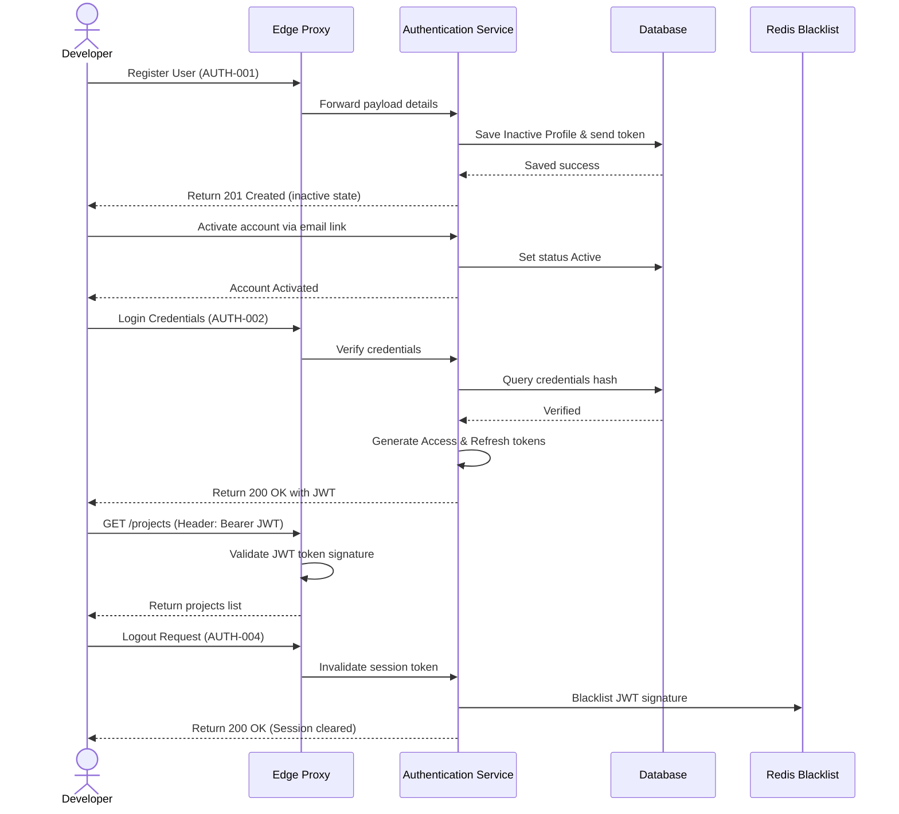
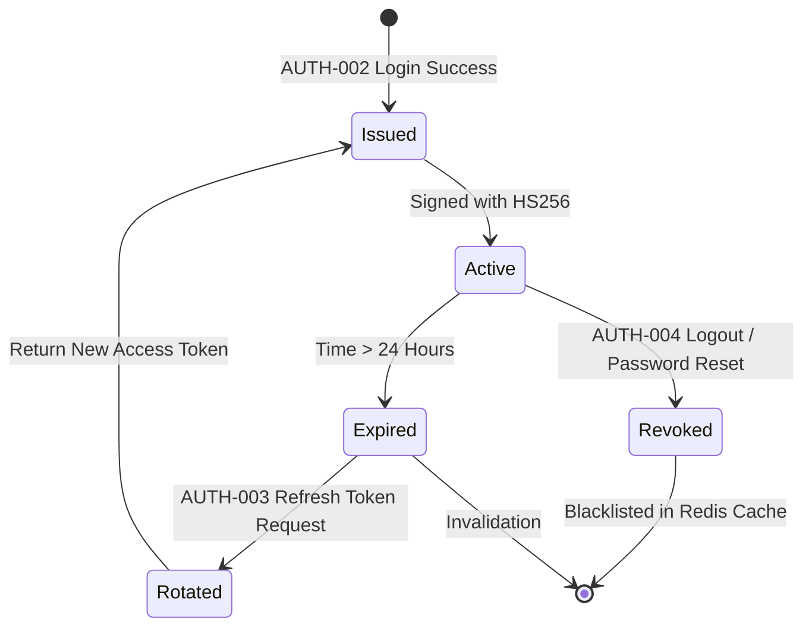

# Authentication & Authorization

## Document Metadata

| Metadata Field | Value |
|---|---|
| Document Type | Security & Compliance / Authentication & Authorization |
| Version | 1.0.0 |
| Status | Published |
| Owner | Chief Information Security Officer (CISO) |
| Reviewer | Developer / Principal Architect |
| Last Updated | 2026-07-22 |

---

# Executive Summary

The ProjectMind AI Authentication and Authorization specification establishes the cryptographic workflows, identity validation parameters, role boundaries, and multi-tenant filters protecting user logins and workspace query paths.

By combining signed JSON Web Tokens (JWT) for authentication with role-based access controls (RBAC) and logical tenant checks, this model secures the system while allowing developers to search codebase knowledgebases.

---

# Authentication Overview

User identity validation and session management are governed by the following controls:

* **Identity Management:** User identities are managed using enterprise Single Sign-On (SSO) systems (SAML 2.0 / Okta). Non-SSO login credentials store passwords as bcrypt hashes, verifying roles on login.
* **Login Process:** Standard authentication requests exchange user credentials for a signed session token. Accounts must be marked as Active in database schemas to complete logins.
* **User Verification:** New registrations trigger automated activation link emails containing short-lived tokens, gating access.
* **JWT Authentication:** The system uses JSON Web Tokens (JWT) to secure stateless communications between client interfaces and microservices.
* **Token Validation:** The API Gateway validates JWT signatures, check expirations, and extract organization and role claims before forwarding requests.

---

# Authentication Flow

The sequence diagram below models registration verification, login credentials checks, JWT token issuance, token rotations, and session logout:

---

# JWT Token Strategy

The platform manages active sessions using a token rotation strategy:

* **Access Token:** Cryptographically signed JSON Web Token (JWT) using HMAC SHA-256 with system keys. Access tokens expire after 24 hours.
* **Refresh Token:** Secure UUID v4 stored in the database, used to acquire new access tokens when they expire. Refresh tokens expire after 30 days.
* **Claims:** The access token encodes user identifiers, emails, roles metadata, and organization tenant UUIDs.
* **Expiration:** Automatic token expiration prevents token reuse.
* **Rotation:** Refreshing an expired access token generates a new refresh token, invalidating the old one.
* **Revocation:** Logging out blacklists the active JWT signature in Redis for its remaining lifespan.

---

# Role-Based Access Control (RBAC)

User privileges are mapped to six logical platform roles:

* **Super Admin:** Platform Operators managing organizations creation and global configurations.
* **Organization Owner:** The corporate client owner managing settings, Billing, and SSO setups.
* **Organization Admin:** Organization administrators managing project workspaces, memberships, and connector configurations.
* **Project Manager:** Project managers configuring connector parameters and repository synchronizations.
* **Developer:** Developers running context searches and reviewing conversation threads.
* **Viewer:** Read-only access to search screens and workspace dashboards.

---

# Permission Matrix

The platform permission matrix maps resource actions to authorized roles:

| Resource | Action | Allowed Roles |
|---|---|---|
| **Organization** | Create / Delete | Super Admin, Owner |
| | Read / Update | Owner, Org Admin |
| **Project** | Create / Delete | Owner, Org Admin |
| | Read / Update | Owner, Org Admin, Project Manager, Developer, Viewer |
| **Repository** | Link / Unlink | Owner, Org Admin, Project Manager |
| | Read / List | Owner, Org Admin, Project Manager, Developer, Viewer |
| **Knowledge Source** | Create / Delete | Owner, Org Admin, Project Manager |
| | Read / Sync | Owner, Org Admin, Project Manager, Developer |
| **AI Chat** | Query / Ask | Owner, Org Admin, Project Manager, Developer, Viewer |
| | Delete Thread | Owner, Org Admin, Project Manager, Developer, Viewer |
| **Users** | Invite / Remove | Owner, Org Admin |
| | Read Roster | Owner, Org Admin, Project Manager, Developer, Viewer |
| **Audit Logs** | Read / Export | Super Admin, Owner, Security Admin |
| **Settings** | Update SSO / Domains | Owner, Org Admin |

---

# Authorization Strategy

ProjectMind AI enforces access boundaries at three execution tiers:

* **API Authorization:** The API Gateway validates JWT signatures and parses roles, filtering out requests that violate the permission matrix.
* **Service Authorization:** Microservices validate roles before executing business logic, returning a *403 Forbidden* for unauthorized requests.
* **Resource Ownership:** Enforce user ID and project ID validations to prevent users from accessing or modifying other tenants' resources.
* **Organization & Project Isolation:** Logical tenant checks ensure queries filter data using the organization ID from the validated JWT claims.

---

# Session Management

* **Login Session:** Issued access tokens act as stateless session keys, valid for 24 hours.
* **Session Timeout:** Access tokens expire after 24 hours, requiring client token rotations.
* **Logout:** Logging out registers the access token signature in Redis blacklist caches, invalidating it immediately.
* **Concurrent Sessions:** Limit users to 5 concurrent active sessions, rotating oldest refresh tokens to prevent token leakage.
* **Idle Timeout:** Client portals automatically delete local tokens after 30 minutes of inactivity.

---

# Password Policy

For accounts not managed by corporate SSO, the following password policies apply:

* **Minimum Length:** Passwords must be at least 8 characters long.
* **Complexity:** Must contain at least one uppercase letter, one lowercase letter, one numeric digit, and one special character.
* **Password History:** Block reuse of the last 5 passwords.
* **Password Expiration:** Enforce password updates every 90 days.
* **Account Lockout:** Accounts are locked for 15 minutes after 5 consecutive failed login attempts within 10 minutes.
* **Failed Login Attempts:** Log failed login events with IP addresses and user identifiers to detect brute-force attacks.

---

# Multi-Tenant Authorization

* **Organization Boundary:** Database queries dynamically append `WHERE organization_id = :orgId` using claims extracted from the user's JWT.
* **Resource Ownership:** Verify that requested resource IDs (e.g. projects, connectors) belong to the active user's organization.
* **Cross-Tenant Prevention:** Reject requests that attempt to join tables across different organization boundaries.
* **Membership Validation:** Confirm that the user account holds an active relationship in the target organization's membership table.

---

# API Authorization Rules

API category access guidelines are defined below:

| API Category | Authentication | Authorization |
|---|---|---|
| **Public Portal** | None | Public access for landing pages. |
| **Authentication** | None (Register/Login/Reset) | Anonymous access; validation gates verify inputs. |
| **Security Auditing** | Required (Bearer JWT) | Super Admin or Owner roles only. |
| **Workspace Settings** | Required (Bearer JWT) | Owner or Admin roles within the target tenant organization. |
| **Codebase Search** | Required (Bearer JWT) | Verified members of the target project workspace. |

---

# Security Controls

* **JWT Validation:** Enforce signature, expiration, and issuer checks on all incoming JWTs.
* **Token Signature:** Access tokens are signed using HMAC SHA-256 with keys rotated monthly.
* **Secure Cookies:** Store JWT tokens in secure browser cookies (HttpOnly, Secure, SameSite=Strict attributes).
* **HTTPS Protocol:** Enforce TLS 1.3 encryption for all data in transit.
* **CSRF Strategy:** Enforce Anti-CSRF double-submit token validations on state-changing requests.
* **CORS Policy:** Restrict allowed origins to verified Angular UI domain interfaces.
* **Rate Limiting:** IP and JWT-based rate pacing limits protect backend resources from DoS queries.

---

# Authentication Failure Handling

Authentication failures must return standardized HTTP status codes and error messages:

* **Invalid Credentials:** Returns *401 Unauthorized* with `INVALID_CREDENTIALS` error code.
* **Expired Token:** Returns *401 Unauthorized* with `TOKEN_EXPIRED` error code.
* **Invalid Token:** Returns *401 Unauthorized* with `INVALID_TOKEN` error code.
* **Missing Token:** Returns *401 Unauthorized* with `MISSING_TOKEN` error code.
* **Unauthorized Access:** Returns *403 Forbidden* with `ACCESS_DENIED` error code when roles constraints fail.
* **Forbidden Access:** Returns *403 Forbidden* with `RESOURCE_BOUNDS_VIOLATION` error code when tenant boundary checks fail.

---

# Audit Requirements

The Authentication Service logs security logs for the following events:

* `LOGIN_SUCCESS`: Logged with user ID, tenant organization, and IP address.
* `LOGIN_FAILURE`: Logged with attempted email, failure reason, and IP address.
* `PASSWORD_CHANGE`: Tracked with modifier user ID.
* `ROLE_CHANGE`: Tracked with target user ID and old/new role values.
* `PERMISSION_CHANGE`: Tracked when organization privileges update.
* `LOGOUT`: Tracked when a user deactivates their session.

---

# Risks

Access management faces key security and operational risks:

### Credential Theft
* *Risk:* Compromised corporate credentials allow unauthorized access to search databases.
* *Mitigation:* Enforce SAML SSO, short-lived JWT sessions, and session blacklists.

### Token Leakage
* *Risk:* Hijacked JWT tokens are used to bypass gateway checks.
* *Mitigation:* Use HttpOnly cookies, enforce TLS 1.3, and rotate refresh tokens dynamically.

### Insider Threats
* *Risk:* A malicious administrator modifies user settings or views queries log histories.
* *Mitigation:* Enforce logical data partitioning, log administrative actions in immutable audit trails, and restrict query log access.

---

# Conclusion

The ProjectMind AI Authentication & Authorization document defines the security architecture, token strategies, RBAC privileges, and tenant isolation rules governing platform access. By enforcing SAML SSO integrations, HMAC-signed JWT lifecycles, and multi-tenant resource boundaries checks, this model secures organization workspaces while enabling developer search capabilities.

---

# Revision History

| Version | Date | Author / Role | Summary of Changes |
|---|---|---|---|
| 0.1.0 | 2026-07-22 | CISO / Architect | Initial creation of the Authentication & Authorization Document. |
