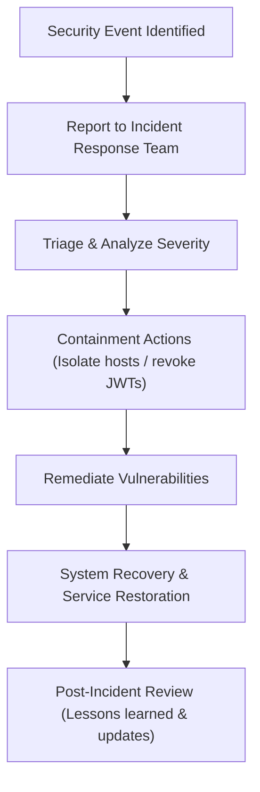

# Security Policies

## Document Metadata

| Metadata Field | Value |
|---|---|
| Document Type | Security & Compliance / Security Policies |
| Version | 1.0.0 |
| Status | Published |
| Owner | Chief Information Security Officer (CISO) |
| Reviewer | Developer / Principal Architect |
| Last Updated | 2026-07-22 |

---

# Executive Summary

ProjectMind AI handles highly sensitive corporate code assets, tickets, and runs logs. To protect this data, this Security Policies document establishes the mandatory controls, administrative rules, and technical standards governing platform operations.

By defining policies for identity management, data protection, secure application lifecycles, container host isolation, AI prompt sanitization, and incident response workflows, this document ensures the platform complies with enterprise security expectations.

---

# Security Objectives

The security policy is guided by six primary objectives:

* **Confidentiality:** Restrict access to repository files and conversation history logs strictly to authorized accounts.
* **Integrity:** Protect indexing files metadata and vector configurations from unauthorized modification.
* **Availability:** Establish resilient, stateless container architectures to guarantee search portal uptime.
* **Accountability:** Track administrative modifications and query events in immutable audit trails.
* **Privacy:** Partition tenant database records and vector spaces logically using organization identifiers.
* **Compliance:** Align development and operational pipelines with OWASP Top 10 standards and GDPR requirements.

---

# Security Principles

Platform engineering and operations must adhere to the following principles:

* **Zero Trust:** Every request (internal or external) must validate JWT signatures and permissions claims.
* **Least Privilege:** Limit accounts and microservices to the minimum scopes needed to perform their functions.
* **Defense in Depth:** Implement security controls across multiple layers (proxy filters, API gateway limiters, container boundaries, DB security groups).
* **Secure by Design:** Address security requirements at the start of feature design and system modeling.
* **Secure by Default:** Initialize new projects with closed ingress, short session bounds, and inactive accounts.
* **Separation of Duties:** Restrict administrative privileges, ensuring no single user can alter indexes and modify audit logs.
* **Principle of Minimal Exposure:** Avoid storing local copies of entire repository source files, keeping only tokenized chunks metadata.

---

# Security Governance

ProjectMind AI enforces the following governance responsibilities:

* **Security Ownership:** The CISO oversees policy updates, access audits, and incident investigations.
* **Development Responsibilities:** Engineering teams must write secure code, resolve static analysis findings, and update dependencies.
* **Operations Responsibilities:** DevOps teams manage TLS certificate rotations, container configurations, and firewall security group rules.
* **Incident Response Responsibilities:** A designated security team is responsible for triaging events, executing containment procedures, and conducting post-incident reviews.
* **Security Review Process:** Conduct threat modeling reviews before merging major system or database schema changes.

---

# Identity & Access Policies

* **User Identity Management:** User identities are managed using enterprise Single Sign-On (SSO) systems (SAML 2.0 / Okta), eliminating password database storage.
* **Authentication Policy:** Enforce Multi-Factor Authentication (MFA) at the IdP. Non-SSO logins require bcrypt password hashing with a high cost factor.
* **Authorization Policy:** Access to microservices endpoints requires validated JWT session tokens containing organization ID and role claims.
* **Role-Based Access Control (RBAC):** Users must be assigned a role matching their team privileges (Engineer, Lead, Admin, Owner). Downstream APIs block calls that exceed the user's role limits.
* **Session Management:** Set JWT sessions expiration to 24 hours. Terminated user sessions are blacklisted in cache stores immediately.

---

# Data Security Policies

* **Data Classification:** Categorize codebase files, tokens, and credentials as Restricted corporate assets.
* **Data Ownership:** Microservices retain ownership of their database schemas. Direct cross-service database access is prohibited.
* **Encryption at Rest:** PostgreSQL databases, pgvector index spaces, and Redis caches must be encrypted using AES-256 standards.
* **Encryption in Transit:** Enforce TLS 1.3 encryption for all external and internal API traffic.
* **Backup Policy:** Schedule automated database snapshots daily, encrypting backups before off-site replication.
* **Retention Policy:** Retain search logs for 30 days, vector indexing spaces until project deletion, and security audit logs for a minimum of 365 days.
* **Secure Deletion:** Support permanent deletion of user data and workspace indexes to comply with GDPR requests.

---

# Application Security Policies

* **Secure Coding Practices:** Developers must write clean code that sanitizes parameters to prevent injection vulnerabilities.
* **Input Validation:** Enforce string lengths, character constraints, and file sizes check boundaries at the API Gateway.
* **Output Encoding:** Sanitize UI responses to prevent cross-site scripting (XSS) attacks.
* **Dependency Management:** Scan third-party libraries weekly, updating dependencies to patch open vulnerabilities.
* **API Security:** Apply rate-limiting quotas on Nginx proxies and API Gateway endpoints to prevent DoS attacks.
* **Secret Management:** Inject API keys, OAuth credentials, and DB passwords as environment variables using secure vault managers.

---

# Infrastructure Security Policies

* **Container Security:** Deploy services within minimal container base images, with root execution disabled.
* **Network Security:** Deploy application containers in private subnets, exposing only ports 80/443 on public edge proxies.
* **Firewall Policies:** Restrict database subnets access to application containers, blocking external database ports.
* **TLS Requirements:** Mandatory TLS 1.3 for all HTTP traffic. Rejects weak cipher suites.
* **Database & Redis Security:** Enforce client authentication and restrict connections to trusted subnets.

---

# AI Security Policies

* **Prompt Validation:** Filter incoming prompts at the API Gateway using regex checks to prevent instruction hijack attempts.
* **Prompt Injection Prevention:** Ground LLM prompts with strict formatting delimiters, isolating context data from instructions.
* **Sensitive Data Protection:** Route LLM queries to private corporate Azure OpenAI instances under strict non-ingestion agreements.
* **AI Output Validation:** Parse LLM output strings to ensure responses do not expose system prompts or database names.
* **Model Access Control:** Restrict LLM API key access to the AI Service container.
* **AI Usage Monitoring:** Log token counts, latencies, and user feedback scores to audit model performance.

---

# Logging & Monitoring Policies

* **Audit Logging:** Immutably log administrative actions, credential changes, role modifications, and project workspace setups.
* **Security Event Monitoring:** Track login failures, session expiration warnings, and unauthorized query access attempts (*403 Forbidden*).
* **Log Retention:** Store security events logs for a minimum of 365 days.
* **Alerting:** Configure alerts to notify administrators of security anomalies (e.g. excessive login failures, unauthorized cross-tenant requests).
* **Incident Reporting:** System failures and security anomalies must be reported immediately to the security team.

---

# Vulnerability Management

* **Dependency Scanning:** Run automated vulnerability scans (Software Composition Analysis - SCA) on all builds.
* **Static Code Analysis:** Run Static Application Security Testing (SAST) in CI/CD pipelines to catch vulnerabilities before code is merged.
* **Penetration Testing:** Conduct external penetration testing annually on staging and production environments.
* **Security Patch Management:** Apply security patches to operating systems and library dependencies within 14 days of release for critical issues.
* **Regular Security Reviews:** Review firewall rules, role privileges mapping, and secrets management weekly.

---

# Security Incident Management

* **Incident Identification:** Security anomalies (e.g. brute force attempts, cross-tenant requests) trigger security incident investigations.
* **Incident Reporting:** Members must report potential security issues immediately using designated internal channels.
* **Containment:** The security team isolates affected hosts, revokes compromised API tokens, and blacklists affected JWT sessions.
* **Recovery:** Restore services from clean backups, apply security patches, and verify data integrity before returning hosts to service.
* **Post-Incident Review:** Conduct a post-incident review within 5 business days of incident resolution, documenting root causes and lessons learned.

---

# Security Responsibilities Matrix

Roles and security responsibilities are defined below:

| Target Role | Security Responsibilities |
|---|---|
| **System Administrator** | Configures global platform rules, manages system users, and audits platform-wide activity logs. |
| **Organization Owner** | Manages tenant SSO settings, domain restrictions, and configures organization administrators. |
| **Security Administrator** | Audits security logs, reviews role privileges mappings, and leads incident response actions. |
| **Developer** | Writes secure code, resolves static code analysis alerts, and updates libraries. |
| **DevOps Engineer** | Manages TLS certificate rotations, firewall rules, and secures container images. |
| **End User** | Maintains session hygiene (logging out from public terminals) and reports security anomalies. |

---

# Risks

Operational security is subject to key risks:

### Unauthorized Access
* *Risk:* Compromised developer sessions allow unauthorized read access to corporate search portals.
* *Mitigation:* Enforce SAML SSO, short-lived JWT sessions, and session blacklists.

### Data Leakage
* *Risk:* Intellectual property is shared with public LLMs during prompt processing.
* *Mitigation:* Enforce RAG context mapping within private corporate Azure OpenAI instances under strict non-ingestion terms.

### Insider Threats
* *Risk:* A malicious administrator modifies user settings or views queries log histories.
* *Mitigation:* Enforce logical data partitioning, log administrative actions in immutable audit trails, and restrict query log access.

---

# Conclusion

The ProjectMind AI Security Policies document establishes the administrative and technical controls protecting tenant codebases, tickets, and user search queries. By enforcing identity management policies, data encryption standards, container isolation, prompt safety, and vulnerability testing, these policies ensure the platform complies with enterprise security expectations.

---

# Revision History

| Version | Date | Author / Role | Summary of Changes |
|---|---|---|---|
| 0.1.0 | 2026-07-22 | CISO / Architect | Initial creation of the Security Policies Document. |
