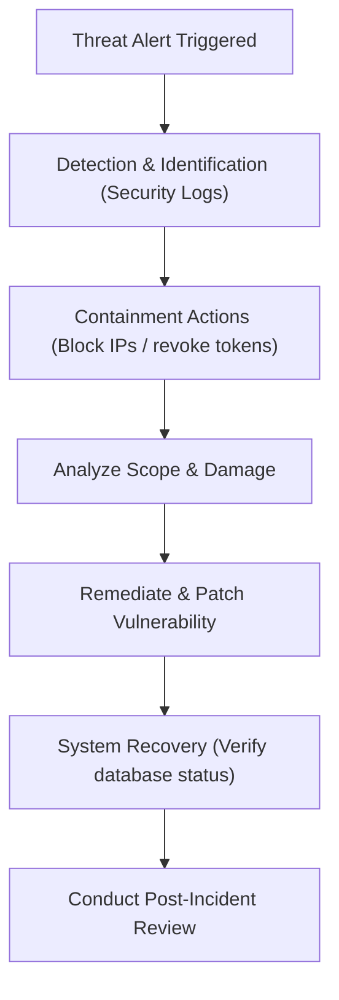

# Threat Model

## Document Metadata

| Metadata Field | Value |
|---|---|
| Document Type | Security & Compliance / Threat Model |
| Version | 1.0.0 |
| Status | Published |
| Owner | Chief Information Security Officer (CISO) |
| Reviewer | Developer / Principal Architect |
| Last Updated | 2026-07-22 |

---

# Executive Summary

Threat modeling is an essential practice to identify, evaluate, and mitigate security risks across the ProjectMind AI platform. Since the application indexes highly sensitive corporate intellectual property—including source code metadata, ticket descriptions, and search query logs—securing these data pathways is critical.

This document applies STRIDE methodology and OWASP Top 10 standards to analyze the platform's attack surfaces, catalog potential vulnerabilities, map incident response actions, and specify security controls.

---

# Threat Modeling Methodology

ProjectMind AI employs four security modeling frameworks:

* **STRIDE Methodology:** Groups threats into six categories (Spoofing, Tampering, Repudiation, Information Disclosure, Denial of Service, Elevation of Privilege) to analyze logical software components.
* **OWASP Top 10:** References the Open Web Application Security Project list to evaluate common web vulnerabilities (e.g. broken access control, injection).
* **Risk Assessment:** Rates threats using a Likelihood vs. Impact matrix, classifying risks as High, Medium, or Low.
* **Attack Surface Analysis:** Identifies entry points (UI, APIs, integrations, databases) to ensure proper security boundaries are maintained.

---

# System Attack Surface

The platform's attack surfaces are categorized below:

* **Web Application:** The Angular UI dashboard, vulnerable to Cross-Site Scripting (XSS) and session hijacking.
* **REST APIs:** The API Gateway endpoints, vulnerable to rate limit bypasses and broken object-level authorization (BOLA).
* **Authentication:** The Auth Service JWT generation, vulnerable to token leakage and brute-force attacks.
* **AI Service:** The RAG grounding prompts, vulnerable to prompt injections and leakage.
* **File Upload:** The manual Markdown document ingestion endpoint, vulnerable to malicious payload uploads.
* **GitHub, Jira, and Confluence Integrations:** Read-only OAuth connection endpoints, vulnerable to credentials theft.
* **PostgreSQL & pgvector Database:** Vulnerable to SQL injections and unauthorized tenant access.
* **Redis Cache:** The temporary tokens and session store, vulnerable to cache poisoning or host exposure.
* **Docker Deployment:** The container runtime environment, vulnerable to container escape or host configuration errors.

---

# STRIDE Threat Analysis

The table below catalogs threat scenarios mapped to STRIDE categories:

| STRIDE Category | Example Threat Scenario | Affected Components | Risk | Mitigation Strategy |
|---|---|---|---|---|
| **Spoofing** | Attacker impersonates an engineer to query private codebases. | Angular UI, API Gateway | High | SAML SSO delegation, MFA, and signature-verified JWTs. |
| **Tampering** | Malicious user modifies API parameters to edit other tenants' settings. | API Gateway, Org Service | High | Extract organization ID dynamically from signed JWT claims. |
| **Repudiation** | An admin deletes a workspace connector, claiming the action was a system bug. | Admin Service, DB | Med | Log administrative actions in immutable audit trails. |
| **Information Disclosure** | User searches files they lack repository permissions to read. | AI Service, pgvector | High | Dynamic RBAC checks matching active GitHub tokens before search. |
| **Denial of Service** | Botnets submit excessive search queries, saturating database connections. | API Gateway, PostgreSQL | High | Enforce rate limiting quotas on Nginx edge proxies and gateways. |
| **Elevation of Privilege** | A Developer attempts to upgrade their role to Admin. | Auth Service, Org Service | High | Block self-promotion requests and validate roles at the service layer. |

---

# OWASP Top 10 Mapping

Platform security policies address critical OWASP risks:

| OWASP Risk | ProjectMind AI Possible Scenario | Mitigation Strategy |
|---|---|---|
| **A01: Broken Access Control** | User accesses another tenant's project workspace settings. | Logical tenant partitioning based on JWT organization ID. |
| **A02: Cryptographic Failures** | Integration credentials stored in plain text. | Encrypt OAuth tokens at rest using AES-256 keys. |
| **A03: Injection** | Prompt injection forces LLM to expose system configurations. | Ground prompts with strict delimiters, separating context from instructions. |
| **A05: Security Misconfiguration** | Database ports left open to public subnets. | Deploy database instances in private subnets, restricting access via firewalls. |
| **A06: Vulnerable Components** | Outdated libraries contain open vulnerabilities. | Weekly automated vulnerability scanning and dependency updates. |

---

# AI Security Threats

Retrieval-Augmented Generation (RAG) pipelines introduce unique AI security threats:

* **Prompt Injection:** Attackers craft prompts that override system instructions to execute malicious commands.
  * *Mitigation:* Sanitize prompt strings at the gateway and enforce strict grounding delimiters.
* **Prompt Leakage:** Attackers query the model to reveal system instructions or prompts.
  * *Mitigation:* Apply regex filtering to model outputs, blocking responses containing system prompt keywords.
* **Data Poisoning:** Malicious actors insert corrupted files into target repositories to corrupt vector search spaces.
  * *Mitigation:* Enforce logical role verifications and restrict indexing changes to authorized code merges.
* **Sensitive Data Exposure:** Grounded prompts send PII or corporate secrets to public LLM training queues.
  * *Mitigation:* Route all API calls to private corporate Azure OpenAI instances under strict non-ingestion terms.
* **Hallucinations:** The LLM generates false context answers or references non-existent files.
  * *Mitigation:* Instruct system prompts to answer strictly from the retrieved context chunks, instructing the model to say "I do not know" if context is missing.
* **Model Abuse:** Automated bots submit excessive requests to deplete API token budgets.
  * *Mitigation:* Enforce rate-limiting and token-usage ceilings per user account.
* **Unauthorized AI Access:** Users query AI endpoints to search workspaces they do not belong to.
  * *Mitigation:* Enforce dynamic tenant and project checks before executing similarity searches in pgvector.

---

# API Threat Analysis

* **Broken Authentication:** Weak token verification allows attackers to hijack sessions.
  * *Mitigation:* Validate signatures, expiration timestamps, and blacklist revoked JWTs in Redis.
* **Broken Authorization:** Lack of resource validation allows users to access other teams' workspaces.
  * *Mitigation:* Verify project and organization boundaries for all requested resource IDs.
* **API Abuse:** Rate limit bypasses exhaust server resources.
  * *Mitigation:* Apply rate-limiting quotas on Nginx edge proxies and API Gateway.
* **Rate Limit Bypass:** Attackers spoof IP addresses to bypass rate pacing.
  * *Mitigation:* Enforce rate limits based on JWT identifiers rather than IP addresses.
* **Parameter Tampering:** Modifying ID values in URLs grants unauthorized resource access.
  * *Mitigation:* Use UUID v4 keys to prevent ID scanning attacks.
* **Replay Attacks:** Intercepted requests are re-sent to execute unauthorized actions.
  * *Mitigation:* Enforce TLS 1.3 transit encryption and utilize short-lived access tokens.

---

# Infrastructure Threats

* **Container Escape:** Compromised container gains root access to the host node.
  * *Mitigation:* Run containers with non-root privileges and utilize minimal base images.
* **Misconfigured Docker:** Open ports or mounting root hosts exposes container runtimes.
  * *Mitigation:* Restrict container mounts to application folders.
* **Network Exposure:** Internal microservices left exposed to public subnets.
  * *Mitigation:* Deploy services in private subnets, routing external traffic through the API Gateway.
* **Database Exposure:** Database port exposed to the internet.
  * *Mitigation:* Bind PostgreSQL only to private subnets, restricting access via security groups.
* **Redis Misconfiguration:** Open Redis instance allows cache poisoning.
  * *Mitigation:* Enable client authentication and restrict access to the application subnet.

---

# Data Security Threats

* **Data Leakage:** Codebase chunks exposed to unauthorized users.
  * *Mitigation:* Enforce logical tenant isolation at the database layer.
* **Cross-Tenant Access:** Buggy query logic returns search results from other tenants.
  * *Mitigation:* Validate organization ID parameters on every database transaction.
* **Unauthorized Downloads:** Users download raw codebase files from the search dashboard.
  * *Mitigation:* Limit search UI responses to text snippets, blocking raw file downloads.
* **Backup Exposure:** Unencrypted backups are accessed by unauthorized users.
  * *Mitigation:* Encrypt database backups using AES-256 prior to off-site replication.
* **Insider Threats:** Malicious administrators access search history logs.
  * *Mitigation:* Log administrative actions in immutable audit trails and restrict search history access.

---

# Risk Assessment Matrix

The risk levels of key platform threats are assessed below:

| Threat | Likelihood | Impact | Risk Level | Mitigation |
|---|---|---|---|---|
| **Prompt Injection** | High | Medium | High | Sanitize prompts and use strict delimiters. |
| **Unauthorized Search Access** | Medium | High | High | Dynamic RBAC checks matching source permissions. |
| **Cross-Tenant Leakage** | Low | High | High | logical organization ID constraints on database queries. |
| **Credential Theft (SSO)** | Low | High | Medium | Enforce MFA and short-lived JWT session keys. |
| **Container Escape** | Low | Medium | Low | Run containers with non-root privileges. |
| **Redis Cache Poisoning** | Low | Medium | Low | Restrict Redis access to internal subnets. |

---

# Security Controls

ProjectMind AI implements three categories of security controls:

* **Preventive Controls:** Include SAML SSO integration, TLS 1.3 encryption, Docker non-root configurations, and prompt validation.
* **Detective Controls:** Include Static Application Security Testing (SAST) in CI/CD pipelines, container vulnerability scanning, and security logging.
* **Corrective Controls:** Include automated failovers, incident containment procedures (revoking compromised API keys), and system restoration from backups.

---

# Incident Response Mapping

The flowchart below maps security threat alerts to incident response workflows:

---

# Residual Risks

Accepted platform risks under ongoing monitoring:

* **Third-Party API Downtime:** Temporary loss of GitHub/Jira connections.
  * *Monitoring:* Health check endpoints query connector statuses every 5 minutes.
* **LLM Output Inaccuracies:** AI generating irrelevant responses.
  * *Monitoring:* Track user feedback scores (thumbs up/down) to tune prompt parameters.

---

# Recommendations

CISO recommendations to improve platform security:

1. **Deploy Private LLMs:** Transition RAG workflows to private OpenAI models hosted within corporate VPC subnets.
2. **Automate Dependency Patching:** Integrate Dependabot to automatically generate pull requests for outdated dependencies.
3. **Execute Quarterly Audits:** Review IAM role mappings and credentials rotations policies quarterly.

---

# Conclusion

The ProjectMind AI Threat Model evaluates the system attack surfaces, logical flows, and AI grounding components using STRIDE and OWASP Top 10 frameworks. Implementing the specified preventive controls, role verifications, and incident containment workflows protects corporate intellectual property while enabling search workspaces.

---

# Revision History

| Version | Date | Author / Role | Summary of Changes |
|---|---|---|---|
| 0.1.0 | 2026-07-22 | CISO / Architect | Initial creation of the Threat Model Document. |
