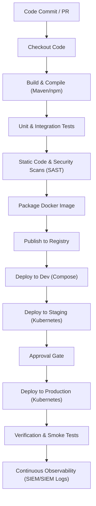
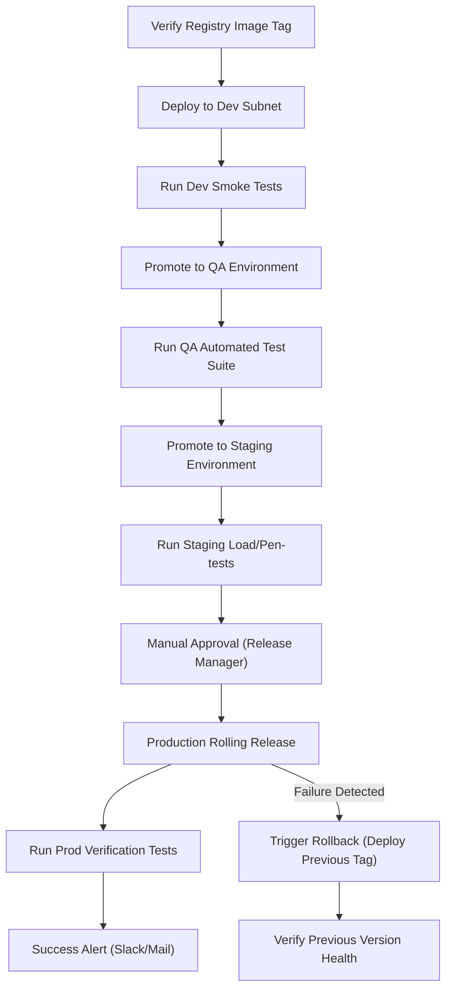

# CI/CD Pipeline

## Document Metadata

| Metadata Field | Value |
|---|---|
| Document Type | DevOps & Deployment / CI/CD Pipeline |
| Version | 1.0.0 |
| Status | Published |
| Owner | Principal DevOps Architect |
| Reviewer | Developer / Principal Architect |
| Last Updated | 2026-07-22 |

---

# Executive Summary

Continuous Integration (CI) and Continuous Delivery (CD) pipelines are critical to automate software delivery, maintain security boundaries, and verify code quality before it is released to production. The ProjectMind AI CI/CD Pipeline establishes the automated workflows that compile, test, scan, package, and deploy Angular frontend assets and Spring Boot microservices.

By defining pipeline stages, quality gates, security gates, artifact management rules, deployment strategies, and rollback policies, this document provides release engineers with the standards to manage platform releases.

---

# CI/CD Objectives

The platform's CI/CD pipeline is guided by six primary objectives:

* **Faster Delivery:** Automate release promotions to reduce manual deployment efforts.
* **Automation:** Automate all testing, building, packaging, and validation steps.
* **High Quality:** Enforce testing quality gates to prevent code defects from reaching staging.
* **Reliable Releases:** Standardize the promotion process to ensure consistent deployments.
* **Secure Deployments:** Integrate security scanning controls (SAST, dependency scanning) directly into build stages (Shift Left Security).
* **Repeatable Builds:** Package applications as immutable Docker container images, ensuring identical runs across environments.

---

# Pipeline Overview

The pipeline automates the promotion of code from development to production through the following stages:

* **Source Code Commit:** A developer commits changes to a feature branch.
* **Pull Request:** A PR to the `develop` or `main` branch triggers the CI pipeline.
* **Build:** Automate compilation (Maven for Spring Boot, npm for Angular) and verify syntax.
* **Test:** Execute automated unit and integration tests.
* **Security Scan:** Run static code and dependency scans.
* **Package:** Compile application binaries into immutable Docker container images.
* **Artifact Storage:** Push tagged container images to secure registries.
* **Deployment:** Deploy images to development, QA, staging, or production environments.
* **Verification:** Run automated smoke tests to confirm deployment success.
* **Monitoring:** Observe post-deployment application health.

---

# Continuous Integration Workflow

The CI pipeline runs on every pull request to verify code quality before it can be merged:

* **Code Checkout:** Pull the feature branch code into the build runner environment.
* **Dependency Installation:** Download and cache dependencies using Maven pom files and npm package locks.
* **Frontend Build:** Run npm compile commands, generating optimized frontend assets.
* **Backend Build:** Run Maven compile commands, verifying Java codebase syntax.
* **Unit Tests:** Run unit tests, blocking the build if any test fails.
* **Integration Tests:** Execute integration tests using MockMvc, validating database calls.
* **Static Code Analysis:** Analyze code files to identify code smells and verify quality standards.
* **Security Scan:** Run static application security testing (SAST) and dependency scans to catch vulnerabilities.
* **Build Verification:** Verify compilation and quality checks are complete before unblocking the PR merge.

---

# Continuous Delivery Workflow

The CD pipeline automates packaging, publishing, environment promotion, approvals, and rollback:

* **Package Creation:** Package compiled binaries into lightweight Docker container images.
* **Docker Image Build:** Configure Docker builds to compile frontend and backend images.
* **Artifact Publishing:** Push container images tagged with git commit hashes to the private registry.
* **Environment Deployment:** Update target environment configurations to deploy the new container tags.
* **Smoke Tests:** Execute automated API verification tests to confirm container health.
* **Approval Gates:** Deployments to production require manual approval from the Release Manager.
* **Production Deployment:** Release containers to production using rolling updates to ensure zero-downtime.
* **Rollback:** Automatically re-deploy the previously tagged stable Docker image if smoke tests fail.

---

# Pipeline Stages

The CI/CD pipeline stages and success criteria are defined below:

| Stage Name | Purpose | Success Criteria |
|---|---|---|
| **Checkout** | Pull feature branch code into the runner. | Git checkout completes successfully. |
| **Build** | Compile Angular assets and Spring Boot jars. | Code compiles without syntax or dependency errors. |
| **Test** | Execute automated unit and integration tests. | 100% of unit and integration tests pass. |
| **Code Quality** | Analyze code files for quality and code smells. | Quality tools return no blocker issues; >80% coverage. |
| **Security Scan**| Run SAST scans and check dependencies. | Zero critical or high-severity vulnerabilities found. |
| **Package** | Package applications into Docker container images. | Docker build completes without configuration errors. |
| **Publish Artifact**| Push tagged images to the private registry. | Image upload is complete and hash-verified. |
| **Deploy Dev** | Deploy containers to the dev subnet. | Dev containers start and pass health checks. |
| **Deploy QA** | Deploy containers to the QA testing environment. | QA containers start and pass test suite checks. |
| **Deploy Staging**| Deploy containers to pre-production. | Staging containers start and pass integration tests. |
| **Deploy Prod** | Release containers to production. | Production containers start and pass verification tests. |

---

# Quality Gates

Pipelines must satisfy the following quality gates before code can be promoted:

* **Unit Test Pass:** 100% pass rates for unit tests on every pull request.
* **Integration Test Pass:** All API and database integration tests must pass.
* **Code Coverage:** Require a minimum of 80% code coverage.
* **Static Analysis:** Code quality check tools must return no blocker issues or security warnings.
* **Dependency Scan:** Dependency verification must find no unpatched critical vulnerabilities.
* **Secret Detection:** Pipeline triggers scanning to prevent hardcoded API keys or passwords.
* **Build Success:** Compilation must complete without configuration or dependencies errors.

---

# Security Gates

To secure software delivery, the pipeline enforces the following security checks:

* **SAST:** Static Application Security Testing scans code files for vulnerability patterns.
* **Dependency Scanning:** Scans dependency libraries to identify open vulnerability alerts.
* **Secret Scanning:** Scans commits to detect hardcoded API keys, OAuth tokens, and database passwords.
* **Container Image Scanning:** Scans container base images for vulnerabilities before registry push.
* **License Compliance:** Scans third-party library licenses to prevent integration of incompatible licenses (e.g. GPL licenses).

---

# Artifact Management

* **Build Artifacts:** Temporary binaries (jar files, compiled JS) are cached in build runners to speed up pipeline execution.
* **Docker Images:** Compiled applications are packaged as Docker container images.
* **Versioning:** Images are tagged with semantic version tags (e.g. `v1.0.0`) and git commit hashes.
* **Retention Policy:** Retain production release images indefinitely. Development and QA images are purged after 30 days.
* **Artifact Promotion:** Images verified in staging are promoted to production by updating environment configuration tags.

---

# Deployment Strategy

* **Development Deployment:** Triggered automatically on every commit to the `develop` branch.
* **QA Deployment:** Triggered automatically when code is promoted for QA testing.
* **Staging Deployment:** Triggered automatically when a release candidate tag is created.
* **Production Deployment:** Requires manual approval from the Release Manager. Deployments use rolling updates to release containers incrementally, ensuring zero-downtime.

---

# Rollback Strategy

* **Failed Deployment Detection:** The deployment runner monitors container starts. If container starts fail or smoke tests return errors, a rollback is triggered.
* **Rollback Trigger:** Rollbacks trigger automatically on verification failures, or manually via admin controls.
* **Previous Version Restore:** The rollback script updates environment configuration tags to re-deploy the last verified stable Docker image.
* **Validation After Rollback:** The pipeline runs automated smoke tests against the rolled-back deployment to verify restore success.

---

# Pipeline Notifications

The pipeline sends notifications to internal communication channels (e.g. email, Slack, Teams) for the following events:

* **Build Success:** Notification sent when code compiles and passes tests.
* **Build Failure:** Alert sent to the developer team detailing build or test failures.
* **Deployment Success:** Notification sent when containers are deployed to target environments.
* **Deployment Failure:** Critical alert sent to DevOps and developer teams detailing deployment errors.
* **Security Failure:** Critical alert sent to the security team detailing blocked PR merges due to vulnerability findings.

---

# Monitoring

The DevOps team tracks the following pipeline health metrics:

* **Pipeline Metrics:** Monitor pipeline run durations and resource usage.
* **Build Duration:** Average time to complete a build from commit to image publish.
* **Deployment Frequency:** Number of code deployments promoted to staging and production weekly.
* **Failure Rate:** Percentage of pipeline runs that return build, test, or deployment failures.
* **Mean Time to Recovery (MTTR):** Average duration to resolve a failed build or deployment.

---

# Roles & Responsibilities

CI/CD pipeline responsibilities are mapped to team roles below:

| Role Name | CI/CD Responsibility |
|---|---|
| **Developer** | Writes code, writes unit tests, and resolves build or test failures. |
| **Reviewer** | Reviews PR code, verifies quality standards, and approves merges into `develop`. |
| **QA Engineer** | Writes integration tests, verifies staging setups, and runs smoke tests. |
| **DevOps Engineer** | Manages CI/CD configurations, maintains build runners, and manages environments. |
| **Security Team** | Configures security scanning tools, reviews vulnerability findings, and audits pipeline secrets. |
| **Release Manager** | Authorizes release candidates promotions and triggers production deployments. |

---

# Risks

CI/CD pipeline operations face key technical risks:

### Build Failure
* *Risk:* Incompatible dependencies or syntax errors block feature integrations.
* *Mitigation:* Cache package locks and maven configurations to ensure reproducible build environments.

### Pipeline Failure
* *Risk:* Build runner failures block all developer integrations.
* *Mitigation:* Configure backup runners and monitor runner health parameters.

### Deployment Failure
* *Risk:* Rolling update deployments hang due to container configuration errors.
* *Mitigation:* Enforce automated rollbacks, re-deploying the previous stable container version.

---

# Best Practices

ProjectMind AI adopts six CI/CD best practices:
* Manage pipeline configurations as code in the repository.
* Encourage developers to commit code in small, incremental changesets.
* Enforce automated test validations at every pipeline stage.
* Package applications into immutable container artifacts.
* Monitor pipeline run durations and failure rates.
* Provide developers with fast feedback on build successes or failures.

---

# Conclusion

The ProjectMind AI CI/CD Pipeline document defines the build stages, quality gates, security checks, and rollback strategies used to release software. By combining automated compile checks, SAST scanning, container image packaging, rolling updates, and automated rollbacks, the pipeline enables rapid release cadences while protecting platform integrity.

---

# Revision History

| Version | Date | Author / Role | Summary of Changes |
|---|---|---|---|
| 0.1.0 | 2026-07-22 | DevOps Lead / SRE | Initial creation of the CI/CD Pipeline Document. |
