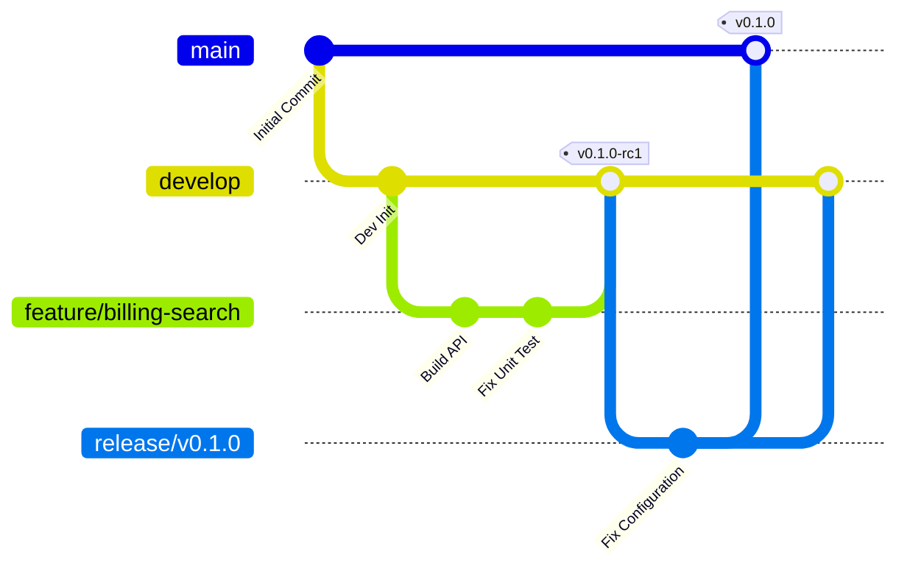
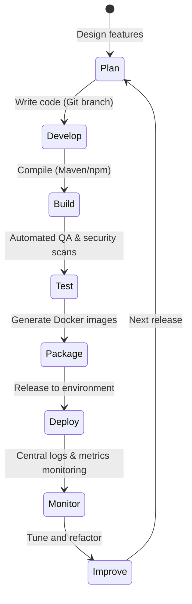

# DevOps Strategy

## Document Metadata

| Metadata Field | Value |
|---|---|
| Document Type | DevOps & Deployment / DevOps Strategy |
| Version | 1.0.0 |
| Status | Published |
| Owner | Principal DevOps Architect |
| Reviewer | Developer / Principal Architect |
| Last Updated | 2026-07-22 |

---

# Executive Summary

The ProjectMind AI DevOps Strategy defines the automation pipelines, git workflows, testing quality gates, and deployment policies used to release software securely, reliably, and efficiently. The strategy establishes automated pathways to promote Angular frontend assets and Spring Boot microservices through isolated development stages, ensuring the platform's logical multi-tenancy and security controls remain validated at every commit.

---

# DevOps Goals

The platform's release and operational goals are:

* **Faster Releases:** Enable automated build and release pipelines, reducing code delivery times.
* **High Availability:** Enforce zero-downtime rolling update deployments to ensure platform uptime.
* **Automation:** Automate all testing, building, packaging, and infrastructure setup steps, reducing manual configuration errors.
* **Reliability:** Enforce automated validation testing at every pipeline run.
* **Scalability:** Package microservices as Docker containers, preparing them for horizontal scaling.
* **Security:** Integrate security scanning controls (SAST, dependency scanning) directly into build pipelines (Shift Left Security).
* **Continuous Improvement:** Use post-deployment monitoring data to tune and optimize pipelines.

---

# DevOps Principles

DevOps operations must adhere to the following principles:

* **Infrastructure as Code (IaC):** Manage network settings, subnets, and environment configurations in version-controlled scripts.
* **Automation First:** Eliminate manual steps in builds, testing, and deployment.
* **Shift Left Security:** Integrate security validation scans into early build stages to catch issues early.
* **Continuous Integration (CI):** Automate code compiles, dependency checks, and unit tests on every pull request.
* **Continuous Delivery (CD):** Automate deployment of verified code artifacts to target staging environments.
* **Observability:** Integrate centralized logs and metrics tracking to monitor application health post-deployment.
* **Immutable Infrastructure:** Deploy services as immutable container images. Changes require releasing a new image version.

---

# Development Workflow

Features are developed and integrated using a GitFlow branch strategy:

* **Feature Development:** Developers create feature branches (e.g. `feature/billing-search`) from the `develop` branch.
* **Branch Strategy:** feature branches are short-lived. Code merges into `develop` for testing, and releases merge into `main`.
* **Pull Requests:** Merging into `develop` or `main` requires a Pull Request (PR), passing build checks and peer reviews.
* **Code Review:** PRs require approval from at least one Senior Developer or Architect before merging.
* **Merge Strategy:** Merge commits are squashed to maintain a clean git history.

---

# DevOps Lifecycle

The ProjectMind AI DevOps lifecycle operates as a continuous workflow loop:

* **Plan:** Outline features and design changes in development tasks.
* **Develop:** Write code on feature branches, validating changes locally.
* **Build:** Automate compilation (Maven for Spring Boot, npm for Angular) and verify syntax.
* **Test:** Execute automated unit and integration tests.
* **Package:** Compile application binaries into immutable Docker container images.
* **Deploy:** Push container images to registries and release them to target environments.
* **Monitor:** Stream log data and trace metrics to observe application behavior.
* **Improve:** Tune configurations and optimize code based on operational feedback.

---

# Source Code Management

* **Repository Structure:** Microservices and the Angular frontend are managed in monorepo or polyrepo structures, with distinct project directories.
* **Branch Naming:** Enforce branch naming conventions:
  * `feature/*` for active feature development.
  * `bugfix/*` for active bug fixing.
  * `release/*` for release candidates packaging.
  * `hotfix/*` for immediate production hotfixes.
* **Release Branches:** Creating a `release/*` branch freezes features, allowing only bug fixes and version updates.
* **Tagging Strategy:** Apply semantic tags (e.g. `v1.0.0`) to the `main` branch on release merges.
* **Versioning Strategy:** Follow Semantic Versioning rules (MAJOR.MINOR.PATCH).

---

# Build Strategy

* **Frontend Build:** Angular projects are compiled using npm scripts, generating optimized HTML/JS/CSS assets.
* **Backend Build:** Spring Boot microservices are compiled using Maven scripts, producing executable jar files.
* **Dependency Management:** Use Maven pom definitions and npm package locks to ensure build reproducibility.
* **Artifact Generation:** Pack compiled binaries into Docker images. Images are tagged with git commit hashes and pushed to container registries.

---

# Deployment Strategy

Code artifacts are promoted through isolated environments:

* **Development:** Automated deployments trigger on every commit to the `develop` branch.
* **Testing:** Quality assurance teams run manual and automated integration testing.
* **Staging:** Replicates production settings to perform pre-release validations.
* **Production:** Code is promoted to production using rolling deployments to ensure zero-downtime.

---

# Environment Strategy

The platform environment strategy is structured as follows:

| Environment | Purpose | Ingestion / Deploy Type | Target Deployment Orchestrator |
|---|---|---|---|
| **Local** | Developer sandbox for local testing. | Manual Maven/npm runs. | Developer Workstations |
| **Development**| Integrates and verifies develop branch code. | Git push automated deploy. | Docker Compose |
| **QA** | Testing environment for quality assurance checks. | Automated promotion. | Docker Compose |
| **Staging** | Pre-production environment for final validations. | Tagged release deployment. | Kubernetes Cluster (Future) |
| **Production** | Live tenant environment serving users. | Manual approval rolling deploy. | Kubernetes Cluster (Future) |

---

# Release Strategy

* **Semantic Versioning:** Version numbers increment based on change scope (major, minor, or patch).
* **Release Candidates:** Generate release candidates (e.g. `v1.0.0-rc1`) on `release/*` branches for staging tests.
* **Hotfix Process:** Hotfix branches branch from `main` to address production issues, merging back to both `main` and `develop`.
* **Rollback Strategy:** If a production deployment fails, re-deploy the previously tagged Docker image, rolling back the system state.

---

# Security in DevOps

* **Secure Pipelines:** Configure runners with minimal privileges, hiding secret keys from logs.
* **Secret Management:** Inject credentials as environment variables using vault managers, keeping secrets out of code.
* **Artifact Verification:** Sign Docker images to verify code origin and prevent tampering.
* **Dependency Scanning:** Integrate Software Composition Analysis (SCA) tools to scan code libraries for vulnerabilities.
* **Image Scanning:** Scan Docker container base images for vulnerabilities before pushing them to registries.

---

# Quality Gates

Pipelines must pass defined quality gates before code can be promoted:

* **Build Validation:** Code must compile successfully without syntax or dependency errors.
* **Unit Tests:** Enforce 100% pass rates for unit tests on every pull request.
* **Integration Tests:** Integration tests must pass in the target environment before release promotion.
* **Code Coverage:** Require a minimum of 80% code coverage.
* **Static Code Analysis:** Catch code quality issues and code smells using static analysis tools.
* **Security Scans:** The pipeline must block merges if critical or high-severity vulnerabilities are detected.

---

# Collaboration Model

DevOps duties are shared across team roles:

* **Developers:** Write code, write unit tests, and resolve build failures.
* **QA Engineers:** Author integration test cases, write automated UI tests, and verify release candidates.
* **DevOps Engineers:** Manage CI/CD pipelines, configure IaC templates, and manage deployment environments.
* **Security Team:** Configure vulnerability scanners, manage secret keys policies, and investigate threat logs.
* **Product Team:** Verify feature behaviors and coordinate release windows.

---

# Risks

CI/CD pipelines face key deployment and configuration risks:

### Deployment Failure
* *Risk:* Database migrations fail during rolling updates, corrupting schemas.
* *Mitigation:* Run database schema migrations using backwards-compatible alterations.

### Environment Drift
* *Risk:* Discrepancies between staging and production settings cause post-release errors.
* *Mitigation:* Enforce infrastructure setups exclusively through version-controlled IaC templates.

### Configuration Errors
* *Risk:* Incorrect credentials or environment variables are injected at deployment.
* *Mitigation:* Enforce strict schemas validation checks on environment startup.

---

# Best Practices

ProjectMind AI adopts five DevOps best practices:
* Release software in small, incremental changesets.
* Enforce automated test validations at every pipeline stage.
* Manage infrastructure exclusively using IaC scripts.
* Implement centralized monitoring and alerting.
* Maintain rollback readiness, verifying previously tagged Docker images.

---

# Conclusion

The ProjectMind AI DevOps Strategy defines the automation pipelines, git workflows, testing quality gates, and deployment policies used to release software securely, reliably, and efficiently. By coordinating development workflows, GitFlow branching, automated testing, and secure secret injections, these strategies support rapid release cadences while protecting corporate database and vector index structures.

---

# Revision History

| Version | Date | Author / Role | Summary of Changes |
|---|---|---|---|
| 0.1.0 | 2026-07-22 | DevOps Lead / SRE | Initial creation of the DevOps Strategy Document. |
