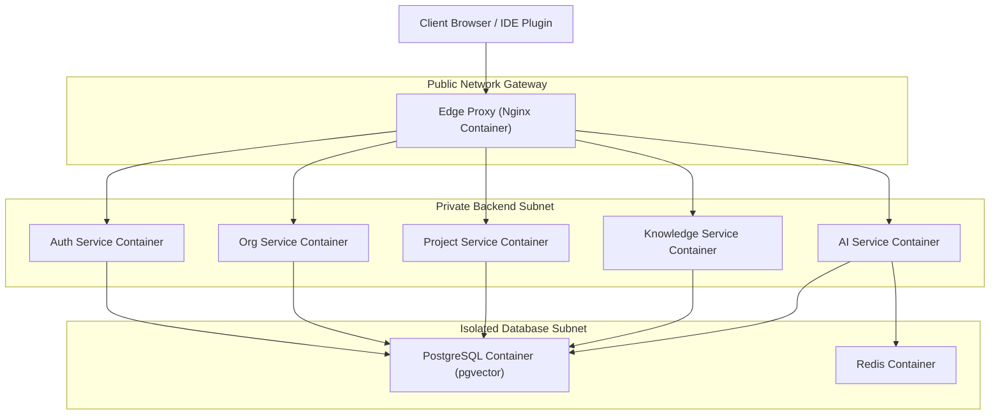
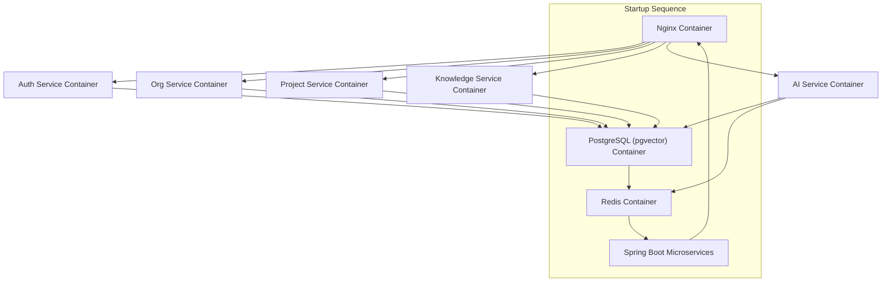
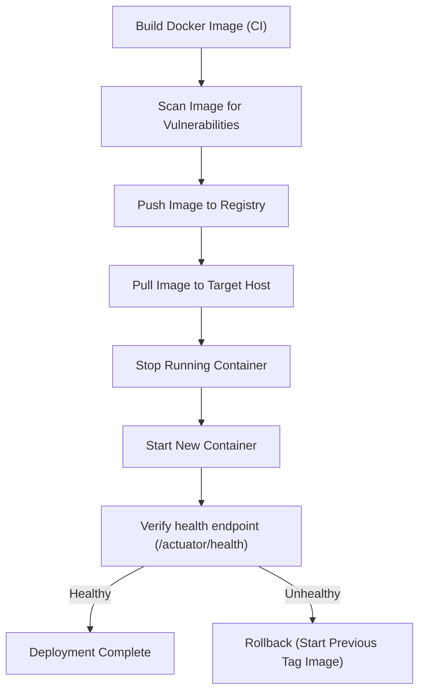

# Docker Architecture

## Document Metadata

| Metadata Field | Value |
|---|---|
| Document Type | DevOps & Deployment / Docker Architecture |
| Version | 1.0.0 |
| Status | Published |
| Owner | Principal DevOps Architect |
| Reviewer | Developer / Principal Architect |
| Last Updated | 2026-07-22 |

---

# Executive Summary

Docker containerization is the deployment standard for ProjectMind AI, packaging application components into isolated containers. Containerization ensures that the Angular web client, Spring Boot microservices, PostgreSQL databases, and Redis caches operate in consistent runtime environments from local sandbox setups to production clusters.

This document defines containerization standards, multi-stage base image choices, persistent volume configurations, virtual network segments, CPU/Memory limitations, health checks, security policies, and deployment promotions workflows.

---

# Containerization Strategy

ProjectMind AI containerization is guided by the following objectives:

* **Why Docker is used:** Docker isolates runtime dependencies from underlying host operating systems, simplifying dependency management and deployment configurations.
* **Containerization Goals:** Achieve repeatable, fast service startups, simplify local developer environment onboarding, and prepare the platform for orchestration (Kubernetes) scaling.
* **Benefits:** Consistently packaged runtime dependencies, reduced deployment cycle times, and simplified environment parity.
* **Isolation:** Containers isolate application processes, keeping database connections and microservices configurations partitioned on the host.
* **Portability:** Container images are compiled once, and then run without changes across developer laptops, QA machines, staging VMs, and production nodes.
* **Scalability:** Stateless microservices run in multiple container instances behind edge proxies, supporting horizontal scaling during load spikes.

---

# Container Inventory

The ProjectMind AI platform runs the following containerized services:

| Container Name | Purpose | Base Image Class |
|---|---|---|
| **Angular Frontend** | Serves compiled static UI web client files. | Nginx Alpine |
| **API Gateway** | Edge reverse proxy routing client requests. | Nginx Alpine |
| **Auth Service** | Verifies logins, manages JWT sessions. | Eclipse Temurin JRE |
| **Organization Service**| Manages logical tenant setups, rosters. | Eclipse Temurin JRE |
| **Project Service** | Manages workspace project groupings. | Eclipse Temurin JRE |
| **Knowledge Service** | Ingests codebase metadata, syncs external APIs. | Eclipse Temurin JRE |
| **AI Service** | Coordinates semantic chunkings, RAG prompts. | Eclipse Temurin JRE |
| **PostgreSQL** | Relational metadata storage. | PostgreSQL Alpine |
| **pgvector** | Vector similarity embeddings index database. | pgvector/pgvector |
| **Redis** | Temporary tokens and session blacklist cache. | Redis Alpine |

---

# Docker Image Strategy

Container images are compiled, tagged, and promoted under the following rules:

* **Base Images:** Enforce the use of minimal, secure base images (e.g. Alpine Linux, Eclipse Temurin headless JRE) to reduce attack surfaces and image sizes.
* **Multi-stage Builds:** Enforce multi-stage build patterns, separating compilation environments (SDKs) from final minimal runtimes. This keeps compiler tools out of final run images.
* **Image Tagging:** Tag images with semantic version numbers (e.g. `v1.0.0`) and git commit hashes to trace code origins.
* **Image Versioning:** Release builds use static tags, while development builds use branch tags (e.g. `develop-latest`).
* **Image Registry:** Store compiled container images in private corporate registries, protected by read-only access keys.
* **Image Promotion:** Promoted images are verified in testing and staging before being tagged for production deployment.

---

# Container Networking

* **Bridge Network:** Containers on the same host communicate using isolated bridge networks.
* **Internal Communication:** Microservices connect using Docker service names, avoiding hardcoded IP addresses.
* **Service Discovery:** Docker DNS resolves service names to active container IP addresses.
* **External Access:** Clients access the platform exclusively through Nginx reverse proxy containers. Direct external access to database or microservice ports is blocked.
* **Network Isolation:** PostgreSQL and Redis containers run on a private database network, isolated from the ingress network.

---

# Persistent Storage

* **Named Volumes:** Databases and caches store persistent data using Docker named volumes.
* **Database Persistence:** Configure a named volume to persist PostgreSQL database files, ensuring data survives container updates or restarts.
* **Redis Persistence:** Configure a named volume to store Redis cache snapshots.
* **Log Storage:** Write application logs to standard output (stdout), allowing host systems to stream and aggregate logs.
* **Backup Volumes:** Connect backup containers to database volumes to perform daily snapshots.

---

# Environment Variables

The container runtime is configured using the following environment variables:

| Variable Name | Purpose | Configuration Target |
|---|---|---|
| `SPRING_PROFILES_ACTIVE` | Configures microservice active profiles. | Auth, Project, Org, Knowledge, AI |
| `DB_HOST` | Database host name (resolves via DNS). | Auth, Project, Org, Knowledge, AI |
| `DB_PASSWORD` | Database connection password. | Vault Injected Secret |
| `REDIS_HOST` | Redis host name. | AI Service |
| `JWT_SECRET` | Secret key used to sign JWT session tokens. | Vault Injected Secret |
| `OPENAI_API_KEY` | API key to access OpenAI endpoints. | Vault Injected Secret |

### Secrets Management Strategy
Do not store credentials in Dockerfiles or compose configurations. Secrets must be injected into containers at runtime as environment variables using vault managers.

---

# Health Checks

To monitor container status, configurations must implement health checks:

* **Frontend:** Configure Nginx to return a *200 OK* on request checks to the UI.
* **API Gateway:** Verify routing endpoints respond correctly.
* **Microservices:** Query Spring Boot Actuator health endpoints (`/actuator/health`).
* **PostgreSQL:** Run `pg_isready` commands to verify database status.
* **Redis:** Run `redis-cli ping` commands to verify cache status.

---

# Resource Management

* **CPU Limits:** Limit microservice containers to a maximum of 1.0 CPU cores to prevent resource starvation on host machines.
* **Memory Limits:** Set memory ceilings on microservice containers (e.g. 512MB limit) to prevent out-of-memory issues.
* **Restart Policies:** Enforce `on-failure:5` restart policies on microservice containers to attempt automatic recovery. Databases and proxies use `unless-stopped`.
* **Scaling Strategy:** Scale stateless microservices by starting multiple container instances behind the edge proxy during peak search loads.

---

# Container Security

* **Non-root Containers:** Configure containers to run using non-root system users, preventing container escape threats.
* **Read-only Filesystem:** Mount container filesystems as read-only, restricting writes to temporary directories (`/tmp`).
* **Minimal Base Images:** Build containers using minimal, secure base images to reduce vulnerability footprint.
* **Secret Injection:** Inject credentials into container memory at startup, avoiding plaintext files on disk.
* **Image Scanning:** Scan container images for vulnerabilities before pushing them to registries.
* **Vulnerability Management:** Weekly vulnerability scans identify and patch outdated base images and libraries.

---

# Docker Compose Architecture

For local sandbox and development deployments, Docker Compose configures the service stack:

* **Local Development:** Developers start the microservice stack, relational database, and Redis cache with a single command.
* **Development Environment:** The development server runs container versions compiled directly from the `develop` git branch.
* **Service Startup Order:** Ensure PostgreSQL and Redis are healthy before starting microservices using dependency order rules.
* **Dependency Management:** Microservices depend on database health before initialization, preventing startup failures.

---

# Logging Strategy

* **Container Logs:** Microservices write JSON logs to standard output (stdout).
* **Centralized Logging:** Configure log drivers to capture stdout logs, forwarding them to the centralized log aggregator.
* **Log Rotation:** Enforce log rotation policies on host nodes, limiting log files to 10MB to prevent disk saturation.
* **Log Retention:** Keep container logs on host machines for 7 days before purging them.

---

# Monitoring

* **Container Health:** Monitor container statuses (Running, Unhealthy) to alert administrators of service issues.
* **Resource Usage:** Track CPU and memory usage to detect memory leaks.
* **Service Availability:** Query edge proxy endpoints to verify overall portal availability.
* **Container Restart Monitoring:** Alert administrators of excessive container restarts, identifying potential configuration issues.

---

# Deployment Workflow

The sequence below models building, scanning, pulling, running, and verifying container images:

---

# Risks

Containerized deployments face key operational risks:

### Large Images
* *Risk:* Large image sizes delay deployment times and increase disk storage usage.
* *Mitigation:* Enforce multi-stage build patterns and utilize minimal base images (Alpine Linux).

### Container Drift
* *Risk:* Developers manually modify container settings, creating configuration discrepancies.
* *Mitigation:* Build containers exclusively using automated CI/CD pipelines, locking configurations.

### Secret Exposure
* *Risk:* Access keys or database credentials are saved inside container filesystems.
* *Mitigation:* Inject secrets into container memory as environment variables, keeping credentials out of code files.

---

# Best Practices

ProjectMind AI adopts seven containerization best practices:
* Build container images using multi-stage compilation patterns.
* Enforce minimal base images (Alpine Linux, headless JRE) to reduce attack surfaces.
* Tag container images with semantic version numbers and git commit hashes.
* Configure containers to run using non-root system users.
* Implement container health checks for automated status monitoring.
* Scan container images for vulnerabilities before pushing them to registries.
* Enforce CPU and memory limit ceilings to prevent host resource starvation.

---

# Conclusion

The ProjectMind AI Docker Architecture defines the containerization standards, persistent volumes, virtual networks, resource limits, and security policies governing the platform. By packaging applications into secure, isolated containers, ProjectMind AI ensures reliable, portable, and scalable software delivery across environments.

---

# Revision History

| Version | Date | Author / Role | Summary of Changes |
|---|---|---|---|
| 0.1.0 | 2026-07-22 | DevOps Lead / SRE | Initial creation of the Docker Architecture Document. |
