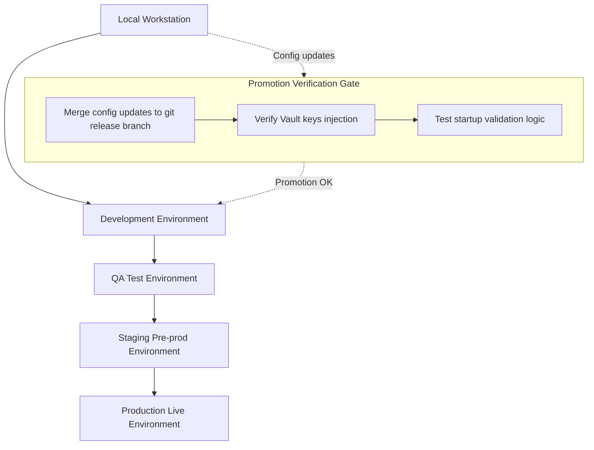

# Environment Configuration

## Document Metadata

| Metadata Field | Value |
|---|---|
| Document Type | DevOps & Deployment / Environment Configuration Strategy |
| Version | 1.0.0 |
| Status | Published |
| Owner | Principal DevOps Architect |
| Reviewer | Developer / Principal Architect |
| Last Updated | 2026-07-22 |

---

# Executive Summary

In a microservices architecture, managing environment configurations is critical to maintain service reliability, enforce data isolation, and protect integration credentials. ProjectMind AI's Environment Configuration Strategy establishes the standards for externalizing configs, managing secrets, and promoting configurations across environments.

This document details the configuration inventory, variables schema, secrets storage vault controls, feature flags management, external services setup, startup validation rules, and configuration change management workflows.

---

# Configuration Objectives

The configuration management model is guided by six primary objectives:

* **Consistency:** Ensure application runtime settings behave identically across environments, using environment variables.
* **Security:** Keep sensitive secrets (passwords, tokens, API keys) out of source code repositories.
* **Scalability:** Support rapid scaling of new environments using standardized configuration files.
* **Flexibility:** Enable environment changes by adjusting configuration files without rebuilding application container images.
* **Maintainability:** centralize configurations to simplify application updates.
* **Reliability:** Enforce automated configuration validation checks on application startup.

---

# Environment Overview

The platform operates across five isolated deployment environments:

| Environment | Purpose | Target Users | Deployment Type |
|---|---|---|---|
| **Local** | Developer sandbox for local testing. | The Developer | Manual Maven/npm runs |
| **Development**| Integrates and verifies develop branch code. | QA Team, Developers | Docker Compose |
| **QA** | Testing environment for quality assurance checks. | QA Team, Developers | Docker Compose |
| **Staging** | Pre-production environment for final validations. | Product Team, QA Team | Kubernetes Cluster |
| **Production** | Live tenant environment serving users. | Enterprise Customers | Kubernetes Cluster |

---

# Environment Promotion Strategy

Configurations are versioned in Git and promoted through staging environments:

* **Local → Development:** Configurations are tested locally before being pushed to feature branches.
* **Development → QA:** Merging feature branches into the `develop` branch triggers deployment to the QA environment.
* **QA → Staging:** Creating a release candidate branch deploys configurations to Staging, mirroring production configurations.
* **Staging → Production:** Promoting release candidate tags to `main` deploys configurations to Production after manual approval.

---

# Configuration Categories

System configurations are structured into eight distinct categories:

| Category | Description |
|---|---|
| **Application** | Non-sensitive settings (port allocations, heap sizes, system profiles). |
| **Database** | Database hosts names, database ports, user credentials, and migration targets. |
| **AI** | Model names selection, temperature parameters, and embedding dimensions. |
| **Security** | Auth token expirations, CORS limits, and token signing secrets. |
| **Logging** | log output paths, console formats, log rotation sizes, and levels. |
| **Monitoring** | Prometheus metrics endpoints, Grafana dashboard setups, and health checks. |
| **Integration** | External connection endpoints and API parameters for GitHub/Jira/Confluence. |
| **Performance** | Database connection pooling sizes, timeout thresholds, and caching expirations. |

---

# Environment Variables

The containerized microservice runtime is configured using the following environment variables:

| Variable Category | Purpose | Required Environment |
|---|---|---|
| **Database** | Host name, port, database name, and migration paths. | All Environments |
| **Redis** | Host name and connection parameters. | Staging, Production |
| **JWT** | Token signing keys and expiration thresholds. | All Environments |
| **AI Provider** | API key, model names (gpt-4o), and azure endpoints. | Staging, Production |
| **API URLs** | Ingress endpoints routing requests. | Staging, Production |
| **Storage** | Named volumes paths for persistence. | Staging, Production |
| **Email** | SMTP host settings, user keys, and template paths. | Staging, Production |
| **Logging** | Severity levels mapping (INFO, DEBUG, WARN). | All Environments |
| **Monitoring** | Prometheus metrics collection flags status. | Staging, Production |

---

# Secrets Management

Secrets (API tokens, database credentials, JWT keys) are protected using the following controls:

* **Secret Storage:** Store sensitive credentials in secure, encrypted cloud vault managers. Secret storage is isolated per environment.
* **Secret Rotation:** Automatically rotate JWT signing keys monthly. Integration OAuth tokens are rotated according to tenant policies.
* **Secret Access Control:** Restrict secret access to authorized DevOps engineers. Developers are blocked from accessing production secrets.
* **Secret Lifecycle:** Secrets are created during tenant initialization, updated during rotation schedules, and revoked when workspaces are deleted.
* **Secret Auditing:** Log secret access attempts to identify unauthorized read attempts.

---

# Feature Flag Strategy

Feature flags control application behavior and release cycles without code deploys:

* **Release Flags:** Guard new feature code in production, unblocking deployments before customer rollouts.
* **Experimental Features:** Enable experimental features for developer tests in development subnets.
* **Beta Features:** Enable preview features for early-adopter tenant members.
* **Emergency Kill Switch:** Allow administrators to immediately deactivate sync workers or integrations during security events.
* **Environment-Specific Features:** Enable debugging tools in development while blocking them in production.

---

# External Service Configuration

* **OpenAI / Azure OpenAI:** AI Service queries private corporate Azure OpenAI instances under non-ingestion terms.
* **GitHub & Jira:** Knowledge connectors communicate with tool APIs using read-only OAuth tokens, limiting write access.
* **Confluence:** Ingest Confluence spaces using read-only API credentials keys.
* **Email Services:** Route automated signup and password reset emails through verified SMTP servers.

---

# Database Configuration

* **Connection Strategy:** Microservices connect to databases using private DNS host names.
* **Pool Configuration:** Configure database connection pooling parameters (HikariCP defaults: max pool size 20, idle timeout 30000ms) to manage connection limits.
* **Migration Strategy:** Automate schema migrations on service startup. Migrations must maintain backward compatibility with running code.
* **Backup Configuration:** Run daily automated snapshots, storing encrypted database backups in off-site vaults.

---

# Logging Configuration

* **Log Levels:** Set log levels to `DEBUG` in Dev/QA to facilitate troubleshooting, and to `INFO` or `WARN` in Production to optimize storage.
* **Log Formats:** Microservices write logs to standard output (stdout) in structured JSON formats.
* **Log Retention:** Retain operational container logs on host machines for 7 days before purging.
* **Environment-Specific Logging:** Production logs are forwarded to centralized log aggregators.

---

# Monitoring Configuration

* **Metrics Collection:** Prometheus servers collect application metrics from Spring Boot Actuator endpoints (`/actuator/prometheus`).
* **Health Checks:** Container engine orchestrators query health checks endpoints to monitor liveness and readiness.
* **Alert Configuration:** Grafana dashboards trigger alerts on pod crashes, database failures, or high latencies.
* **Performance Monitoring:** SRE dashboards monitor API error rates and query volumes.

---

# Security Configuration

* **Authentication Configuration:** Spring Security gates REST endpoints, requiring valid Bearer JWT tokens.
* **Authorization Configuration:** Microservices validate roles (RBAC) and logical organization boundaries on every transaction.
* **TLS Configuration:** Enforce TLS 1.3 for all HTTP traffic. Rejects weak cipher suites.
* **API Security:** Gateway rate limiting protects backend endpoints from DoS queries.
* **CORS Strategy:** Restrict CORS allowed origins to verified tenant Angular UI domain URLs.

---

# Configuration Validation

* **Startup Validation:** Microservices validate the presence of mandatory environment variables on startup.
* **Configuration Verification:** Health probes verify database and cache connections before marking containers as ready.
* **Missing Configuration Detection:** Missing variables (e.g. database password) trigger immediate container startup aborts, preventing broken states.
* **Invalid Configuration Handling:** Log configuration errors to stdout, alerting developers of startup failures.

---

# Change Management

* **Configuration Review:** Configuration updates require a Pull Request (PR) and peer review before merging.
* **Approval Process:** Merging configuration updates to the `develop` or `main` branch requires approval from the DevOps Lead or Architect.
* **Version Control:** Manage environment configuration files in a dedicated git repository.
* **Rollback Strategy:** If a configuration change causes issues, re-deploy the previously stable git tag configuration.

---

# Risks

Configuration management faces key operational risks:

### Configuration Drift
* *Risk:* Manual modifications on hosts create discrepancies between environments.
* *Mitigation:* Restrict host access and manage settings exclusively using IaC scripts.

### Secret Leakage
* *Risk:* plain text secrets are committed to git repositories.
* *Mitigation:* Use pre-commit hooks to scan code files and reject commits containing secrets.

### Invalid Configuration
* *Risk:* Typographical errors in variables break container initialization.
* *Mitigation:* Enforce automated configuration schema validations on every pipeline run.

---

# Best Practices

ProjectMind AI adopts six configuration best practices:
* Externalize all environment-specific settings.
* Manage container infrastructure as immutable artifacts.
* Restrict production secret access to DevOps engineers.
* Manage environment configuration files in git repositories.
* Validate configuration variables schema on service startup.
* Conduct monthly reviews of configuration variables.

---

# Conclusion

The ProjectMind AI Environment Configuration Strategy defines the standards to organize, manage, secure, validate, and promote configurations across environments. Externalizing settings using environment variables, securing credentials in KMS vaults, validating configurations on startup, and versioning configuration files in git ensures secure, consistent deployments.

---

# Revision History

| Version | Date | Author / Role | Summary of Changes |
|---|---|---|---|
| 0.1.0 | 2026-07-22 | DevOps Lead / SRE | Initial creation of the Environment Configuration Document. |
