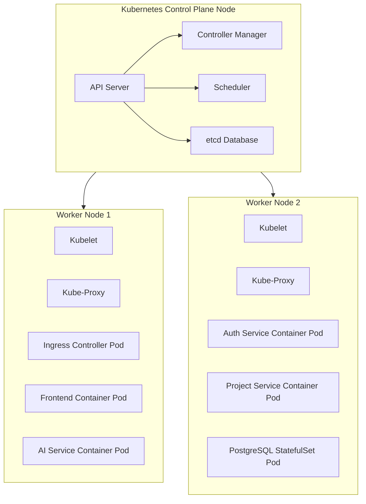
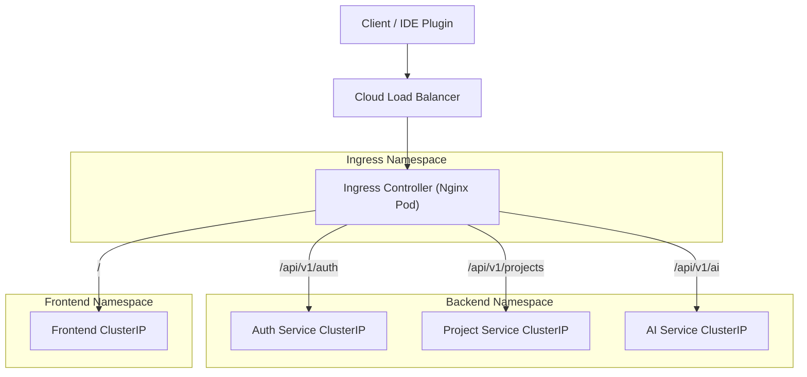
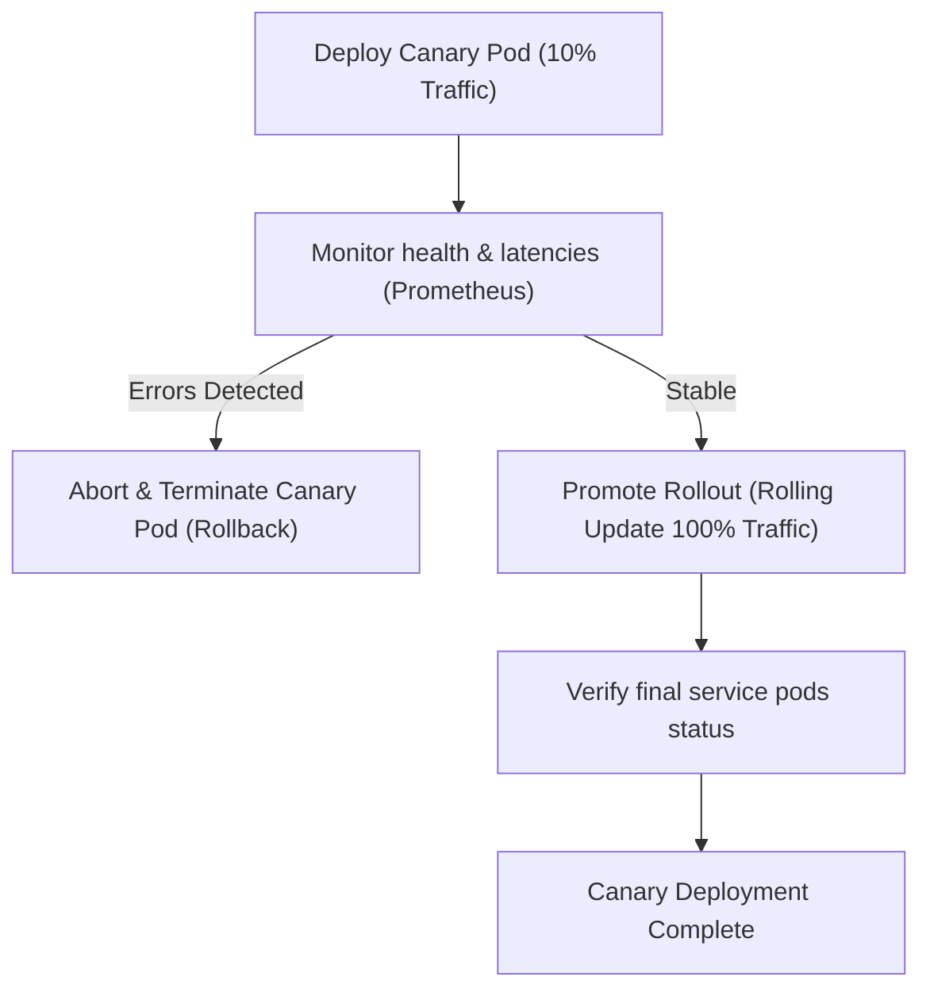

# Kubernetes Deployment

## Document Metadata

| Metadata Field | Value |
|---|---|
| Document Type | DevOps & Deployment / Kubernetes Deployment Strategy |
| Version | 1.0.0 |
| Status | Published |
| Owner | Principal Kubernetes Architect |
| Reviewer | Developer / Principal Architect |
| Last Updated | 2026-07-22 |

---

# Executive Summary

For large-scale, high-concurrency production environments, container orchestration is required to manage self-healing, rolling updates, network routing, and autoscaling. ProjectMind AI uses Kubernetes to deploy, manage, and scale the application stack.

This document defines the Kubernetes cluster topology, namespace strategies, workloads, services, ingress routing, PersistentVolumes, Pod autoscaling, health probes, resources mappings, and security policies governing the cluster.

---

# Kubernetes Cluster Overview

The platform production environment runs on a highly available, multi-zone Kubernetes cluster:

* **Control Plane:** Run in a multi-master configuration across three availability zones to ensure etcd database and controller manager availability.
* **Worker Nodes:** Distributed across zones to prevent single-point node failures.
* **Cluster Components:** Managed by kubelet, kube-proxy, and CoreDNS.
* **High Availability:** Nodes scale dynamically based on cluster resource usage.
* **Cluster Topology:** Separates control planes from worker nodes, routing external traffic through elastic cloud load balancers.

---

# Namespace Strategy

ProjectMind AI partitions cluster resources into isolated namespaces to enforce security boundaries and simplify resource management:

* `ingress`: Exposes Nginx ingress controllers and routes external traffic.
* `frontend`: Runs the Angular web application pods.
* `backend`: Hosts the Spring Boot microservices.
* `database`: Runs PostgreSQL database, pgvector vector indexer, and Redis cache pods.
* `monitoring`: Hosts Prometheus, Grafana, and log aggregation tools.
* `dev` / `qa` / `staging` / `production`: Isolated environment namespaces to partition release candidate runs.

---

# Workload Architecture

Platform components are mapped to Kubernetes workload types based on their state requirements:

* **Deployments:** Used for stateless workloads (Angular frontend, API Gateway proxy, Spring Boot microservices). This allows pods to scale out and update without service interruption.
* **StatefulSets:** Used for stateful databases (PostgreSQL, pgvector, Redis) to guarantee stable network identifiers and persistent disk mappings.
* **DaemonSets:** Run on all worker nodes to collect container logs and system metrics.
* **Jobs:** Execute one-off data migration tasks or index builds.
* **CronJobs:** Run recurring cleanup tasks, backup scripts, and log rotations.

---

# Service Architecture

Kubernetes Services expose application pods internally and externally:

| Service Name | Kubernetes Service Type | Purpose |
|---|---|---|
| **Angular Frontend** | `ClusterIP` | Exposes frontend pods internally to the ingress controller. |
| **API Gateway** | `ClusterIP` | Exposes proxy ingress endpoints to external load balancers. |
| **Auth Service** | `ClusterIP` | Internal communication endpoint for user authentication checks. |
| **Organization Service**| `ClusterIP` | Internal endpoint to manage tenant structures. |
| **Project Service** | `ClusterIP` | Internal endpoint to manage workspaces. |
| **Knowledge Service** | `ClusterIP` | Internal endpoint for sync queues processing. |
| **AI Service** | `ClusterIP` | Internal endpoint for similarity searches and RAG. |
| **PostgreSQL (pgvector)**| `ClusterIP` (Headless) | Exposes PostgreSQL instances, supporting primary-replica replication. |
| **Redis** | `ClusterIP` | Internal session blacklist cache access. |

### Service Type Definitions
* **ClusterIP:** Exposes the Service on a cluster-internal IP. Reaches pods internally.
* **NodePort:** Exposes the Service on each Node's IP at a static port. (Disabled for security).
* **LoadBalancer:** Exposes the Service externally using a cloud provider's load balancer.
* **Headless Service:** Used for StatefulSets database replication, bypassing kube-proxy.

---

# Ingress Architecture

The Ingress Controller acts as the single entry point routing HTTPS traffic to services:

* **External Access:** Cloud load balancers forward HTTPS requests to Nginx Ingress Controllers.
* **Routing Rules:** Inspect incoming request hostnames and URL paths.
* **TLS Termination:** The Ingress Controller decrypts TLS certificates, forwarding decrypted traffic to internal ClusterIP services.
* **API Gateway Integration:** Route client traffic to the API Gateway proxy container to validate JWT sessions.
* **Path-Based Routing:** Route paths (e.g. `/api/v1/ai/*`) to backend namespaces, and root paths (`/`) to the frontend namespace.

---

# Configuration Management

* **ConfigMaps:** Store non-sensitive environment variables (e.g. database host names, logging configurations).
* **Secrets:** Store sensitive data (e.g. database passwords, OAuth tokens, JWT signing keys) as encrypted secrets.
* **Environment Variables:** Inject ConfigMaps and Secrets into pod containers at startup.
* **Secret Rotation:** Integrates with external vault systems to automatically rotate secrets without service restarts.

---

# Persistent Storage

* **Persistent Volumes (PV):** Explicitly provisioned storage blocks from cloud storage pools.
* **Persistent Volume Claims (PVC):** Stateful pods request persistent storage matching target capacities and access modes.
* **Storage Classes:** Configure fast SSD storage classes for PostgreSQL and pgvector database files.
* **Database Storage:** Database StatefulSets claim persistent disks to ensure data survives pod restarts.
* **Backup Volumes:** Mount separate backup volumes to run daily data replication tasks.

---

# Scaling Strategy

ProjectMind AI scales dynamically using three Kubernetes autoscaling features:

* **Horizontal Pod Autoscaler (HPA):** Scales microservice pods out when average CPU usage exceeds 70%, or back in when load decreases.
* **Vertical Scaling:** Automatically scales pod CPU and memory requests based on resource usage.
* **Cluster Autoscaler:** Provisions additional worker nodes to the cluster when pods are blocked due to resource limits.
* **Load Distribution:** Kube-proxy distributes ingress traffic across active microservice pod instances.

---

# Deployment Strategy

To release code updates without service downtime, the platform uses canary deployment strategies:

* **Canary Deployment:** Releases a new image to a single pod, routing 10% of traffic to it. If errors occur, the canary pod is terminated (rollout aborted). If stable, a rolling update promotes the image to all pods.
* **Rolling Updates:** Replaces active pods with new versions incrementally, ensuring continuous service availability.
* **Rolling Rollback:** Roll back changes by re-deploying the previous stable container tag on validation failures.

---

# Health Management

To implement self-healing, pods configure three types of probes:

* **Startup Probe:** Validates that microservice initialization has completed successfully.
* **Liveness Probe:** Periodically queries `/actuator/health/liveness` to confirm container processes are running. If a probe fails, Kubernetes restarts the pod.
* **Readiness Probe:** Periodically queries `/actuator/health/readiness` to verify the container is ready to accept HTTP request traffic. If a probe fails, the pod is removed from load balancer routing pools.

---

# Resource Management

The table below outlines target resource limits and replicas planning for the production namespace:

| Workload / Service | CPU Request | CPU Limit | Memory Request | Memory Limit | Target Replicas |
|---|---|---|---|---|---|
| **Angular Frontend** | 0.1 Cores | 0.5 Cores | 128 MB | 256 MB | 2 Pods |
| **API Gateway** | 0.2 Cores | 0.5 Cores | 256 MB | 512 MB | 2 Pods |
| **Auth Service** | 0.5 Cores | 1.0 Cores | 512 MB | 1024 MB | 2 Pods |
| **Org Service** | 0.2 Cores | 0.5 Cores | 256 MB | 512 MB | 2 Pods |
| **Project Service** | 0.2 Cores | 0.5 Cores | 256 MB | 512 MB | 2 Pods |
| **Knowledge Service**| 0.5 Cores | 1.0 Cores | 512 MB | 1024 MB | 2 Pods |
| **AI Service** | 1.0 Cores | 2.0 Cores | 1024 MB | 2048 MB | 2 Pods |
| **PostgreSQL** | 1.0 Cores | 2.0 Cores | 1024 MB | 4096 MB | 1 Primary / 2 Replicas |
| **Redis** | 0.2 Cores | 0.5 Cores | 256 MB | 512 MB | 2 Pods |

---

# Security

* **RBAC:** Enforce Role-Based Access Control on cluster administrators, restricting API resources permissions.
* **Network Policies:** Restrict network traffic between namespaces. Database namespaces only accept connections from backend microservices namespaces.
* **Pod Security:** Run containers with non-root system users, blocking root access escalation.
* **Secret Management:** Encrypt secrets at rest in etcd and inject them into container memory at startup.
* **Image Security:** Enforce pull policies that verify image signatures, blocking unverified registry images.
* **Admission Controllers:** Use admission controllers to validate pod security parameters before scheduling runs.

---

# Monitoring

* **Pod Monitoring:** Monitor pod resource usage (CPU, Memory) and logs using Prometheus.
* **Cluster Monitoring:** Track node health and resource capacities across availability zones.
* **Metrics Collection:** Prometheus servers collect application metrics from actuator endpoints.
* **Logging:** Centralized log collectors stream container logs to the log aggregation vault.
* **Alerting:** Grafana dashboards trigger alerts on pod crashes, database failures, or ingress errors.

---

# Disaster Recovery

* **Pod Recovery:** If a pod crashes, the deployment controller automatically provisions a new instance.
* **Node Failure:** If a worker node fails, the scheduler re-schedules active pods on healthy nodes.
* **Cluster Failure:** Deploy cluster configurations to secondary cloud regions using IaC scripts during major outages.
* **Storage Recovery:** Restore PostgreSQL database volumes from daily off-site snapshots.

---

# Risks

Kubernetes deployments face key operational risks:

### Node Failure
* *Risk:* Physical host outages terminate active application containers.
* *Mitigation:* Distribute worker nodes across three availability zones, scheduling duplicate replicas.

### Pod Crash Loop
* *Risk:* Microservice configuration errors cause pods to crash on startup.
* *Mitigation:* Implement Startup and Liveness probes to monitor initialization.

### Network Isolation Failure
* *Risk:* Compromised containers access database pods directly, bypassing microservices controls.
* *Mitigation:* Enforce Network Policies that restrict ingress traffic to database namespaces.

---

# Best Practices

ProjectMind AI adopts seven Kubernetes best practices:
* Build container images using immutable base structures.
* Implement Startup, Liveness, and Readiness probes.
* Configure Horizontal Pod Autoscalers (HPA) to scale pods dynamically.
* Enforce CPU and Memory requests and limits.
* Partition environments and service layers using namespaces.
* Enforce RBAC and Network Policies to restrict access.
* Release software updates using rolling update strategies.

---

# Conclusion

The ProjectMind AI Kubernetes Deployment document defines the cluster topology, namespace strategies, workloads, services, ingress routing, PersistentVolumes, Pod autoscaling, health probes, resources mappings, and security policies. Implementing this orchestration strategy provides the scalability, resiliency, and security required to deploy and run ProjectMind AI in enterprise production environments.

---

# Revision History

| Version | Date | Author / Role | Summary of Changes |
|---|---|---|---|
| 0.1.0 | 2026-07-22 | DevOps Lead / SRE | Initial creation of the Kubernetes Deployment Document. |
