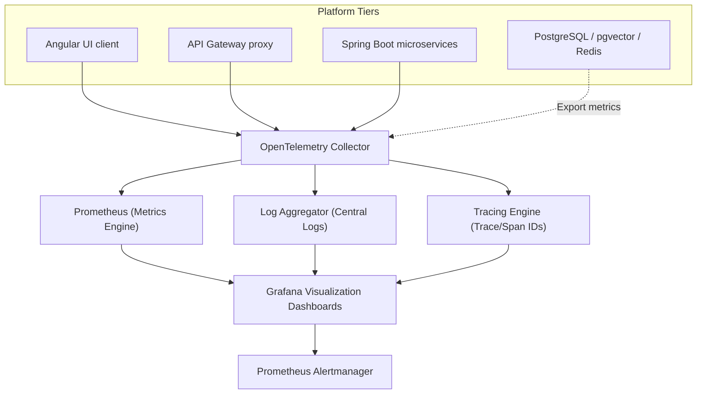
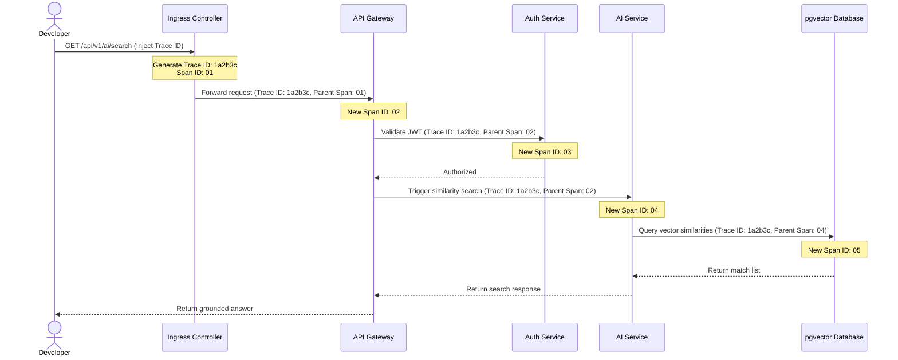
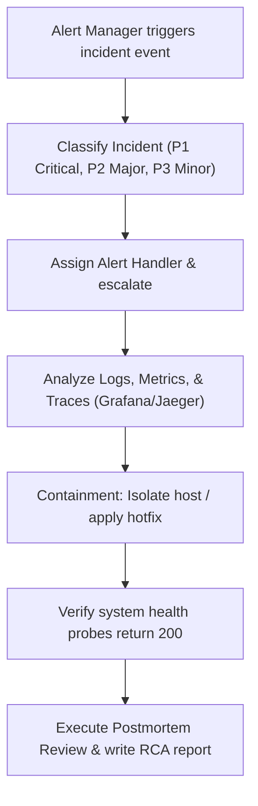

# Monitoring & Observability

## Document Metadata

| Metadata Field | Value |
|---|---|
| Document Type | DevOps & Deployment / Monitoring & Observability |
| Version | 1.0.0 |
| Status | Published |
| Owner | Principal DevOps Architect |
| Reviewer | Developer / Principal Architect |
| Last Updated | 2026-07-22 |

---

# Executive Summary

In a microservices architecture, real-time observability is necessary to guarantee search latency targets, prevent cross-tenant data leaks, and maintain platform uptime. ProjectMind AI's Monitoring & Observability strategy establishes the controls to track system telemetry (Metrics, Logs, Traces, and Events).

This document outlines metrics collection endpoints, log aggregation strategies, tracing schemas, dashboards, alert rules, and incident management workflows, ensuring the SRE team can diagnose issues and maintain system reliability.

---

# Monitoring Objectives

The platform monitoring strategy is guided by seven primary objectives:

* **Availability:** Track service status across pods to maintain high availability.
* **Reliability:** Verify that index updates, connector syncs, and database transactions complete without errors.
* **Performance:** Monitor API and vector search query latencies to verify compliance with P95 targets (<2.0s).
* **Security Monitoring:** Detect security events (e.g. brute force logins, cross-tenant access attempts).
* **Capacity Planning:** Track CPU, memory, and database disk usage to scale resources ahead of demand.
* **Incident Detection:** Enable automated alerting to notify support teams of system issues.
* **Operational Visibility:** Provide dashboards showing sync schedules, task queues, and API throughput.

---

# Observability Architecture

ProjectMind AI collects and aggregates metrics, logs, and distributed traces from all services:

* **Metrics:** Numerical values representing resource usage and performance. Collected from Spring Boot Actuator endpoints.
* **Logs:** Structured JSON log files generated by containers, forwarded to centralized aggregators.
* **Distributed Traces:** Trace IDs track request lifecycles across microservice boundaries.
* **Events:** System notifications logging status changes (e.g. deployments, container restarts).

---

# Monitoring Scope

The platform telemetry monitoring covers the following scope layers:

| Target Layer | What is Monitored | Telemetry Type |
|---|---|---|
| **Angular Frontend** | UI load times, API request latencies, client JS errors. | Metrics, Logs |
| **API Gateway** | Request count, HTTP statuses, API latencies, rate limits. | Metrics, Logs |
| **Auth Service** | Login volumes, credentials check latencies, failures. | Metrics, Logs, Traces |
| **Org Service** | Tenant allocations, settings updates events. | Metrics, Logs, Traces |
| **Project Service** | Workspace configurations, member updates events. | Metrics, Logs, Traces |
| **Knowledge Service**| Sync task queue status, webhook processing latencies. | Metrics, Logs, Traces |
| **AI Service** | Chunking times, embedding latencies, vector searches. | Metrics, Logs, Traces |
| **PostgreSQL** | Connection pool limits, query durations, replication lag. | Metrics, Logs |
| **Redis** | Memory usage, cache hit rates, eviction counts. | Metrics, Logs |
| **pgvector** | HNSW index size, cosine similarity query latencies. | Metrics, Logs |
| **Kubernetes** | Pod status, node CPU usage, memory requests. | Metrics, Logs, Events |
| **Infrastructure** | VM disk capacity, network traffic. | Metrics, Logs |

---

# Metrics Collection

The monitoring engine collects seven categories of metrics:

* **System Metrics:** Host CPU, memory, and disk usage.
* **Application Metrics:** Spring Boot active threads, garbage collection pauses, and response metrics.
* **Business Metrics:** Daily active users (DAU) and total index size.
* **AI Usage Metrics:** Prompt length, token usage, and user feedback ratings.
* **Database Metrics:** PostgreSQL active connections and transaction volumes.
* **JVM Metrics:** Java heap memory usage and thread counts.
* **API Metrics:** Request volume, HTTP statuses, and API response times.

---

# Logging Strategy

* **Application Logs:** Microservices write JSON logs to standard output (stdout).
* **Access Logs:** Nginx proxies log request URLs, IP addresses, and HTTP status codes.
* **Error Logs:** Microservices log stack traces and execution warnings (`WARN`, `ERROR`).
* **Audit Logs:** Log administrative actions and user login events to immutable databases.
* **Security Logs:** Gateway tracks blocked rate-limit attempts and auth failures.
* **AI Logs:** Log prompt lengths, token usage, and model latency metrics.

### Centralized Logging
Logs are streamed from containers to a centralized log aggregator, allowing security teams to search logs using correlation IDs.

---

# Distributed Tracing

To trace requests across distributed microservices, the API Gateway injects Trace IDs and Span IDs into incoming HTTP headers:

* **Trace IDs:** A unique identifier generated per request to trace execution across microservices.
* **Span IDs:** A unique identifier generated per microservice call to trace individual execution segments.
* **Request Flow:** Trace IDs are passed in header variables (`X-Trace-Id`) across service-to-service calls.
* **Service Dependency Tracking:** Telemetry tools visualize trace data to map service call dependencies.
* **End-to-End Request Analysis:** Tracing logs are used to identify performance bottlenecks and trace service errors.

---

# Health Checks

To monitor container status and implement self-healing, the orchestration platform configures health checks:

* **Liveness Checks:** Periodically query actuator endpoints (`/actuator/health/liveness`) to confirm container processes are running. If a check fails, the container is restarted.
* **Readiness Checks:** Periodically query `/actuator/health/readiness` to verify the container is ready to accept HTTP traffic. If a check fails, the pod is removed from load balancer routing pools.
* **Startup Checks:** Monitor slow-starting microservices, delaying liveness and readiness checks until initialization is complete.
* **Dependency Checks:** Actuator monitors database and cache connection health. If a database is unreachable, the readiness probe fails.

---

# Dashboard Strategy

Grafana dashboards present targeted telemetry data:

| Dashboard Name | Purpose | Target Audience |
|---|---|---|
| **Executive Dashboard** | Summarizes monthly active users, total queries, and sync task completions. | Stakeholders, C-Suite |
| **Operations Dashboard** | Displays API throughput, error rates, and average query latencies. | SRE, Support Team |
| **Infrastructure Dashboard**| Displays host CPU, memory, disk usage, and pod statuses. | SRE, DevOps Team |
| **Application Dashboard** | Displays Spring Boot heap usage, active threads, and GC pauses. | Developer Team |
| **Security Dashboard** | Displays login failures, blocked requests, and role changes. | CISO, Security Admin |
| **AI Dashboard** | Displays prompt token usage, model latencies, and feedback ratings. | AI Team, SRE |

---

# Alerting Strategy

Prometheus Alertmanager routes alerts based on severity and escalation rules:

* **Critical Alerts (PagerDuty / SMS):** Raised on system failures (e.g. database down, 5xx error rates >5%, pod crash loops).
* **Warning Alerts (Slack / Email):** Raised on resource limits warnings (e.g. disk capacity >80%, average response times >2.0s).
* **Performance Alerts:** Raised on slow query response times.
* **Security Alerts:** Raised on multiple failed login attempts or cross-tenant access attempts.
* **Infrastructure Alerts:** Raised on high CPU or memory usage.
* **AI Service Alerts:** Raised on downstream API connection timeouts or token budget overruns.

---

# SLI / SLO / SLA

Platform service level agreements (SLA) are defined below:

* **Service Level Indicators (SLI):** Metrics measuring performance (e.g. search query latency, HTTP error rate).
* **Service Level Objectives (SLO):** Target performance metrics.
* **Service Level Agreements (SLA):** Business commitments to customers.

### Core SRE Metrics targets

| Telemetry SLI | Service Level Objective (SLO) | Service Level Agreement (SLA) |
|---|---|---|
| **Search Query Latency** | P95 latency < 2.0 seconds. | P99 latency < 3.0 seconds. |
| **HTTP Error Rate** | < 0.1% failed requests (5xx). | < 0.5% failed requests (5xx). |
| **Workspace Sync Time** | Sync updates complete in < 60 mins. | Sync updates complete in < 120 mins. |
| **System Availability** | > 99.9% uptime monthly. | > 99.5% uptime monthly. |

---

# Incident Management

* **Incident Detection:** Monitoring tools trigger alerts when SLO targets are violated.
* **Classification:** Incidents are classified based on severity:
  * *P1 Critical:* Production outage affecting all users (e.g. database down).
  * *P2 Major:* Major features degraded (e.g. sync workers offline, slow search).
  * *P3 Minor:* Minor features degraded (e.g. user dashboard metric delay).
* **Escalation:** P1 alerts notify SRE teams via PagerDuty. If unacknowledged within 15 minutes, alerts escalate to the DevOps Lead.
* **Resolution:** DevOps engineers deploy hotfixes, restart containers, or restore configurations to resolve incidents.
* **Root Cause Analysis (RCA):** SRE teams conduct root cause analysis to identify the source of the issue.
* **Postmortem Process:** Write a postmortem report within 5 days of resolution, outlining prevention actions.

---

# Capacity Planning

* **CPU & Memory Monitoring:** SRE teams monitor pod resource usage to adjust CPU/memory limits.
* **Storage Growth:** Monitor pgvector index and log storage growth rates, expanding storage volume capacities before saturation.
* **Database Capacity:** Monitor active database connections and pool usage.
* **AI Usage Capacity:** Track prompt volumes and token consumption to manage API budgets.
* **Network Capacity:** Monitor bandwidth usage to prevent network congestion.

---

# Performance Monitoring

* **API Response Time:** Gateway logs latency metrics per endpoint to identify slow APIs.
* **Database Performance:** PostgreSQL logs slow queries (>100ms) to identify needed index updates.
* **Cache Performance:** Redis tracks cache hit and eviction rates to verify cache sizes.
* **AI Response Time:** AI Service logs model response latencies, tuning context sizes if response times increase.
* **Throughput:** Monitor API requests per second (RPS) to manage gateway capacities.
* **Error Rates:** Track HTTP 5xx errors to identify backend application issues.

---

# Reporting

The SRE team compiles the following reports:

* **Daily Reports:** Summaries of system health, errors, and latencies.
* **Weekly Reports:** Summaries of deployment events, alerts, and capacity usage.
* **Monthly Reports:** SLO compliance scores, total API throughput, and cost summaries.
* **Executive Reports:** High-level summaries of platform uptime, query volumes, and budget usage.
* **Compliance Reports:** Summaries of administrative changes, role modifications, and audit logs.

---

# Risks

Telemetry monitoring systems face key operational risks:

### Missing Alerts
* *Risk:* Monitoring tool configuration errors cause alerts to be dropped.
* *Mitigation:* Conduct weekly testing of alert routing rules and check health checks statuses.

### Alert Fatigue
* *Risk:* Excessive minor alerts cause engineers to ignore warnings, missing critical issues.
* *Mitigation:* Standardize warning alerts to Slack notifications, reserving pager alerts for critical outages.

### Log Explosion
* *Risk:* Debug logging configurations in production saturate disk storage.
* *Mitigation:* Set default logging levels to `INFO`, applying automated log rotations rules.

---

# Best Practices

ProjectMind AI adopts six monitoring best practices:
* Centralize all telemetry collection.
* Configure dashboards for target audiences.
* Standardize alerting rules, reserving pager alerts for critical outages.
* Traces requests across microservices using Correlation IDs.
* Review SLI and SLO targets quarterly to adjust parameters.
* Automate incident detections and alert routing workflows.

---

# Conclusion

The ProjectMind AI Monitoring & Observability document defines the metrics collection, log aggregation, distributed tracing, alerting, SLI/SLO targets, and incident management workflows. Implementing this observability strategy provides the visibility and reliability required to run ProjectMind AI in enterprise production environments.

---

# Revision History

| Version | Date | Author / Role | Summary of Changes |
|---|---|---|---|
| 0.1.0 | 2026-07-22 | SRE Lead / DevOps | Initial creation of the Monitoring & Observability Document. |
